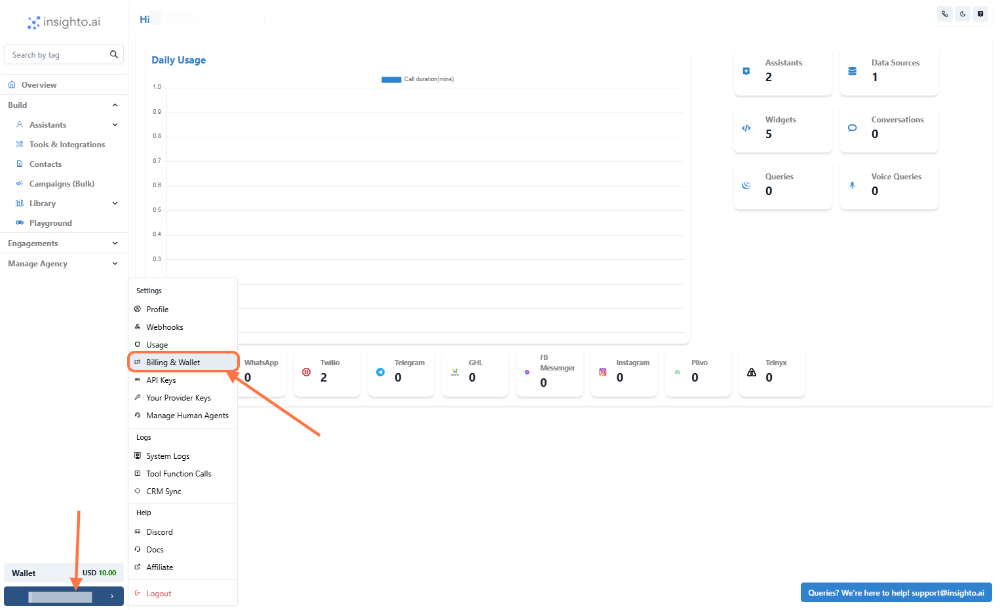
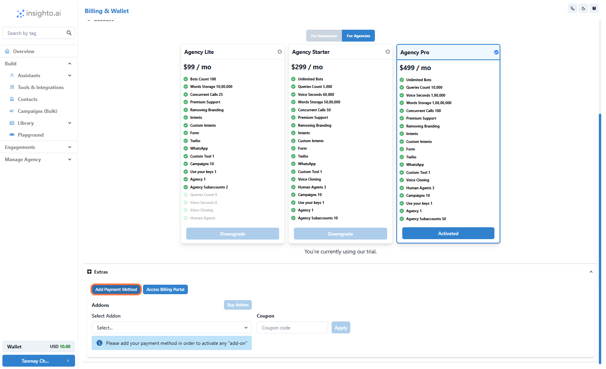
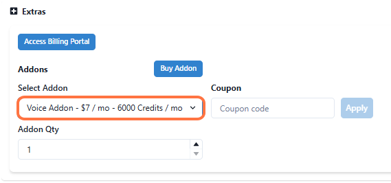
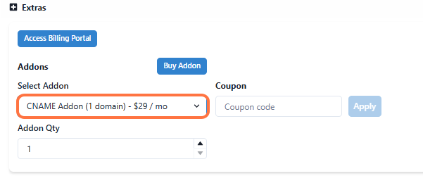
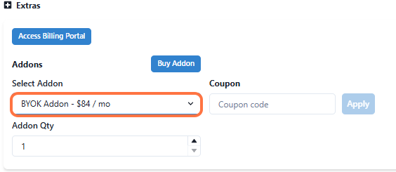
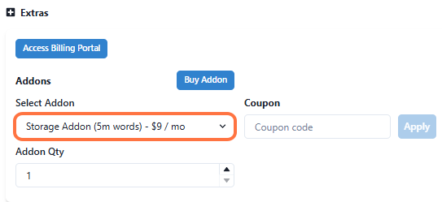
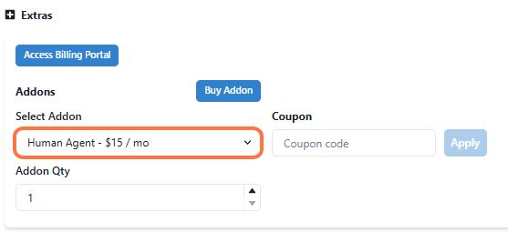
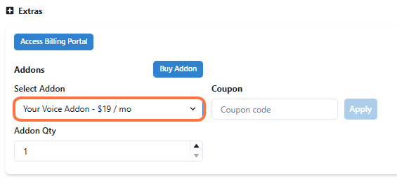
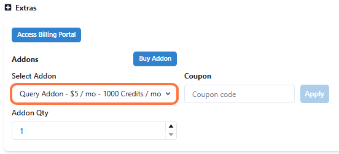

This guide walks you through how to purchase and manage add-ons within the platform. Add-ons are optional enhancements that extend the platform’s capabilities and tailor it to your specific needs. In this guide, you’ll learn how to browse available add-ons, make purchases, and manage them to get the most out of your platform experience.

---

1. Click on Billing & Wallet

Go to settings (From bottom left panel) and click on **Billing and Wallet**.

---

2. Click on Add Payment Method

To access and purchase add-ons, you’ll first need to add a payment method:

✅ Click the “Add Payment Method” button in your dashboard.  
✅ A secure portal will open, allowing you to enter your card details.  
✅ Once you’ve added your card details, your payment method will be saved, and you’ll be able to access the add-ons.

---

3. Voice Add-On

**Cost**: USD 7 per month

This add-on provides **6,000 credits for voice usage**, enabling voice interactions with your AI assistant.

---

4. CName Add-On

**Cost**: USD 29 per month

**Description**: Host your chatbot on your own domain, creating a seamless, branded experience for your users.

---

5. BYOK (Bring Your Own Key) Add-On

**Cost**: USD 29 per month

For users who prefer to use their own keys instead of platform credits or wallet funds.

---

6. Storage Add-On

**Cost**: USD 9 per month

Extends your storage capacity to **5 million words**, enabling management of larger data sources for your AI assistants.

---

7. Human Agent Add-On

**Cost**: USD 15 per month

Allows you to create access for a **human agent** to log in and handle chats when users request a transfer.

---

8. Your Voice Add-On

**Cost**: USD 19 per month

Enables users to **use their own voice** on agents for personalized and engaging interactions.

---

9. Query Add-On

**Cost**: USD 5 per month

Provides credits for **queries usage** on chat agents, expanding your AI interactions.

