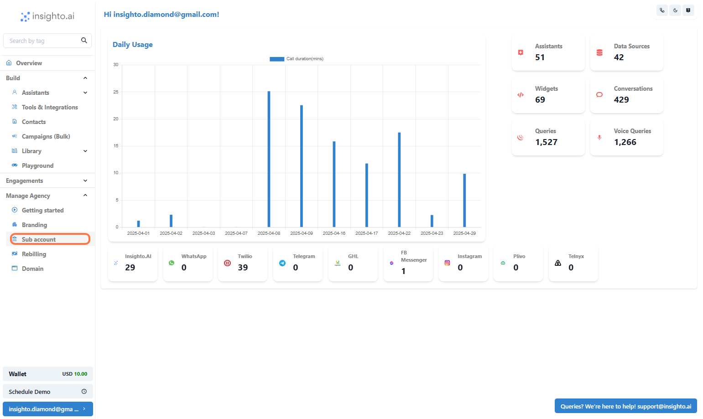

 1. Click on Manage Agency

---

 2. Click on Sub account

---

 3. Click on Add

---

 4. Click on Add Sub-account…

---

5. Click on Submit

---

### ✅ Sub-Account Setup Complete!

🎉 Congratulations! You've successfully setup your first sub-account.

---

6. Client Account Management Options

Now that your subaccount is created, you have several operations available to manage the account under the operations tab.

👉 **1. Log In**  
Access the client account directly for a hands-on experience.

👉 **2. Activate/Deactivate**  
Quickly toggle between active or inactive status for the client account.

👉 **3. Change Plan**  
Easily update the client’s subscription plan based on their needs.

👉 **4. Reset Credits**  
Manage and reset credits for the client’s account as needed.

👉 **5. Reset Password**  
Provide the client with a fresh password to regain access.

👉 **6. Delete Account**  
Completely remove the client’s account from your system when necessary.

---

### ✅ Agency Setup Complete!

🎉 Congratulations! You've successfully completed your agency configuration.  
You're all set to start managing client accounts and scaling your agency.
