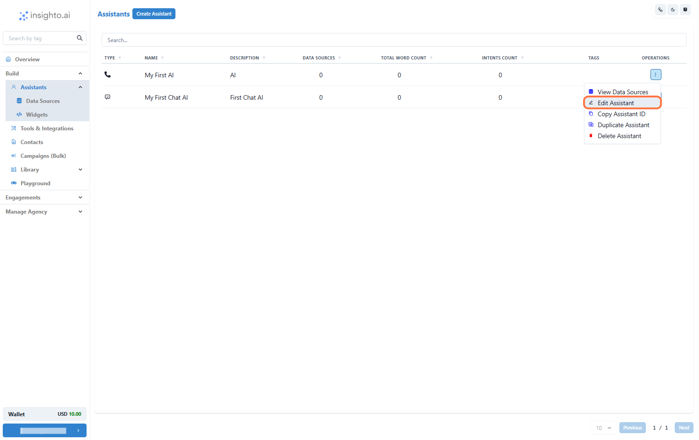
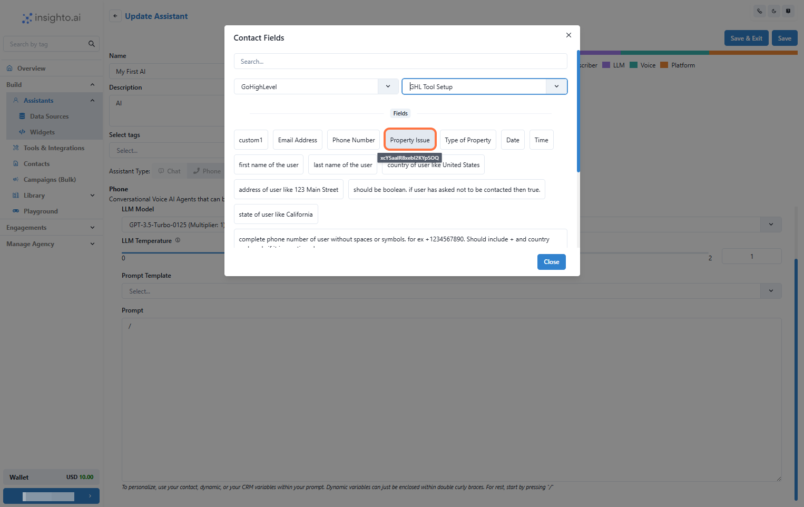
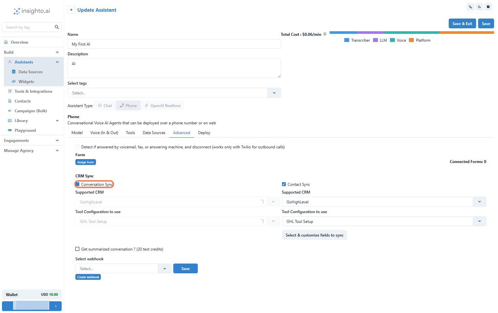
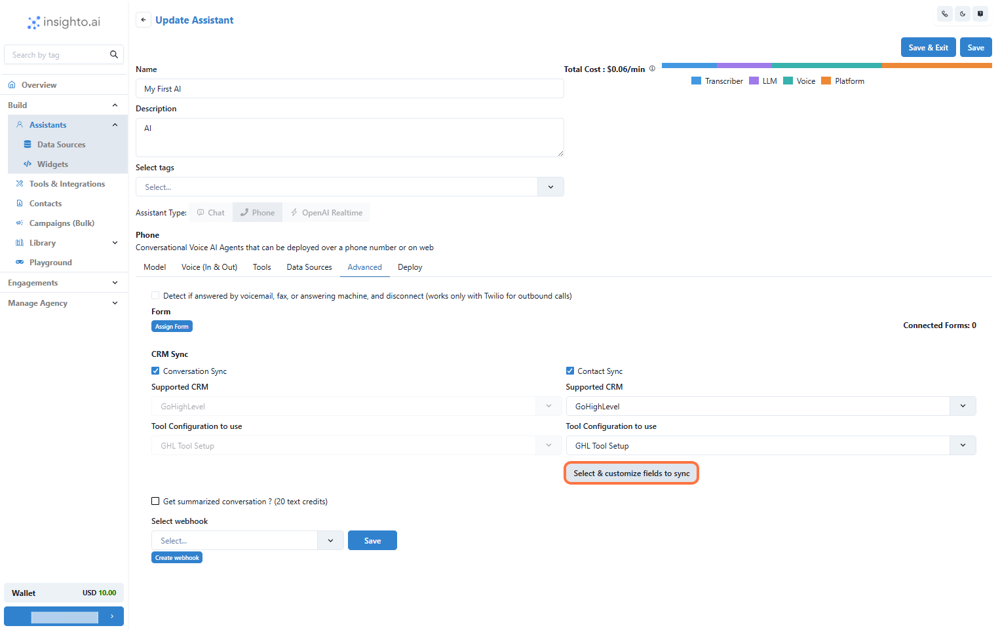
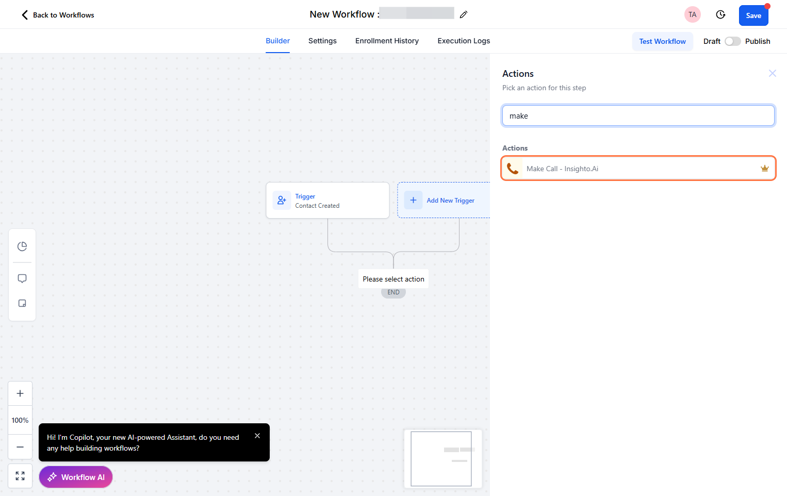
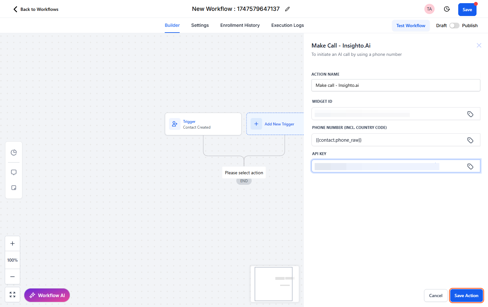

title: Using GHL Dynamic Variables, CRM Sync & Make a Call App
description: Learn to use dynamic variables from GHL, sync contacts/conversations, and trigger calls using the Make a Call App.
---

# Using GHL Dynamic Variables, CRM Sync & Make a Call App

This guide will walk you through how to leverage dynamic variables from Go High Level (GHL) within prompts, enable CRM contact and conversation syncing, and trigger calls using the Make a Call App inside Insighto.

These features are essential for building deeply integrated and responsive voice workflows with your AI assistant

---

1. Prerequisites: Assistant & App Setup

Before you begin, ensure the following are set up:

- ✅ A **Phone Assistant** is already created using Twilio, Plivo, or Telnyx  
- ✅ The **Make a Call App** is installed and active in your GHL account

---

2.  Edit Any Existing Phone Assistant

Go to the **Operations** tab under Assistants.

- Click the three-dot menu beside the assistant you want to use  
- Select **Edit Assistant**

---

3.  Use Dynamic Variables in the Prompt

1. Go to the **Models** section  
2. In the **Prompt** field, type a forward slash `/` to open the variable menu  
3. Choose a GHL Tool Configuration from the dropdown  
4. Select and insert variables like contact name, appointment time, etc., directly into your prompt

This allows your assistant to dynamically personalize prompts using real-time GHL data.

---

4. Enable Contact & Conversation Sync

Navigate to the **Advanced** section and enable:

- **Contact Sync**  
- **Conversation Sync**

This will:

- Automatically create a contact in GHL after a conversation  
- Push the chat transcript to that contact's profile in GHL

---

5. Select & Customize Fields to Sync

Click the **Select & Customize Fields to Sync** button in the Advanced section.

You’ll be able to:

- Choose which conversation fields should sync  
- Map user data (name, phone, email, etc.) to GHL contact fields

---

6. Trigger a Call When a New Contact Is Created

Go to your GHL **Workflows** and set up:

- **Trigger**: Use the "Contact Created" trigger  
- **Action**: Add "Make a Call" from the Insighto app

This will place a call to the newly created contact.

---

7. Configure Call Action Details

Inside the **Make a Call** action:

1. **Widget ID** – Find this in the Insighto Widgets section  
2. **Phone Number Field** – Select the GHL field containing the contact’s number  
3. **API Key** – Generate from Insighto (Settings → API Keys)

Paste your API key here to authenticate the call action.

---

8. Test the Workflow

1. Create a new contact manually or via form  
2. Your workflow should trigger automatically  
3. The AI should initiate a call using the configured widget

Use a test number to confirm the call is successfully made.

