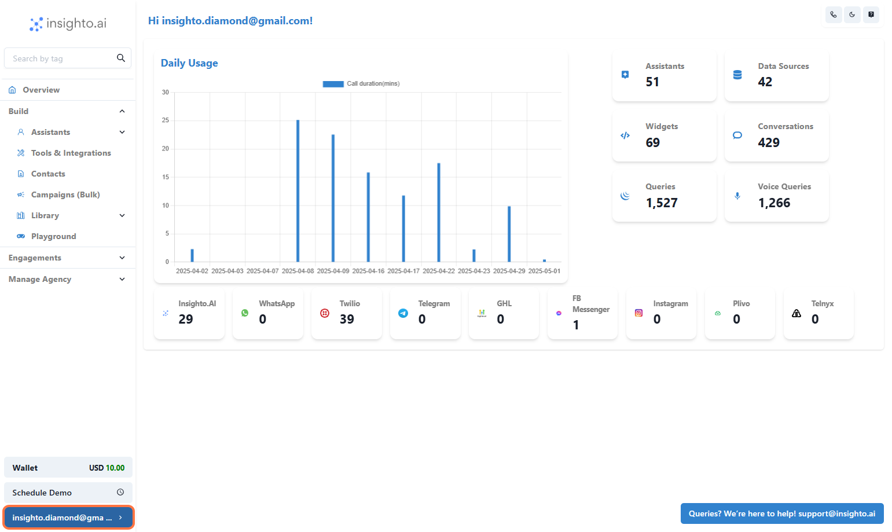
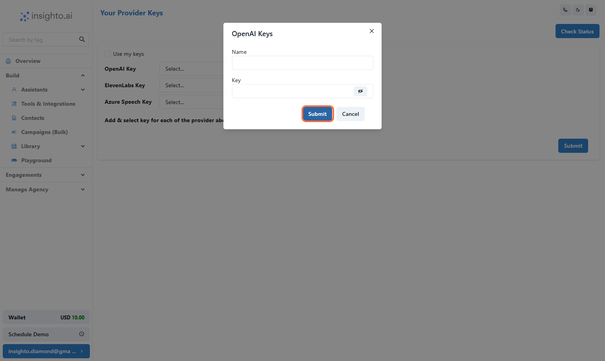
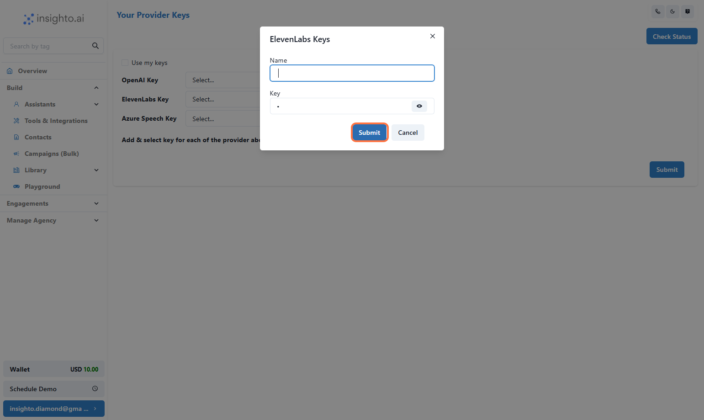
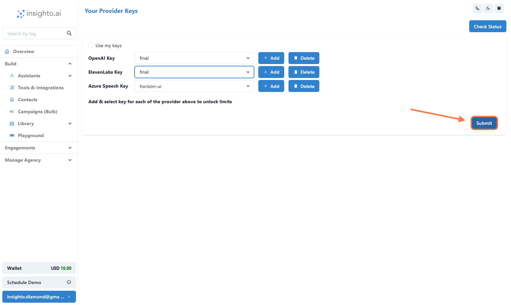
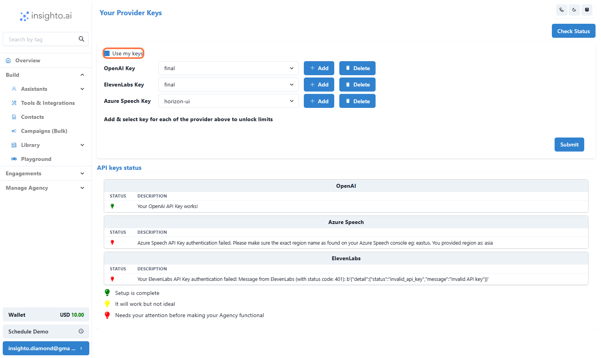

Use your own API keys for OpenAI, Azure, and ElevenLabs to bypass Insighto usage charges and directly consume your own quotas.
Insighto.ai gives you the flexibility to use your own API keys. This helps you bypass usage charges from Insighto for main and subaccounts when directly consuming your own quotas from these services.

---

 1. Click on settings

---

 2. Click on "Your Provider Keys"

---

 3. Understand Required API Keys for BYOK

To activate BYOK, you'll need to connect the following keys:

✅ **Required**  
- **OpenAI API Key** – Powers chat and AI responses.  
- **Azure Speech API Key** – Enables text-to-speech and use Azure voices.

⚙ **Optional**  
- **ElevenLabs API Key** – Needed only if using ElevenLabs for voices on Assistants.  
  (You can enter a placeholder like `dummy` if not using it.)

⚠ **Important**: Both **OpenAI** and **Azure** keys must be provided for BYOK to work.

> 🔗 **How to Get Your API Keys**

- 🧠 [OpenAI API Key](https://help.openai.com/en/articles/4936850-where-do-i-find-my-openai-api-key)  
- 🗣 [Azure Speech API Key](https://docs.merkulov.design/how-to-get-microsoft-azure-tts-api-key/)  
- 🎙 [ElevenLabs API Key (Optional)](https://help.elevenlabs.io/hc/en-us/articles/14599447207697-How-to-authorize-yourself-using-your-xi-api-key)

---

 4. Click the "Add" button next to OpenAI

This opens a dialog box to input your OpenAI API key.

---

 5. Paste your key, Give a Name to the key and click "Submit"

Your OpenAI key is now saved.

---

 6. Click the "Add" button next to ElevenLabs

Click the "Add" button next to ElevenLabs

---

 7. Paste the key or enter dummy, then click "Submit"

Paste the key or enter `dummy`, then click "Submit"

---

 8. Click the "Add" button next to Azure

A box will appear to enter your Azure Speech API key.

---

 9. Paste your key, Region, Name and hit "Submit"

Paste your key, Region, Name and hit "Submit"

---

 10. Click the "Submit" button on the Provider Keys page

This saves all your added keys

---

 11. Click "Check Status" to Verify Your Keys

This will validate if the provided keys are correct and active.

✅ If everything is set up properly, you’ll see a success message.  
❌ If there's an issue, you’ll get an error indicating which key needs to be fixed.

---

 12. View Success and Error Indicators

After clicking "Check Status", you’ll see a message for each key:

✅ **Success Example:**  
“OpenAI Key Validated Successfully” (shown in green)

❌ **Error Example:**  
“Azure Key Invalid – Please check and re-enter” (shown in red)

---

 13. Enable BYOK for Your Account

Once all keys are added and show a successful status:

✅ Toggle the “Use My API Keys” checkbox to activate BYOK for your account.  
This tells Insighto to use your keys instead of platform credits for all processing.

