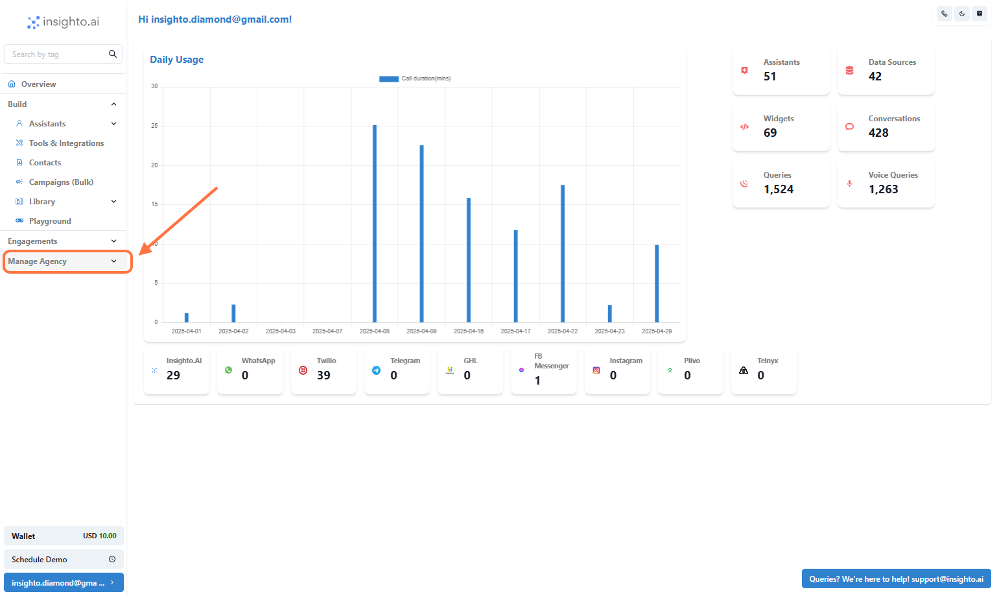
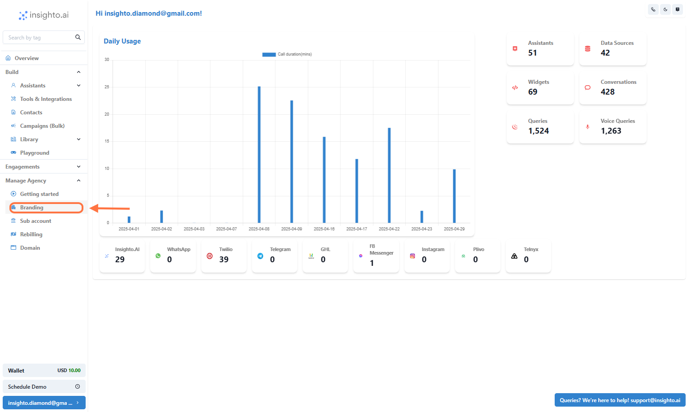
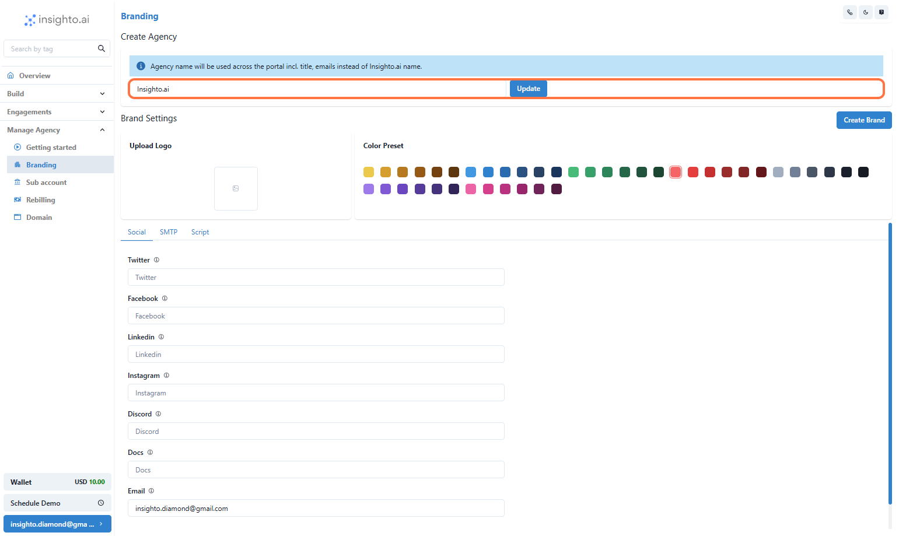
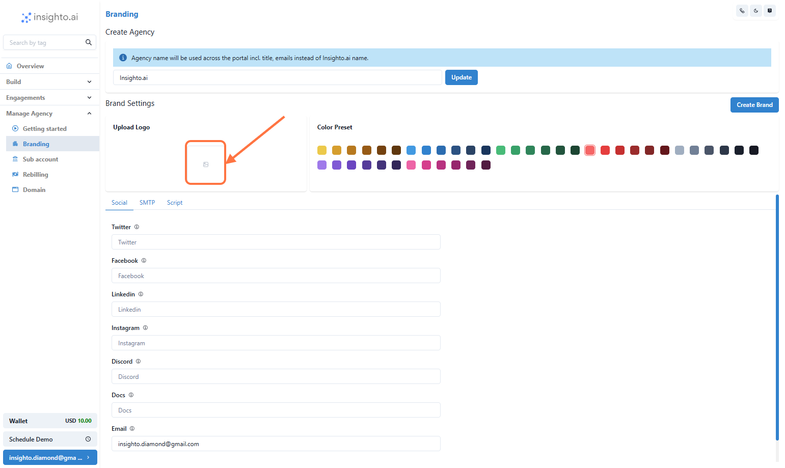
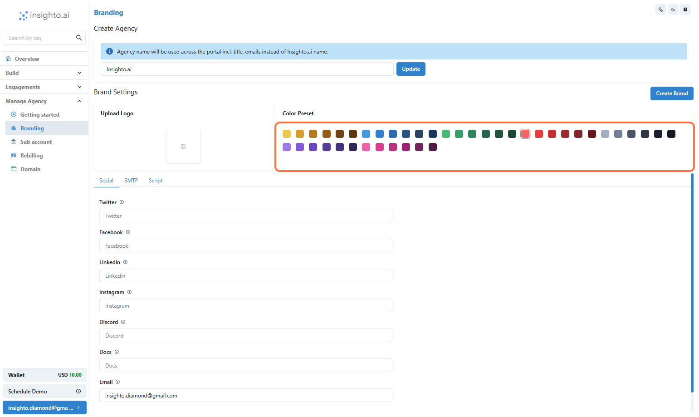
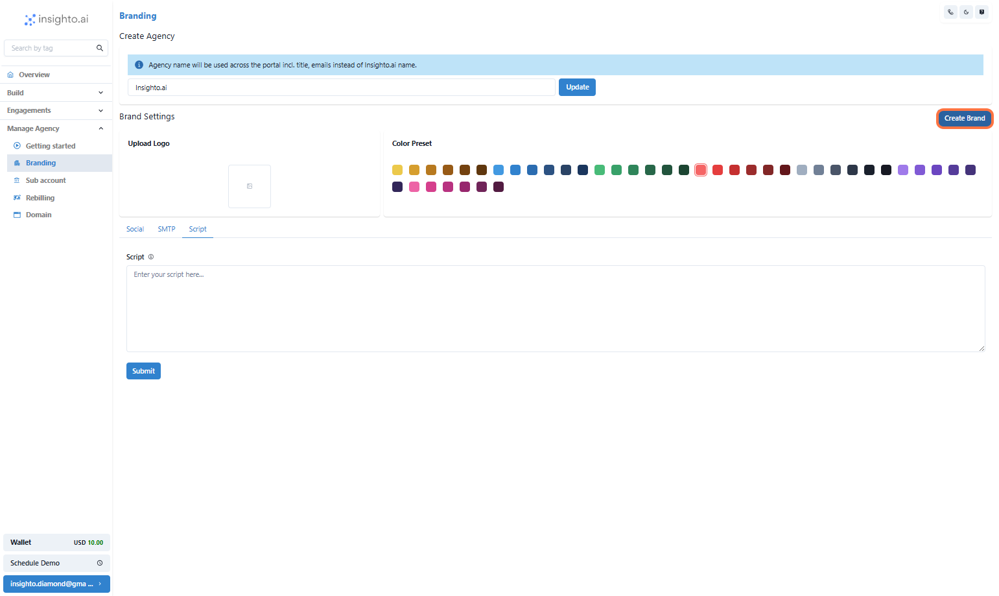
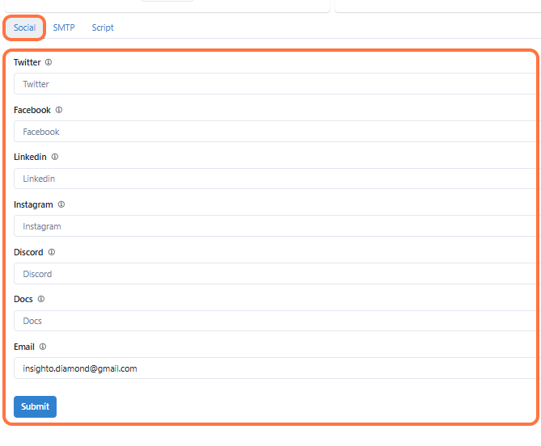
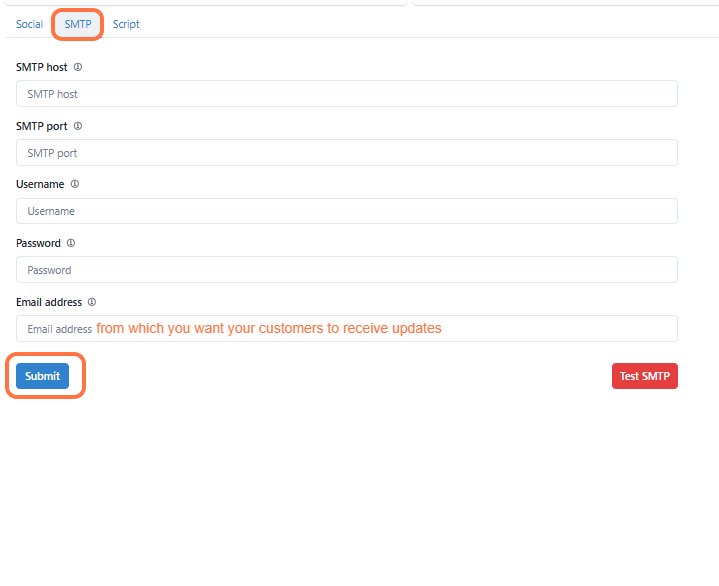

Branding is a vital aspect of establishing your agency's identity. With Insighto.ai, you can customize your agency's dashboard to reflect your brand aesthetics. This guide will walk you through these steps.

 1.  Click on Manage Agency

 2.  Click on branding

 3.   Set Your Agency Name

Choose a unique name that represents your agency. This will appear across your white-labeled dashboard and communications.

Click on the Create/Update button to save your agency name.

 4.  Upload Your Agency Logo

Add your logo to personalize your dashboard and deliver a branded experience to your clients.

 5.  Choose Your Agency Color Preset

Select a color theme that matches your brand identity. This will style your agency dashboard and client interfaces.

 6.  Click on Create Brand

 7.  Add Social & Support Links (Optional)

Connect your agency’s social media, community links (e.g., Discord), documentation, and support email to provide easy access for your clients.

 8.  Set Up SMTP for Email Delivery

SMTP (Simple Mail Transfer Protocol) is used to send emails from your agency domain. Connect your SMTP credentials to ensure white-labeled emails (like Sign, forgot password or notifications) go out from your own email address.

📌 Example: If you're using Gmail (Google Workspace), you can use:

- **SMTP Host:** smtp.gmail.com  
- **Port:** 587  
- Use your Gmail address and App Password as credentials.

Check with your email provider for SMTP details and make sure less secure apps or app-specific passwords are enabled if required.

Click on Submit and then Test SMTP to make sure it's configured properly.

 9.  Add Custom Header Scripts

Paste any custom script (e.g., Google Analytics, tracking pixels) to be injected into the header of your agency dashboard and client interfaces.

