Build a simple phone assistant and deploy it on your website using the WebCall widget.  
No knowledge base or tools for now — just a quick way to get started.

---

1. Log in to your Insighto.ai account

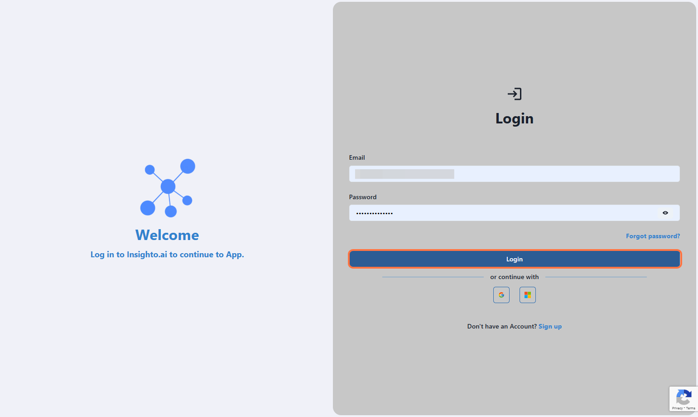

---

### Start with Creating Assistant

2. From the left panel, click on Assistants

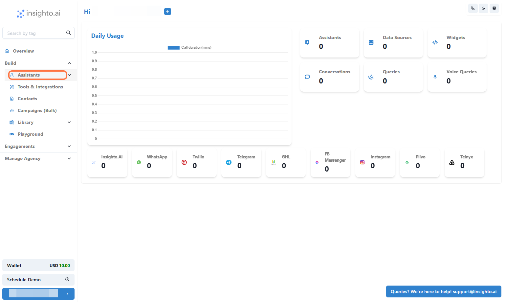

---
3. Click the "Create Assistant" button

---

4. Enter a Name & Description for your assistant

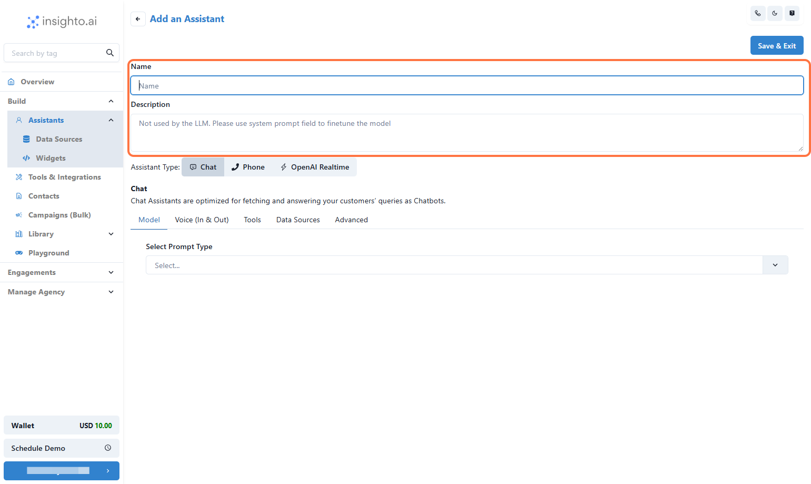

---

5. Set the Assistant Type to Phone

---

6. Go to Model Tab

Under this, the assistant is set to **Prompt** by default.

- The default LLM is **GPT-3.5**, but you can choose another model from the dropdown.
- Adjust the **temperature** if needed (higher = more creative, lower = more precise).

In the **Prompt** box, enter a simple instruction like:  
> “Greet the user and ask how you can assist them today.”  
or add your prompt according to your use-case.

> 💡 You can update this prompt anytime based on your assistant’s role.

---

7. Click on Voice Tab

Click on **Voice Tab**.

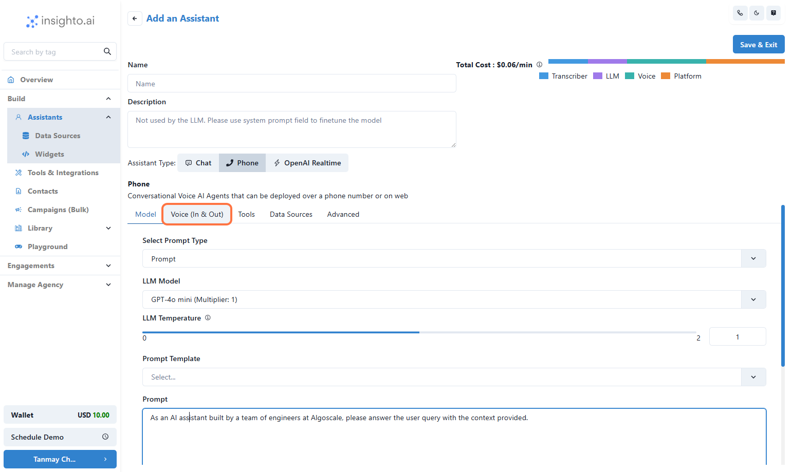

---

8. Configure Voice Settings

In the **Voice** tab:

- **Recognizer Language** is set to English by default.  
  To use another language, remove English and select your preferred language from the list.
- **AI Voice** is set to Ava by default.  
  You can choose another voice from the dropdown.

Additional options:
- **Who speaks first** – Decide whether the assistant or user starts the conversation.
- **Silence timeout** – Time the assistant waits before responding if the user is silent.
- **Silent message** – What the assistant says if silence is detected.
- **Interruption time** – Controls when the assistant can interrupt the user.
- **Recognizer confidence threshold** – Adjust how strictly the assistant interprets voice input.

> 💡 These settings help fine-tune the assistant’s responsiveness and user experience.

---

✅ **Next Steps Unlocked After Creation**  
The Tools, Data Sources, and Advanced tabs will become accessible once you create the assistant.  
These features will be covered in separate guides. For now, let’s focus on building and testing a simple assistant.

---

9. Click on Save & Exit

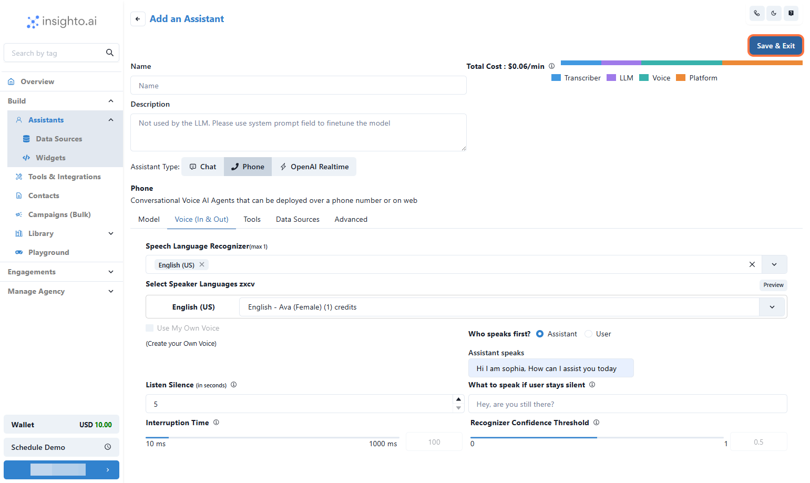

---

10. 🎉 Congratulations!

Your first AI voice assistant is now configured.

> What’s next? Let’s see how to deploy it on your website and start testing using the Web Call widget.

---

Creating a Widget

11.  Click on Widgets

---

12.  Click on Create Widget

---

13.  Select Insighto.ai

Since we’re deploying this assistant as a WebCall widget

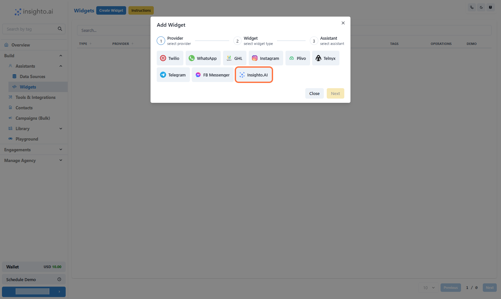

---

14. Click on Next

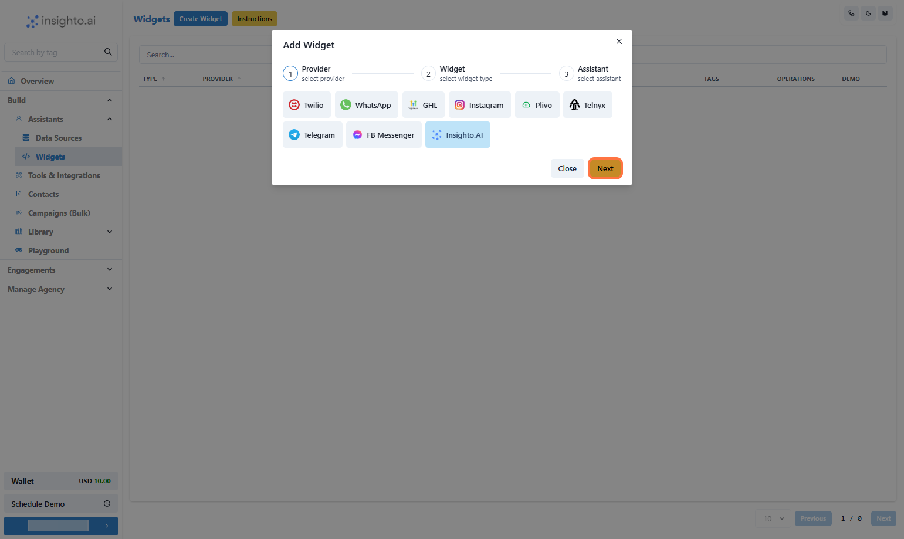

---

 15.  Click on Embed AI Agent voice as shown below

Enter the Name & Description of your widget

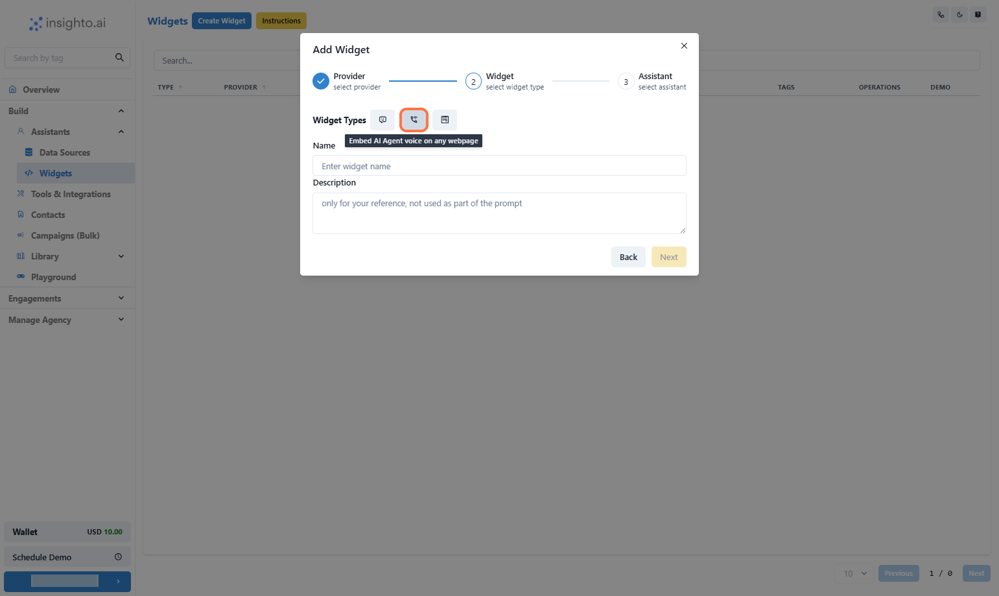

---

16.  Click on Next

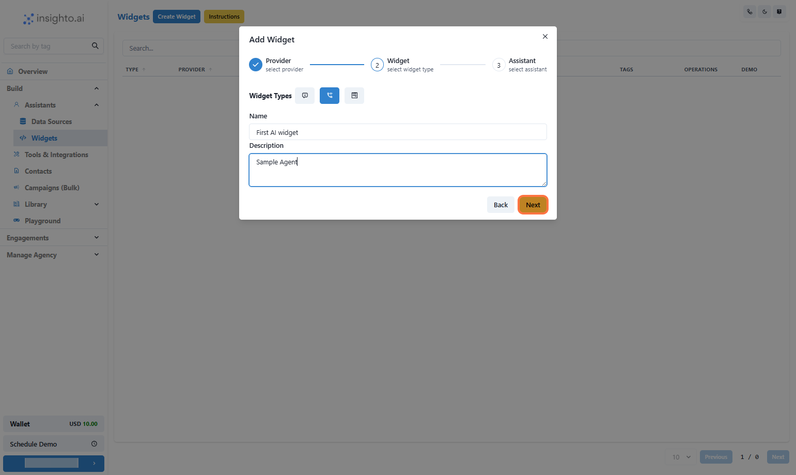

---

17.   Select the Assistant

From the Assistant dropdown, select the voice assistant you just created.

💡 Only assistants with Phone type will appear in this list.

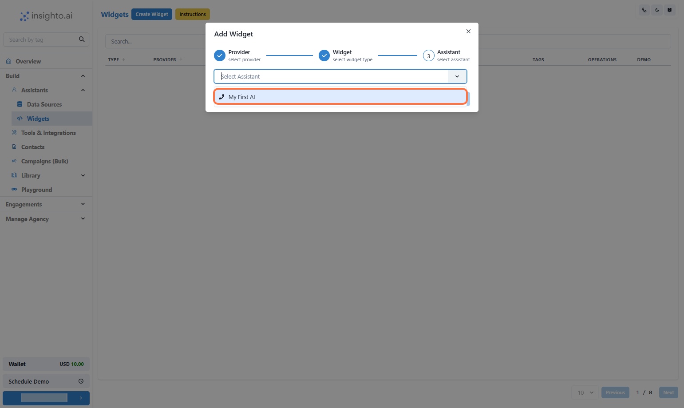

---

18. Click on Finish

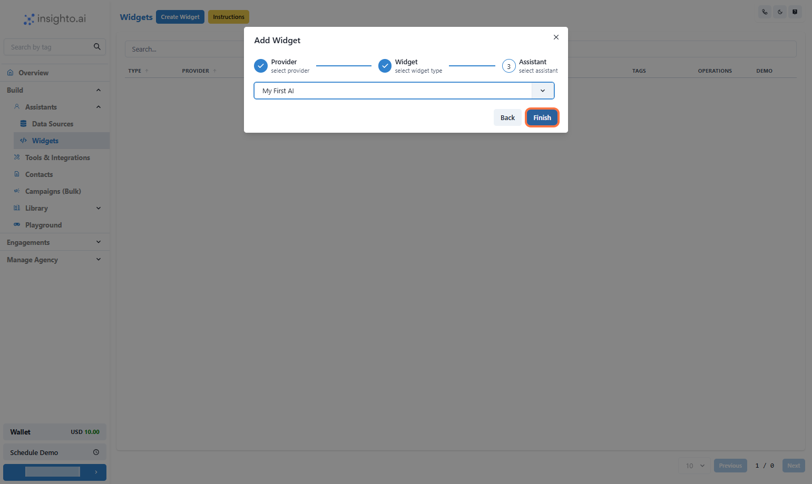

---

19  Congratulations! Your Widget is created

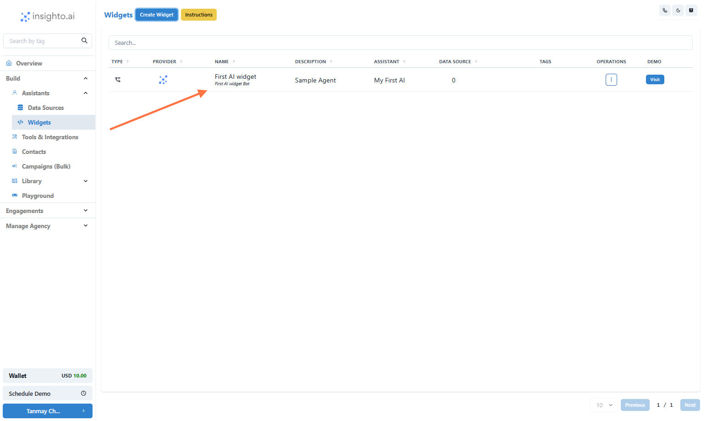

---

20.  Click on Visit

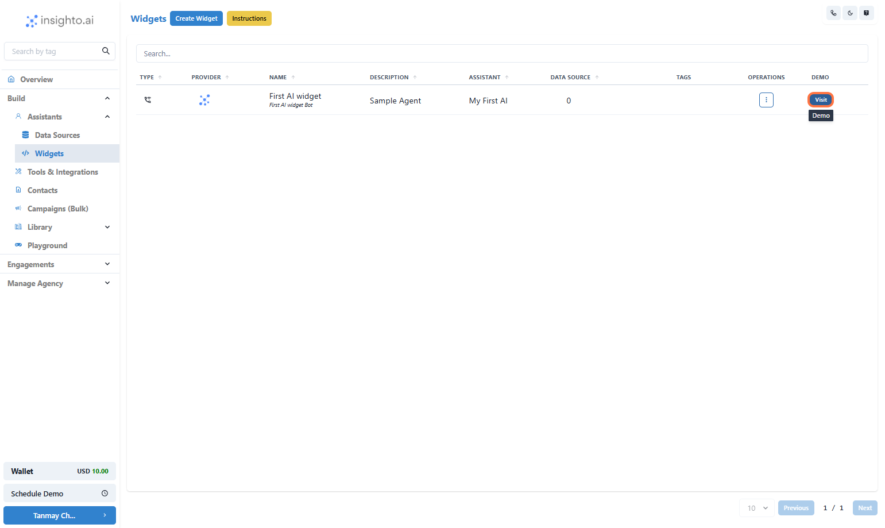

---

21.  Click on Tap to speak

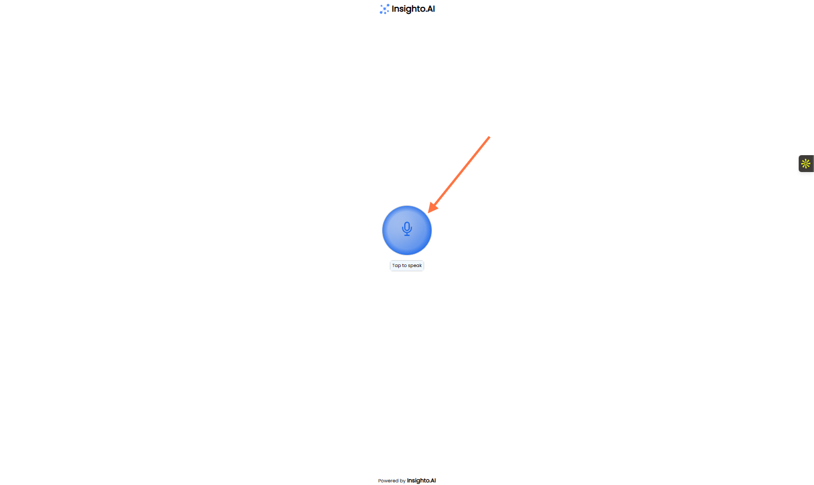

---

## Deploy it on your website now!  

22.  Click on Options

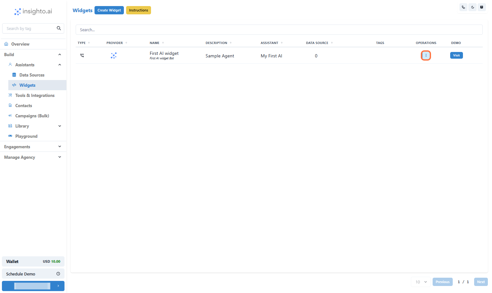

---
23.  Click on Get Code & QR

---

24.  Select the Widget Type

Choose how the assistant will appear on your website:  
• Phone Icon Widget – A floating phone icon appears on your site.  
• HTML iFrame – Embed the assistant directly within a specific section of your webpage.

---

25.  Click on Embeded

Copy the generated code snippet

• Phone Icon Widget – Adds a floating phone icon; style script goes in the `<head>`, and widget code in the `<body>`.  
• HTML iFrame – Embeds the assistant directly on the page; place the iFrame code within the `<body>` where you want it displayed.

