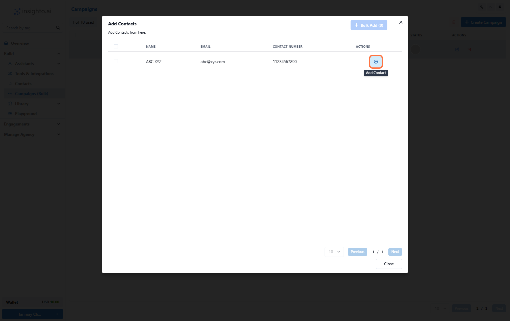

# Campaigns

The **Campaigns** feature helps you automate outreach to your contacts by scheduling voice calls using an AI voice agent.

---

## ✅ Prerequisites

Before creating a campaign, make sure you have the following:

- A **voice agent** deployed on a phone number through a supported provider like **Twilio**, **Plivo**, or **Telnyx**.
- A list of **leads (contacts)** you want to reach out to during the campaign.

---

## 👥 Add Contact in Insighto (4 Steps)

### Step 1: Go to Contacts Section

From the left panel, click on **Contacts**.

---

### Step 2: Add a Single Contact

Click on **Add Contact** to upload a single contact.

---

### Step 3: Enter the Details & Click on Submit

Fill out the contact details in the form, then click **Submit**. A new contact will be created in the platform.

---

### Step 4: Upload Contacts in Bulk

Click on **Bulk** to import contacts using a CSV file.

---

## 📞 Create Campaigns (5 Steps)

### Step 5: Go to Campaigns Section

Navigate to the **Campaigns** section from the left-hand panel.

---

### Step 6: Click on Create Campaign

Click the **Create Campaign** button to start setting up a new campaign.

---

### Step 7: Enter the Details and Click on Add

- Name your campaign (e.g., "Lead Qualification Campaign")  
- Select the **Voice Widget** you want to use for calling  
- Set the **start date**, **time zone**, and **daily calling hours**  
- Choose the **days of the week** for the campaign to run  
- Click **Add**

---

### Step 8: Select the Contacts and Click on Close

Choose the contacts you want to include in the campaign, then click **Close**.

---

### Step 9: Enable and Monitor Your Campaign

Once your setup is complete:

- Toggle to **Enable** the campaign.
- It will run based on your defined schedule.
- Track the **status and performance** of the campaign in the interface.

---

## 📊 After Campaign (1 Step)

### Step 10: Check the Conversations After Campaigns

You can:

- Review conversations for a specific contact in the **Contacts** section, or  
- Track all conversations in the **Engagement** section from the left panel.

