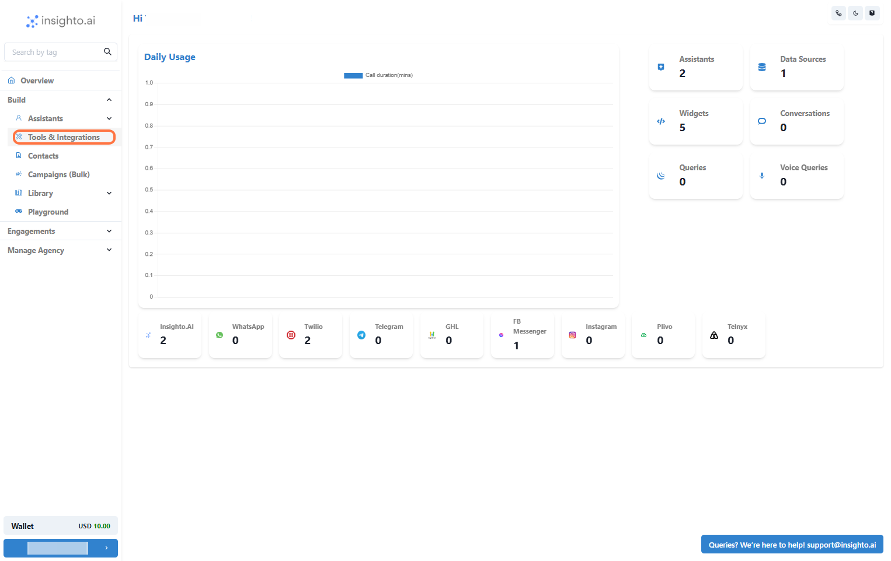
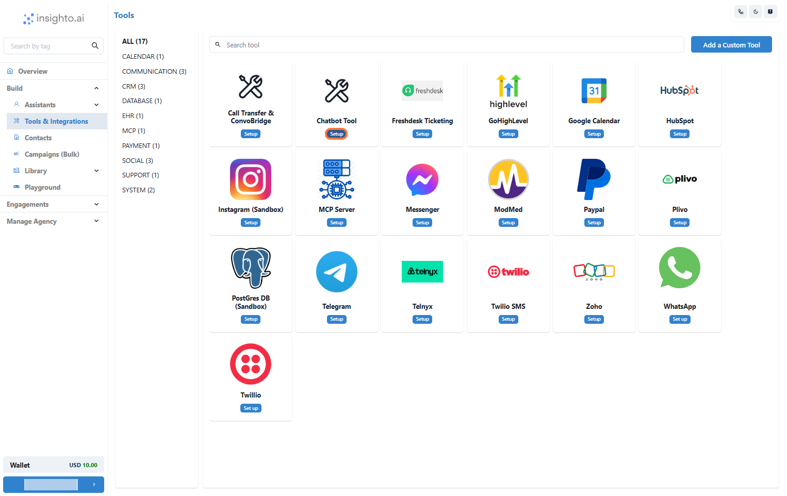
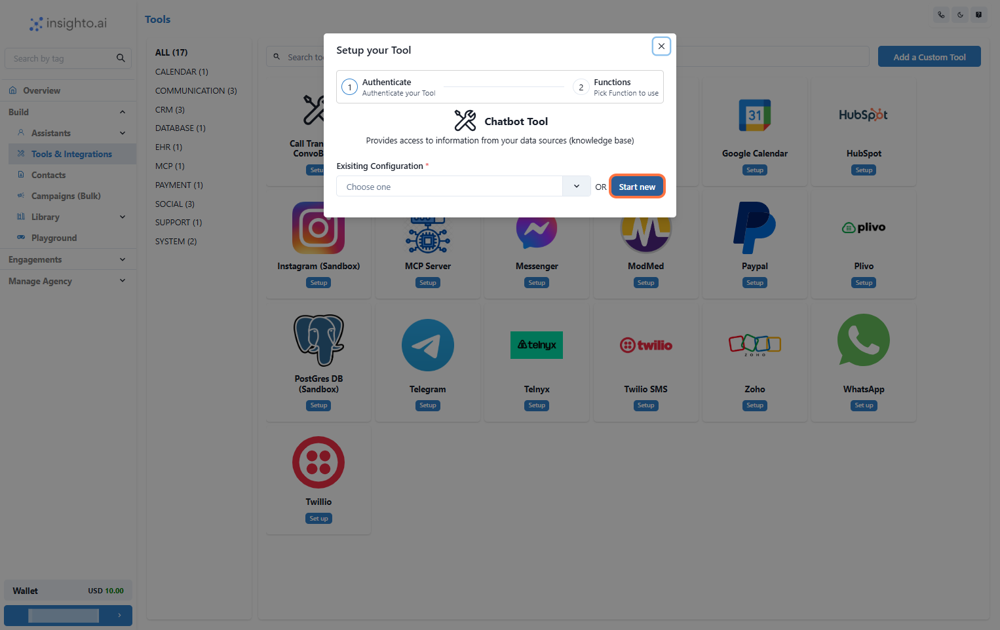
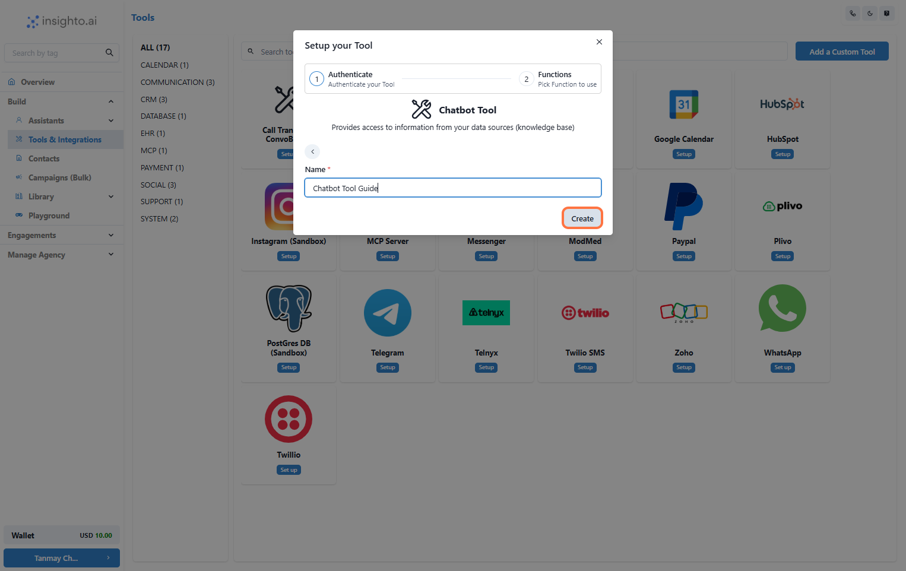
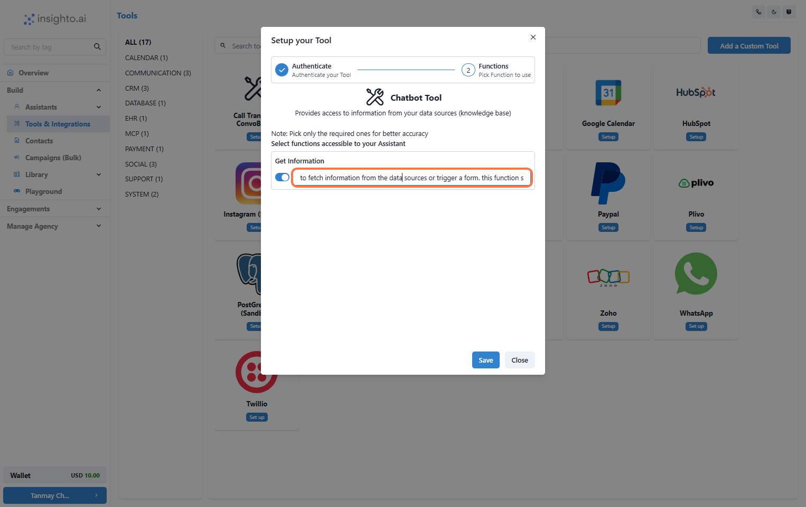
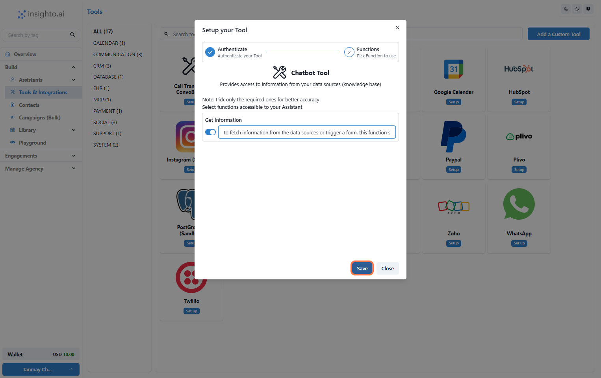
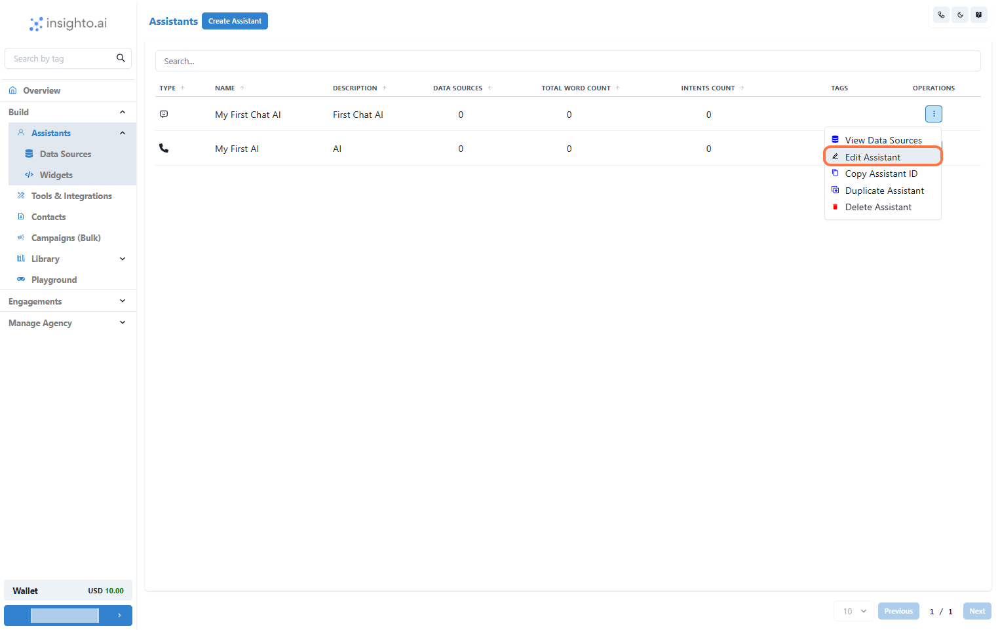
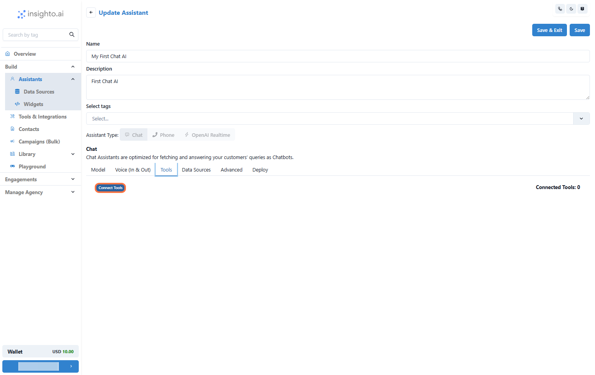
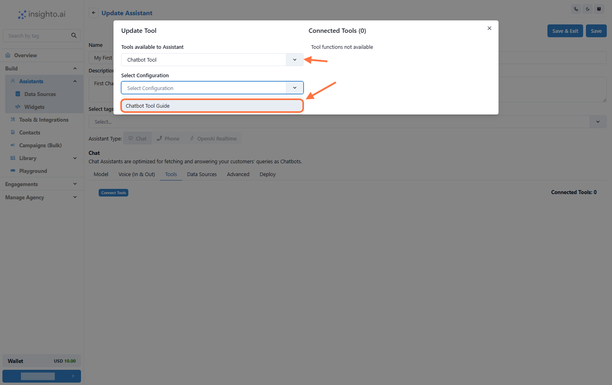
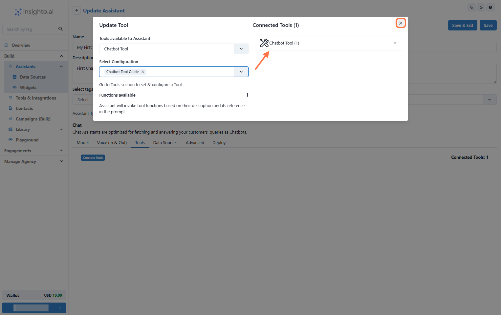

The Chatbot Tool is designed specifically for chat-type agents and acts as the logic layer when integrating other tools. It ensures that your assistant can fetch relevant information from data source or trigger a form. Use this tool to fine-tune how your assistant interacts with connected tools and handles queries smoothly.

 Note: This tool is essential when issues arise in retrieving data from connected sources or triggering forms in chat assistants. Proper setup ensures reliable performance across integrated features.

---
#  Setup Chatbot Tool in Insighto.ai

 Step 1: Go to Tools & Integration

From the left-hand sidebar of your Insighto dashboard, click on Tools & Integration.

---

 Step 2: Locate the Chatbot Tool and Click Set Up

Locate the Chatbot Tool and Click Set Up

---

 Step 3: Click on Start New

After clicking Set Up, a popup window will appear. Click the Start New button to begin creating a new configuration for the Chatbot Tool.

---

 Step 4: Name Your Configuration and Click Create

Enter a name for your Chatbot Tool configuration. Choose something descriptive that reflects the assistant or purpose it’s tied.

Once you've entered the name, click Create to proceed.

📝 Tip: Use a consistent naming convention if you're managing multiple assistants or configurations.

---

 Step 5: Enable the Get Information Function

In the configuration screen, toggle on the Get Information function. This allows your assistant to fetch responses from connected sources such as the Knowledge Base.

📝 Note:  
This function can also be optionally used to trigger a form when needed. To use it for that purpose, you’ll need to update the function’s description accordingly during setup.

---

 Step 6: Click Save to Complete the Tool Setup

Once you’ve configured the Get Information function and made any necessary updates, click Save to finalize your Chatbot Tool setup. This will apply all your changes and complete the setup process.

---

🎉 Congratulations!  
Your Chatbot Tool is now set up and ready to be used with your chat assistant.

---

# 🔌 Connect Tool with Chat Assistant

Step 7: Go to Assistants from Left panel

In the left panel of your dashboard, click on Assistants. This will take you to the page where all your chat & voice assistants are listed.

---

Step 8: Edit the Existing Chat Assistant

Find the chat assistant you want to connect the Chatbot Tool to. In the Operations tab, locate the three dots. Click on these dots to open a menu, then select the Edit Assistant option.

---

 Step 9: Click on Connect Tools

In the chat assistant editor, navigate to the Tools tab. Then, click on the Connect Tools button to start linking the Chatbot Tool (and any other necessary tools) to your assistant.

---

 Step 10: Select Tool Type and Configuration from the Dropdown

A popup window will appear once you click Connect Tools.

First, select the Tool Type from the dropdown. Choose Chatbot Tool as the type.

Then, the system will display an option to select the Tool Configuration from a second dropdown. Choose the configuration you created earlier.

Once selected, the tool will be linked to your assistant.

---

 Step 11: Confirm the Chatbot Tool Connection and Save Changes

After selecting the Chatbot Tool configuration, you’ll see a confirmation message that the Chatbot Tool has been successfully connected.

Close the popup window.

Don’t forget to save the changes in your assistant by clicking the Save button.

