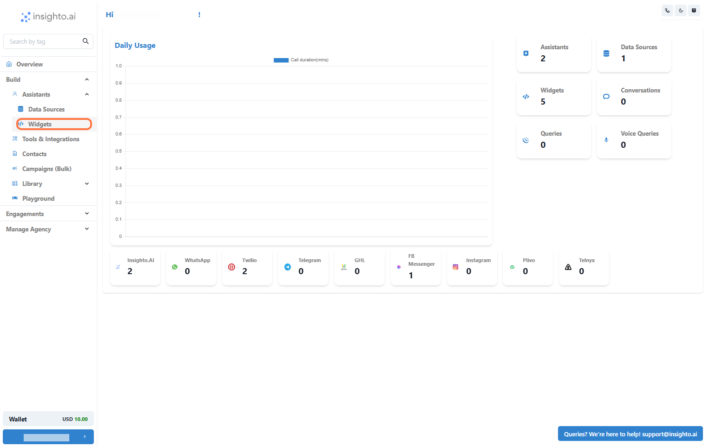
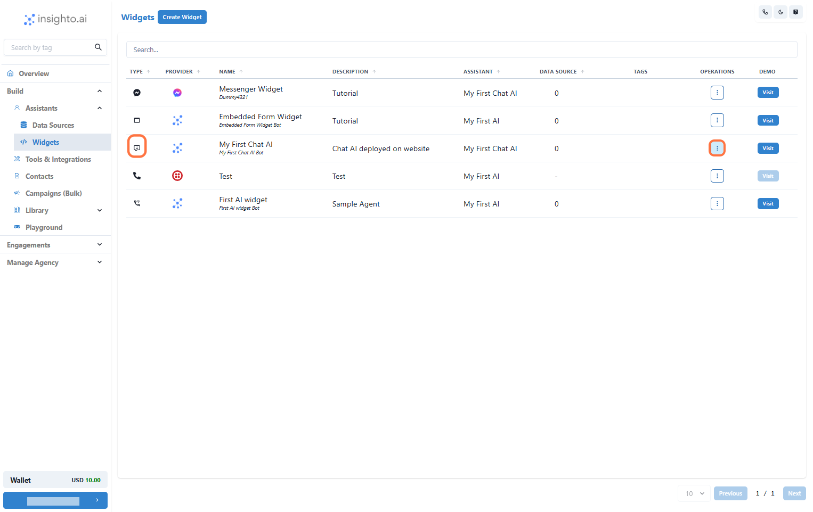
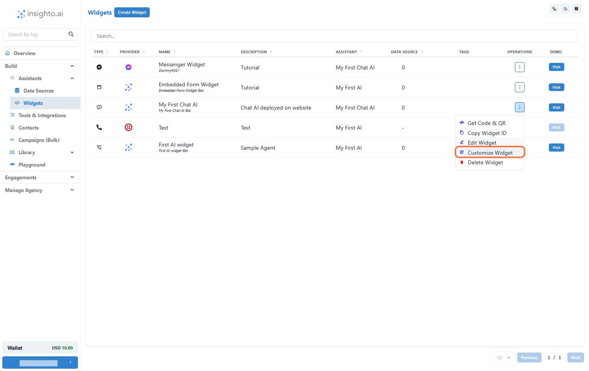
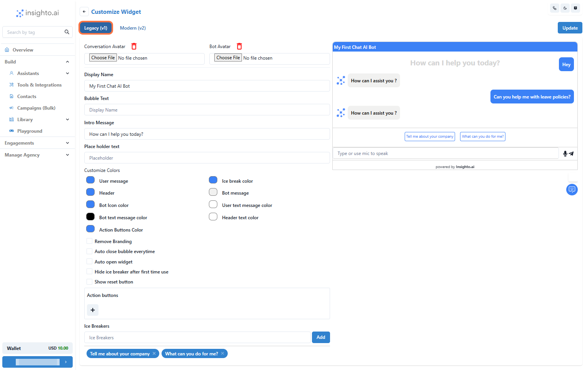
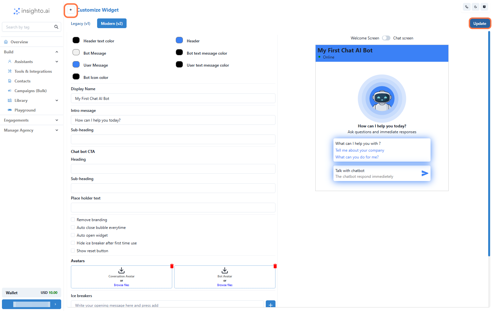

In this guide, you'll learn how to customize the appearance of your chatbot widget—whether you're using the legacy version or the modern version. We’ll walk you through where and how to update design elements like colors, themes, and layout to better align with your brand’s identity and provide a seamless user experience.:contentReference[oaicite:9]{index=9}

:contentReference[oaicite:11]{index=11}:contentReference[oaicite:13]{index=13}

---

## 📘 Guide Me

### 0

---

## 🎨 Where to Customize Your Chat Widget

**6 Steps**

### 1. Go to the Widgets Section

:contentReference[oaicite:15]{index=15}:contentReference[oaicite:17]{index=17}

### 2. Confirm Widget Type and Access Options

:contentReference[oaicite:19]{index=19}:contentReference[oaicite:21]{index=21}

- :contentReference[oaicite:23]{index=23}
- :contentReference[oaicite:26]{index=26}:contentReference[oaicite:28]{index=28}

:contentReference[oaicite:30]{index=30}:contentReference[oaicite:32]{index=32}

> 📝 **Note:** :contentReference[oaicite:34]{index=34}:contentReference[oaicite:36]{index=36}

### 3. Select Customize Widget from the Menu

:contentReference[oaicite:38]{index=38}:contentReference[oaicite:40]{index=40}

:contentReference[oaicite:42]{index=42}:contentReference[oaicite:44]{index=44}

### 4. Customize Your Widget – Legacy Version

:contentReference[oaicite:46]{index=46}:contentReference[oaicite:48]{index=48}

- :contentReference[oaicite:50]{index=50}
- :contentReference[oaicite:53]{index=53}
- :contentReference[oaicite:56]{index=56}
- :contentReference[oaicite:59]{index=59}:contentReference[oaicite:61]{index=61}

### 5. Customize Your Widget – Modern Version

:contentReference[oaicite:63]{index=63}:contentReference[oaicite:65]{index=65}

### 6. Save Your Changes and Return to Widget Section

:contentReference[oaicite:67]{index=67}:contentReference[oaicite:69]{index=69}

:contentReference[oaicite:71]{index=71}:contentReference[oaicite:73]{index=73}

> ✅ **Note:** :contentReference[oaicite:75]{index=75}:contentReference[oaicite:77]{index=77}

