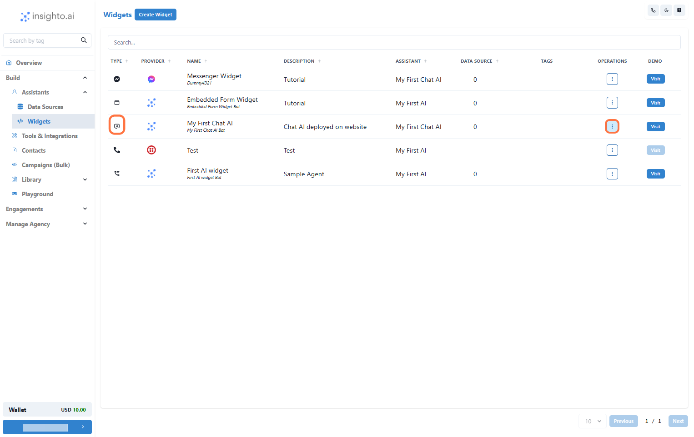

# Customizing Widgets

This guide explores the various customization options available for different widget types, including chat widgets, webcall widgets, and embedded forms. Learn how to tailor these widgets to align with your brand and user experience, covering settings like appearance, behavior, and integrations. By the end of this guide, you’ll be equipped to create a seamless and engaging experience for your users across all widget types.

## Guide Me

### 1. Confirm Widget Type and Access Options

In the widget list, look for the widget you want to customize. Make sure the:

- Widget Type is either Chat, Webcall or Embedded
- Provider Type is Insighto logo

Once confirmed, click on the three dots under the Operations column for that widget. This will open a menu with available actions.

📝 Note: Customization options are only available for Insighto chat widgets. Widgets connected to other platforms may have different settings.

## Customize Your Chat Widget

### 2. Select Customize Widget from the Menu

After clicking the three dots under the Operations column, a small menu will appear. From this menu, select Customize Widget.

This will open the customization panel where you can adjust the visual appearance and behavior of your chat widget.

### 3. Customize Your Widget – Legacy Version

Both the Legacy and Modern versions offer the same set of customization options. These include:

- Editing welcome text, placeholder, and chatbot name
- Choosing a color scheme that aligns with your brand
- Adding icebreaker messages to guide user interactions
- Enabling or disabling widget features like typing indicator, conversation restart, and more

### 4. Customize Your Widget – Modern Version

For the Modern version, make sure to click on the “Modern” option as shown in the image to begin customizing that layout.

### 5. Save Your Changes and Return to Widget Section

Once you’ve finished customizing your widget, click on the Update button to save all changes.

Then, click on Back to return to the main Widgets section.

✅ Note: Your changes will be applied immediately and will reflect across all live deployments where this widget is used—no extra steps needed.

## Customize your Web call Widget

### 6. Select Customize Widget from the Menu

After clicking the three dots under the Operations column, a small menu will appear. From this menu, select Customize Widget.

This will open the customization panel where you can adjust the visual appearance and behavior of your Web Call widget.

### 7. Customizing Webcall Widget (Iframe Deployment)

When using the Iframe deployment type for the webcall widget, you have the following customization options:

- ✅ Header Name – Choose a custom header title for your widget.
- ✅ Add Logo – Upload your logo by pasting the URL.
- ✅ Remove Branding – Option to remove the platform’s default branding for a more personalized appearance.
- ✅ Record Button Color – Customize the color of the record button to align with your brand.

### 8. Customizing Webcall Widget (Phone Deployment)

For the Phone deployment type, you can customize these key elements:

- ✅ Bot Icon – Choose a custom icon to represent the bot during the call.
- ✅ Record Button Color – Adjust the color of the record button to better match your visual identity.

## Customize your Embedded Form Widget

### 9. Select Customize Widget from the Menu

After clicking the three dots under the Operations column, a small menu will appear. From this menu, select Customize Widget.

This will open the customization panel where you can adjust the visual appearance and behavior of your Embedded widget.

### 10. Customizing Embedded Form Widget

For embedded form widgets, you can personalize the appearance and behavior to align with your brand and user experience. The available customization options include:

- ✅ Header Name – Set the title that appears at the top of the form.
- ✅ Logo – Add your company logo using a URL.
- ✅ Remove Branding – Option to hide platform branding for a white-labeled look.
- ✅ Confirmation Message – Define the message shown to users after they submit the form.
- ✅ Submit Button Label – Customize the text on the submission button (e.g., "Submit", "Send", "Continue").
- ✅ Background Color – Adjust the background color of the widget to match your site’s design.

> "If you build it, they will come."
