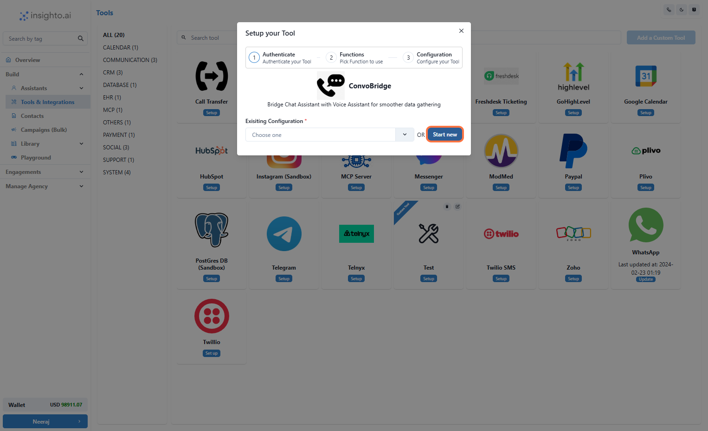
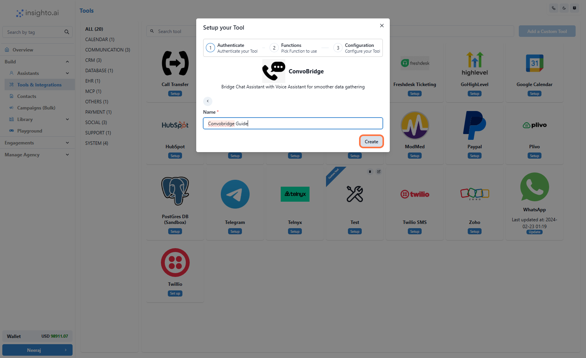
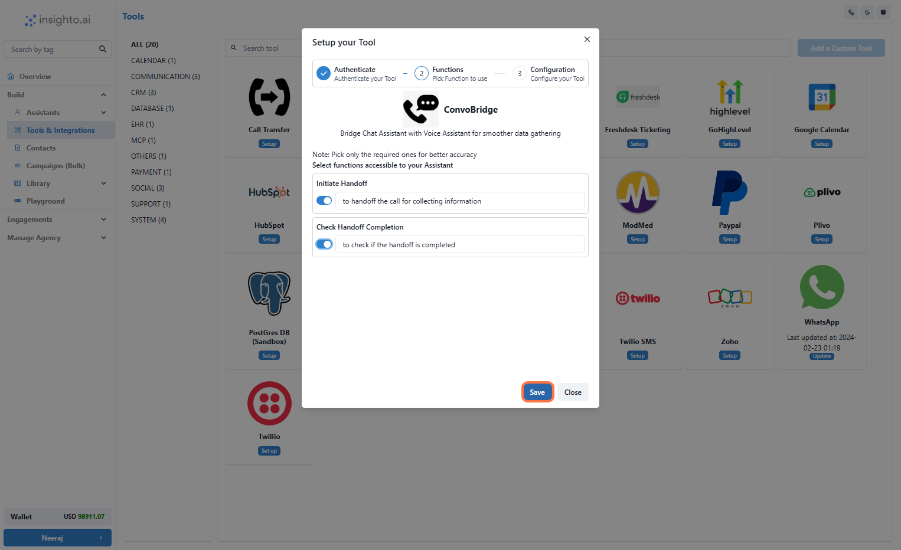
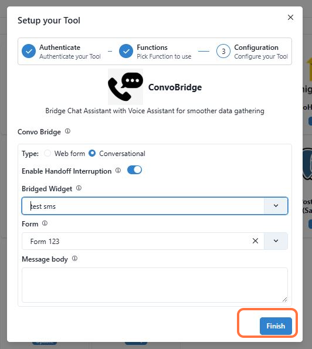
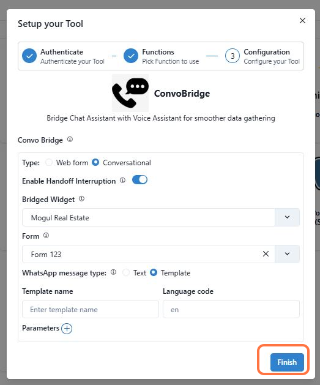

## 🧩 Introduction

**ConvoBridge** is ideal for situations where capturing details such as email addresses, home addresses, or other relevant information is more efficient through text chat rather than voice. After gathering these details via chat, the conversation can smoothly continue with a phone agent.

### ✅ Prerequisites

- An AI chat SMS agent or AI WhatsApp chat agent  
- A phone agent setup using either Web call or Phone Number  
- A form that will capture the details  

> **Note:** The tool will be connected to the parent widget (i.e., Phone Assistant), and the form will connect to the bridged widget (i.e., Chat Assistant).

In this guide, you’ll learn how to configure ConvoBridge in two main ways:

- **Option A:** Phone assistant to SMS widget  
- **Option B:** Phone assistant to WhatsApp widget  

---

1. Go to Tools & Integration and Click on Setup

From the left-hand sidebar of your Insighto dashboard, click on **Tools & Integration**.

Locate the **Convo Bridge Tool** and click **Set Up**.


---

2. Click on Start New

After clicking **Set Up**, a popup window will appear.

Click the **Start New** button to begin creating a new configuration.



---

3. Name Your Configuration and Click Create

Enter a name for your tool configuration.

Once you’ve entered the name, click **Create** to proceed.



---

4. Enable the Handoff Functions and Click Save

In the configuration screen, toggle on the **Handoff** function.

Click **Save** to finalize your tool setup. This will apply all your changes and complete the setup process.

---

After enabling the ConvoBridge function in your dashboard, you’ll be guided to the configuration setup where you’ll customize how the handoff will work.


---

## 📱 Phone Assistant to Chat Assistant (SMS)

5. Setup with SMS Widget

Here’s what to do in this configuration step:

- **Select the Type:**  
  Choose between `Webform` or `Conversational`.

  - **Webform:** A link is shared with the customer, and they fill in the form themselves.  
  - **Conversational:** The chat agent will ask questions from the form one by one, creating a more interactive experience.

- **Enable Interruption (Optional):**  
  Toggle this on if you want the phone agent to be able to interrupt the conversation while the user is filling out the chat widget.

- **Select the Bridged Widget:**  
  Choose **SMS** as the widget to use for the chat handoff.

- **Select a Form:**  
  From the dropdown, select the form you want to use to capture user details.

- **Configure the Message Body:**  
  This is the first message sent to the user when the chat handoff begins.

  **Example:**

  > Hi! Please provide a few details so we can continue helping you. Click the link below to start.



---

## 💬 Phone Assistant to Chat Assistant (WhatsApp)

6. Setup with WhatsApp Widget

Here’s what to do in this configuration step:

- **Select the Type:**  
  Choose between `Webform` or `Conversational`.

  - **Webform:** A link is shared with the customer, and they fill in the form themselves.  
  - **Conversational:** The chat agent will ask questions from the form one by one.

- **Enable Interruption (Optional):**  
  Toggle this on if you want the phone agent to be able to interrupt the conversation.

- **Select the Bridged Widget:**  
  Choose **WhatsApp** as the widget for the chat handoff.

- **Select a Form:**  
  From the dropdown, select the form to use.

- **Configure the Message Type (WhatsApp-specific):**  
  WhatsApp has limitations for sending the first outbound message.

  You’ll see two options:

  - **Text:** Only works if the user was active in the past 24 hours. (Not recommended for new users.)  
  - **Template:** Recommended. Use a pre-approved template from your WhatsApp Business account.

  When you select **Template**, you’ll be prompted to enter:

  - **Template Name**  
  - **Language Code**

  You can retrieve these from your Meta Business account.



---

## 🔗 Connect with Phone Assistant and Trigger Using Prompt

7. Connect with Your Phone Assistant

Use the following prompt sample for configuring your assistant logic:

```text
Greet the user by thanking them for calling Computer Care and ask their name.

If they ask to disconnect the call, then do it.

Then ask for their phone number including country code.

To capture their information, hand off the conversation and ask the user to provide the information on WhatsApp.

During the handoff, any submissions received must be acknowledged and spelled back to the user (e.g., email address, home address).

Once the user confirms, check if the handoff is completed and verify each detail by spelling it out.

If validated by the user, thank them and disconnect the call.
