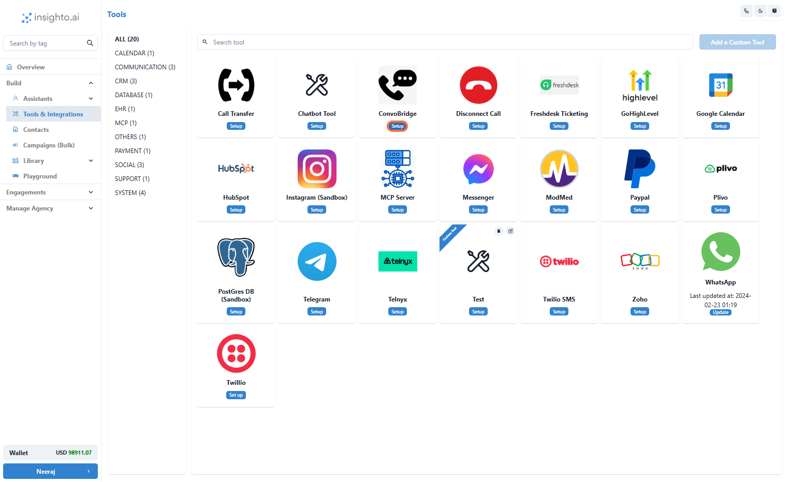
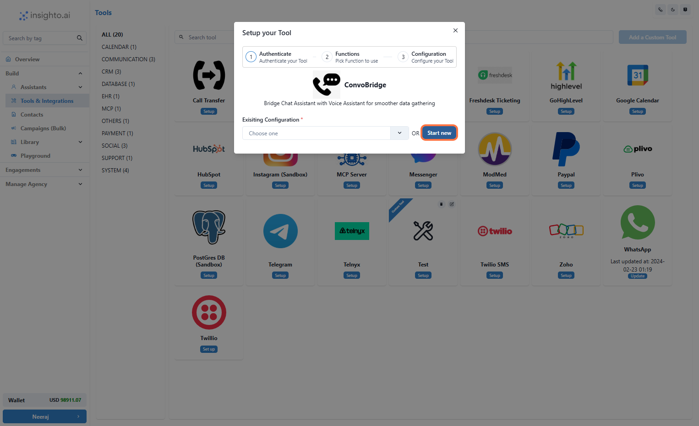
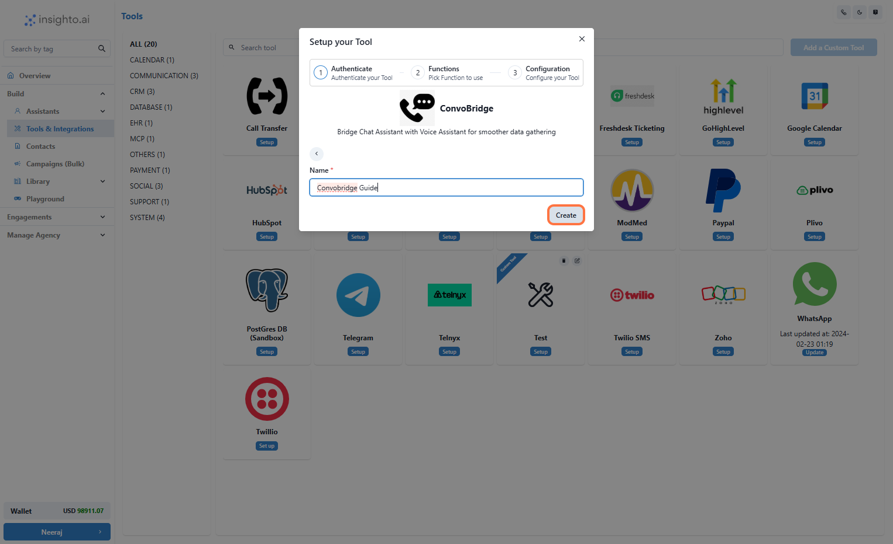
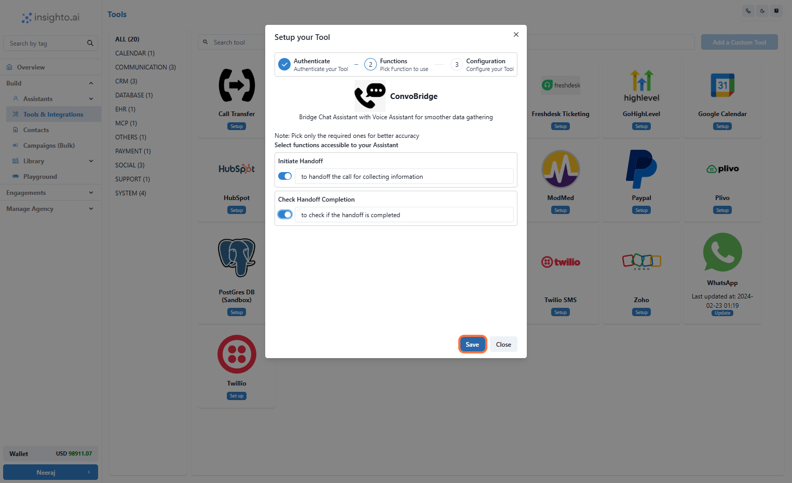
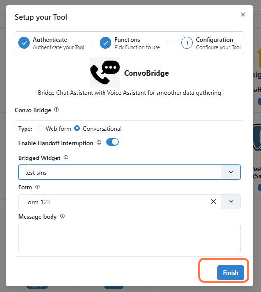
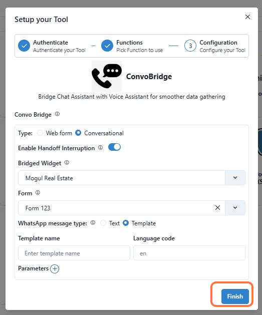

This comprehensive guide will help you configure the ConvoBridge Tool, which enables seamless handoff from an AI phone assistant (using Web call or number) to a chat assistant (via SMS or WhatsApp)

---

## Introduction 

ConvoBridge is ideal for situations where capturing details such as email addresses, home addresses, or other relevant information is more efficient through text chat rather than voice. After gathering these details via chat, the conversation can smoothly continue with a phone agent.

Before getting started, ensure you have the following prerequisites:

✅ An AI chat SMS agent or AI WhatsApp chat agent  
✅ A phone agent setup using either Web call or Phone Number.  
✅ A Form that will capture the details  

> **Note:** Tool will be connected to parent widget i.e. Phone Assistant & Form will connect to bridged widget i.e. Chat Assistant

In this guide, you’ll learn how to configure ConvoBridge in two main ways:

**Option A**: Phone assistant to SMS widget  
**Option B**: Phone assistant to WhatsApp widget

---

1. Go to Tools & Integration & Click on Setup

From the left-hand sidebar of your Insighto dashboard, click on **Tools & Integration**.  
Locate the **Convo Bridge Tool** and click **Set Up**.

---

2. Click on Start new

After clicking **Set Up**, a popup window will appear. Click the **Start New** button to begin creating a new configuration.

---

3. Name Your Configuration and Click Create

Enter a name for your Tool configuration.  
Once you’ve entered the name, click **Create** to proceed.

---

4. Enable the Handoff Functions & Click on Save

In the configuration screen, toggle on the function.  
Click **Save** to finalize your Tool setup. This will apply all your changes and complete the setup process.

> After enabling the ConvoBridge function in your dashboard, you’ll be guided to the configuration setup where you’ll customize how the handoff will work.

---

## Phone Assistant to Chat Assistant (SMS) 

---

5. Setup with SMS Widget

**Select the Type:**  
Choose between **Webform** or **Conversational**.

- **Webform**: Users are sent a link to the form along with a custom message and are taken to a hosted webpage where they fill out the form themselves. This allows for a quick, self-serve experience.  
- **Conversational**: The chat agent will ask questions from the form one by one, creating a more interactive, guided experience.

**Enable Interruption (Optional):**  
Toggle this on if you want the phone agent to be able to interrupt the conversation while the user is filling out the chat widget.  
> Tip: You can use real-time feedback to keep users engaged on your Phone Assistant—for example, by acknowledging or thanking them after they provide specific details like their email address.

**Select the Bridged Widget:**  
Choose **SMS** as the widget to use for the chat handoff.

**Select a Form:**  
From the dropdown, select the form you want to use to capture user details.

**Configure the Message Body:**  
This is the first message sent to the user when the chat handoff begins.

- **For Webform type**:  
  Include the placeholder  in your message. This will be automatically replaced with the actual form URL you configured.

  **Example:**  
  _“Hi! Please provide a few details so we can continue helping you. Click the link below to start: {{form_link}}”_

- **For Conversational type**:  
  No placeholder is needed.

---

## Phone Assistant to Chat Assistant (WhatsApp) 

---

6. Setup with WhatsApp Widget

Here’s what to do in this configuration step:

**Select the Type:**  
Choose between **Webform** or **Conversational**.

- **Webform**: Users are sent a link to the form along with a custom message and are taken to a hosted webpage where they fill out the form themselves. This enables a quick, self-serve experience.  
- **Conversational**: The chat agent will ask questions from the form one by one, creating a more interactive, guided experience.

**Enable Interruption (Optional):**  
Toggle this on if you want the phone agent to be able to interrupt the conversation while the user is filling out the chat widget.  
> Tip: You can use real-time feedback to keep users engaged on your Phone Assistant—for example, by acknowledging or thanking them after they provide specific details like their email address.

**Select the Bridged Widget:**  
Choose **WhatsApp** as the widget for the chat handoff.

**Select a Form:**  
From the dropdown, select the form you want to use to capture user details.

**Configure the Message Type (WhatsApp-specific):**  
WhatsApp has strict limitations for sending the first outbound message to users. You’ll see two options:

- **Text**: Only works if the user has been active within the last 24 hours. This is generally not recommended for new outreach.  
- **Template**: The recommended option. A template is a pre-approved message created in your WhatsApp Business configuration and approved by Meta.

When you select **Template**, you’ll be prompted to enter:

- The **Template Name**
- The **Language Code**

You can retrieve these details from your Meta account. These ensure that your outbound message can be delivered to the recipient.

> **Note:** You can create templates as per your needs directly in your Meta WhatsApp Business account and use them here. These templates are used to initiate the first conversation with the user.

**Configure the Message Body (Webform only):**  
This is the first message sent to the user when the chat handoff begins.

- **For Webform type**:  
  Include the placeholder  in your message. This will be automatically replaced with the actual form URL you configured.

  **Example:**  
  _“Hi! Please provide a few details so we can continue helping you. Click the link below to start: {{form_link}}”_

- **For Conversational type**:  
  No placeholder is needed.

---

## Connect with Phone Assistant & Trigger using prompt 
---

7. Connect With your Phone Type Assistant

**Prompt Sample:**

Greet the user as thanking them for calling Computer Care and asking their name,  
if they ask to disconnect the call then do it.  
then ask their phone number including country code.  
to capture their information, handoff the conversation and ask the user to provide the information on WhatsApp.  

During the handoff, any submissions received must be acknowledged and spelled out back to the user. Such as email address or address  

once the user confirms, check if handoff is completed and verify each detail with them by spelling out.  

If validated by the user then thank them and disconnect the call

---

## Additional Notes  

If you're using a telephony provider (like Twilio), the handoff can be initiated to the caller’s phone number—there’s no need to gather it during the conversation.

If you're using a web calling widget, make sure to collect the user’s phone number before initiating the handoff, as it won’t be available otherwise.
