Add knowledge to your assistant by uploading documents, scraping websites, or pasting raw content — so it can answer queries accurately based on your data.

---
## Create PDF Data Source:

   1. Click on Data Sources

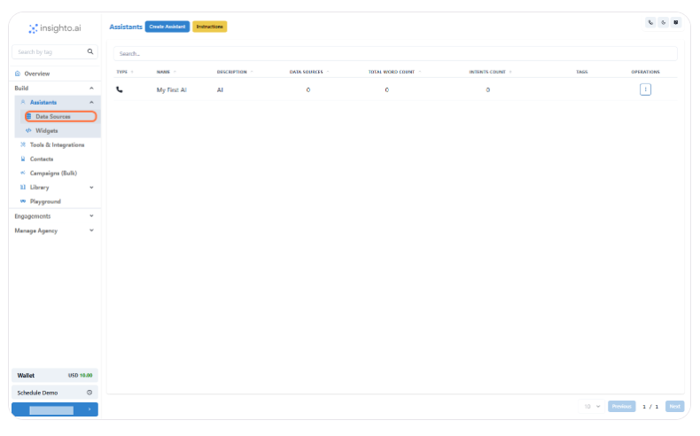

---

   2. Click on Create Data Source

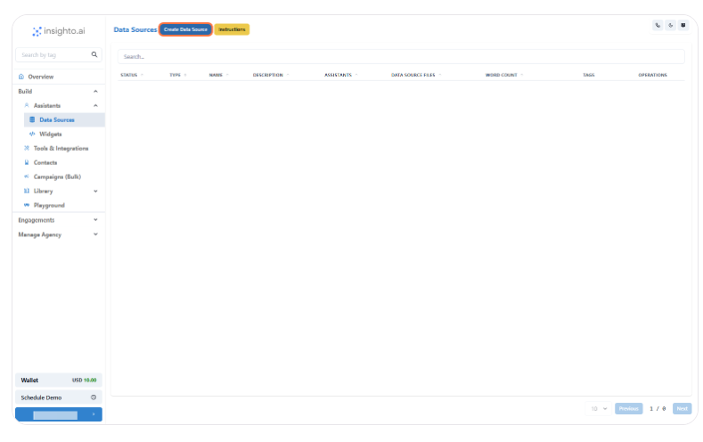

---

   Available Options to Add Your Knowledge Base

Insighto supports multiple formats to help you upload or link your assistant's knowledge:

✅ PDF Upload – Upload documents like policy guides, manuals, or help docs  
🌐 Website Scraper (HTTP) – Provide a website URL for the AI to crawl and specify the maximum number of pages (default Value: 100)  
📝 Text Blob – Manually paste raw text  
📊 CSV Upload – Upload a two-column CSV file where one column holds text and the other can include image URLs (great for visual FAQs or catalogs)

📌 In this guide, we’ll walk you through uploading a PDF as your data source.

---

   3.  Upload Your PDF File

Select PDF as the data source type, then:

Enter a name and brief description for your data source  
Click Upload PDF and select your file  
Hit Submit to save the data source.

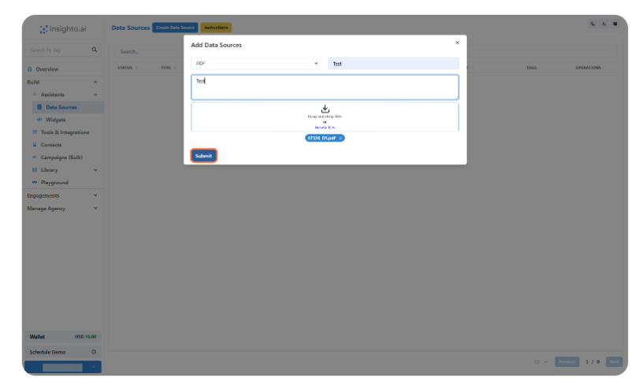

📎 Tip: You can add multiple PDFs if you want to expand your assistant’s knowledge.

Upload Your PDF File

---

   4. Indexing in Progress 

---

   5. Data Source Ready to Use

Once the status changes to Ready to use, your PDF is fully processed and can now be connected to your assistant.

🚀 Let’s move ahead and link it to your voice assistant in the next step.

✅ Data Source Ready to Use

🎉 Data Source Created Successfully!  
Your PDF data source is now ready. Let’s go ahead and connect it to your assistant so it can start using the information you’ve uploaded.

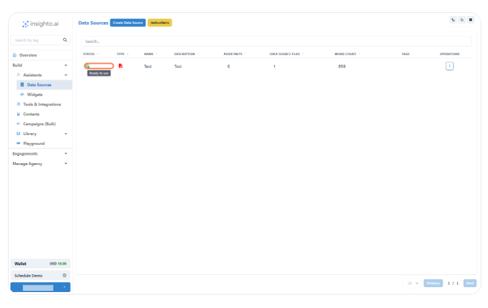

---

   6. Click on Assistants

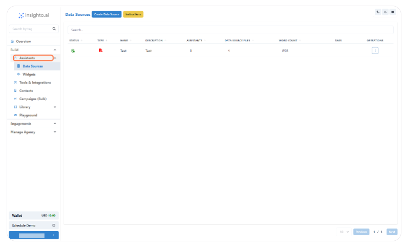

---

   7. Click on Options

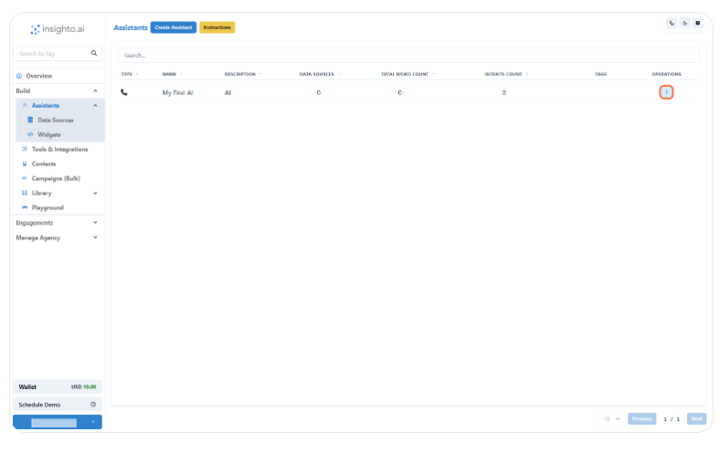

---

   8. Click on Edit Assistant

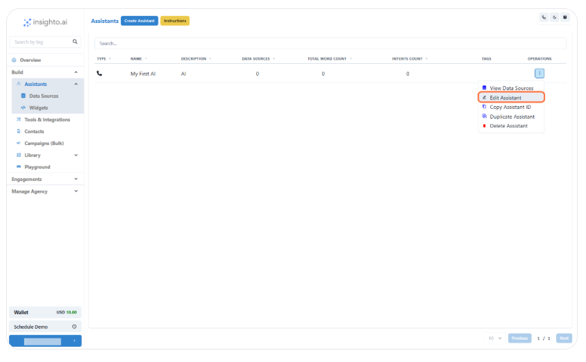

---

   9. Click on Data Sources

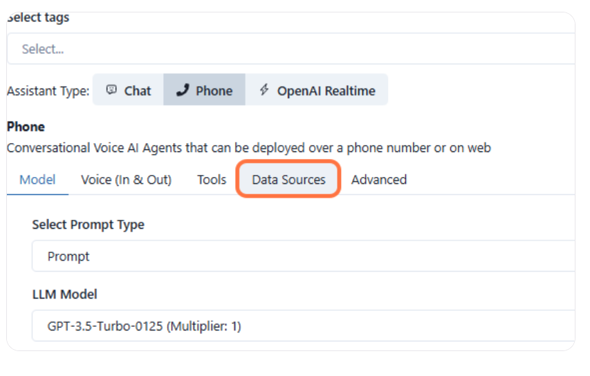

---

   10. Click on Assign Data Source

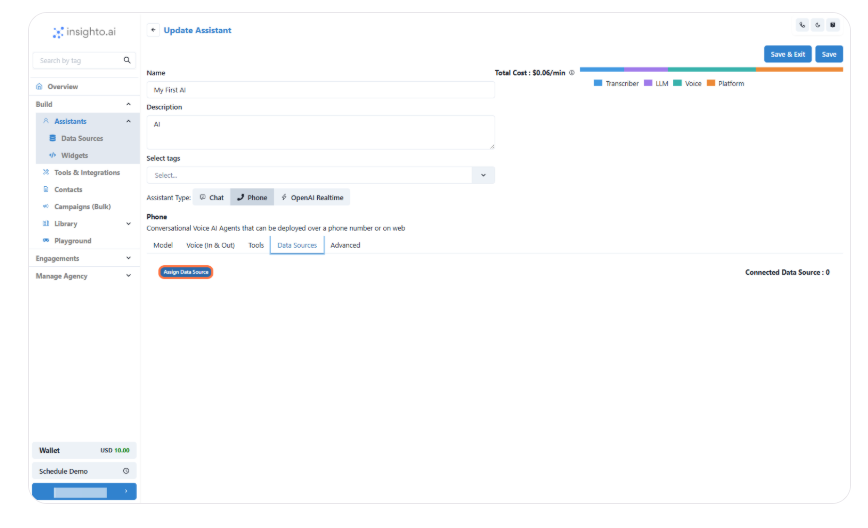

---

   11. Connect the Data Source

Select the checkbox next to the PDF data source you want to connect.  
Once selected, click Close to confirm and finish the connection.

Connect the Data Source

🎉 Congratulations! Your Data Source is Now Connected  
You’ve successfully linked your PDF data source to the assistant.  
To save these changes, click Save & Exit.

🔗 Once saved, your assistant will be ready to use the new knowledge.

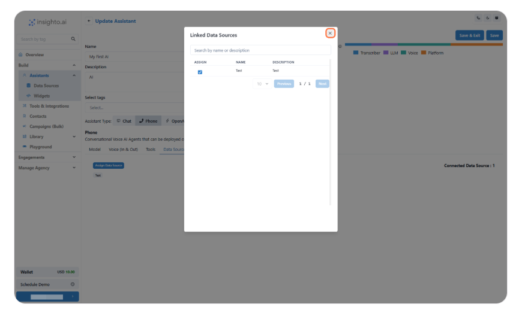

---

# 📂 Add Data Source: HTTP, CSV or Text Blob  
 

In addition to uploading a PDF, you can also connect your assistant to a CSV file or Text Blob or Scraped data from website.  
Choose the method that best fits your data

---

   12. HTTP Type Data source

Provide a website base URL for the AI to crawl and specify the maximum number of pages (default: 100).

Glob Format – You can also include or exclude specific URLs using the Glob format.  
Click here to learn more about Glob format.

HTTP Type Data source

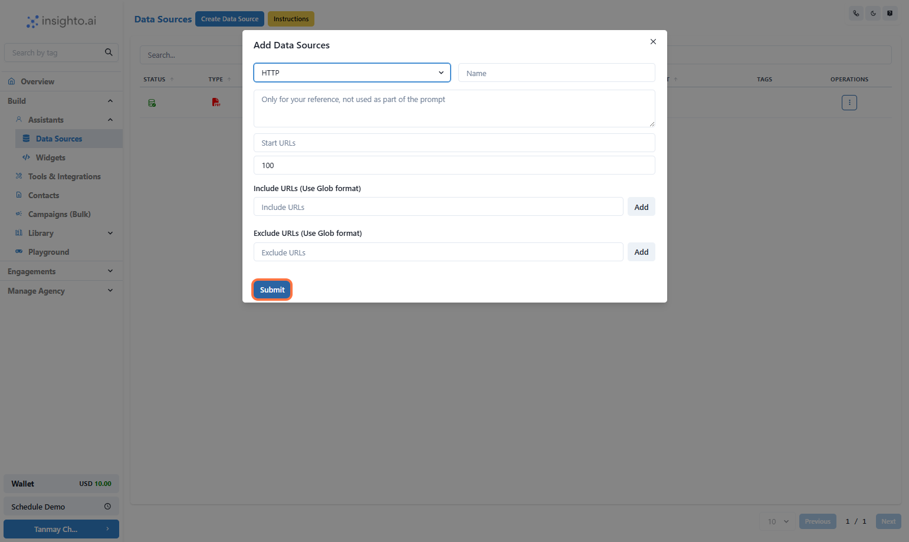

---

   13. Text Blob Data Source

Copy and paste raw text content from any source.

Text Blob Data Source

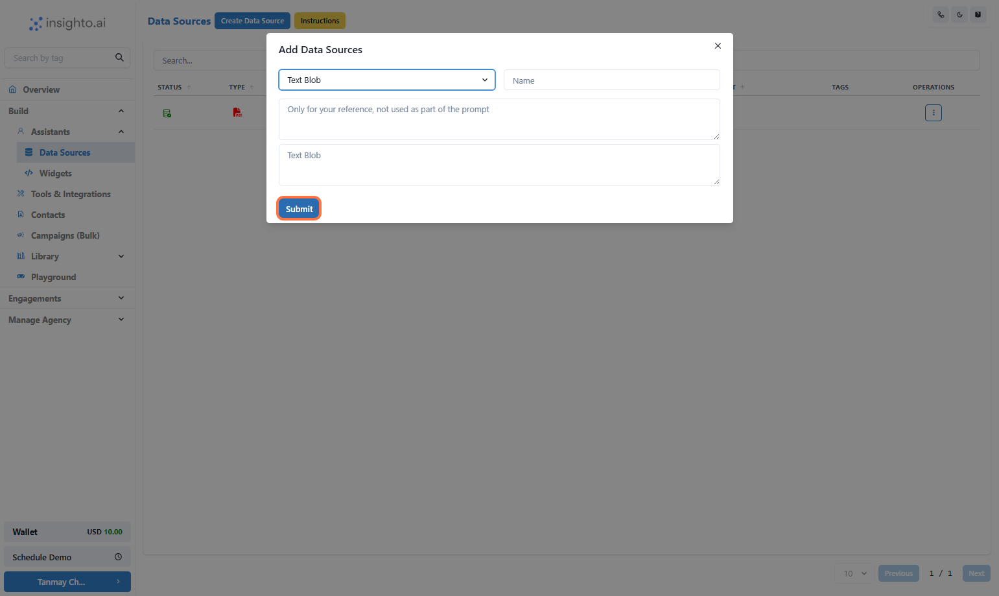

---

   14. CSV ( Text + Image) Data Source

Upload a CSV file containing both text and image references to enhance the Knowledge Base.

CSV ( Text + Image) Data Source

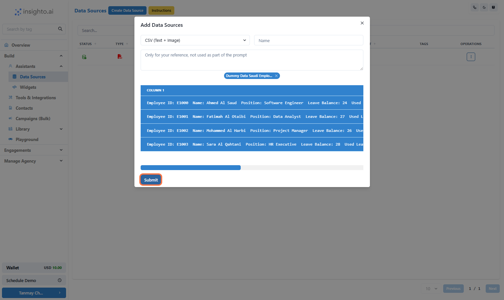

---

# 🛠️ Troubleshooting & FAQs

| Issue                                                   | Description                                                                                                                                                | Solution                                                                                                            |
|----------------------------------------------------------|------------------------------------------------------------------------------------------------------------------------------------------------------------|---------------------------------------------------------------------------------------------------------------------|
| Data source status shows "Failed"                        | This can happen if the format of the uploaded file is incorrect or the website crawler didn’t complete the indexing. Only a few pages may be crawled.     | Delete the data source and upload it again.                                                                        |
| Unable to delete the data source                         | If a data source is connected to an assistant, the delete option will not be visible.                                                                      | First disconnect it from any assistant it's assigned to.                                                           |
| What is the word count?                                  | Indicates the total number of words in the uploaded data source. Each plan has word count limits.                                                         | You can check your usage in the Billing & Usage section of your account.                                           |
| Add another file to an existing data source              | You can either create a new data source or upload another file to the existing one.                                                                        | Ensure the file is of the same type (e.g., add a PDF to an existing PDF data source).                              |
| Will the data update automatically after website crawl?  | No, crawled data is static.                                                                                                                                | If the website content changes, you must manually recrawl it to update the data.                                   |
| Connect to a dynamic database                            | Useful for live, frequently updating data.                                                                                                                 | Use the Custom Tools option under Tools & Integrations to set up dynamic data connections via API.                |
