In this guide, you’ll learn how to build custom forms, connect them with your assistant, and trigger them dynamically during conversations to capture structured information from users.

---
1.  Navigate to the Library

Click on **Library** from the left panel in your dashboard. This will expand a dropdown with options like **Forms**, **Tools**, and more.

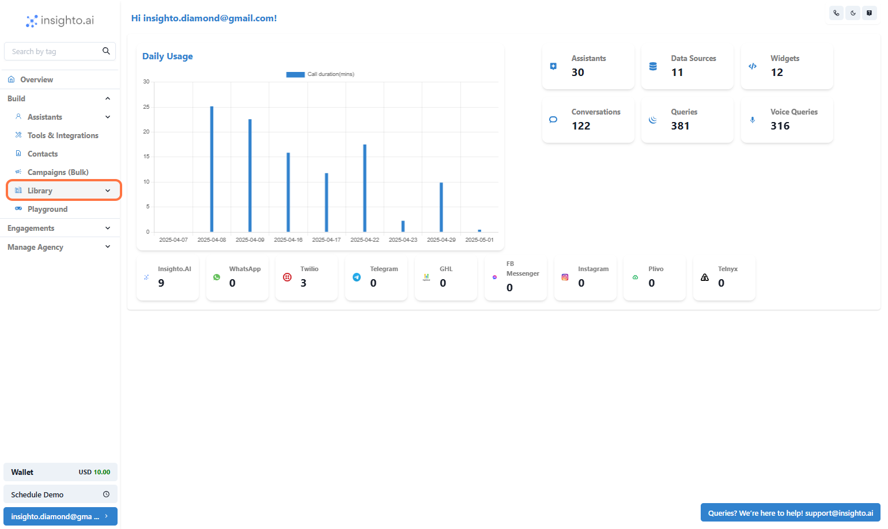

2.  Click on Forms

From the dropdown under **Library**, click on **Forms** to view existing forms or create a new one.

---

3.  Click on Create Form

Hit the **Create Form** button at the top to start building a new form.

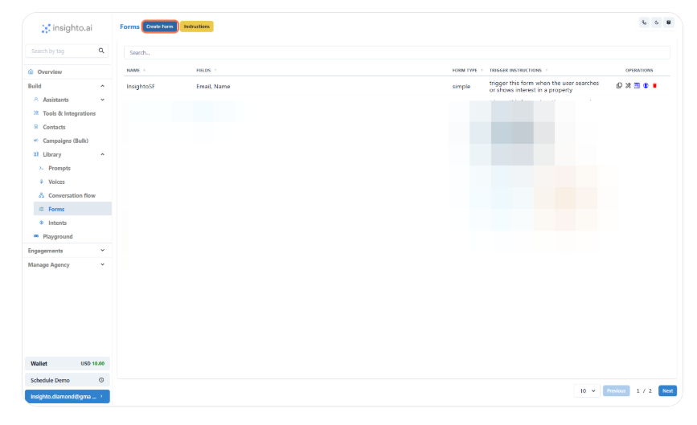

---

4.  Define Basic Form Details

Start by selecting the **Form Type** and giving your form a meaningful **Name**.

Use the **Trigger Instruction** field to define a phrase or keyword that, when mentioned by the user during a conversation, will automatically trigger this form.

Choose a label for the **Submit Button** (e.g., “Send”, “Submit”, “Done”).

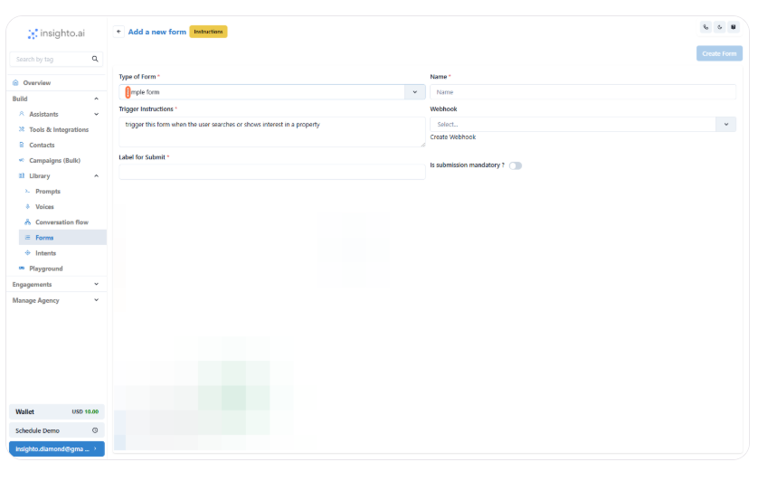

---

5.  Add a Text Field to Capture User Name

To create a field that captures the user's name, select **Text** as the field type and fill in the following:

- **Name**: Used internally to identify the field. Avoid spaces. Use formats like `FullName` or `full_name`.
- **Description**: A short helper text to guide the user on what to enter in this field.
- **Label**: This is the visible field name on the form. You can use spaces here, like **Full Name**, for better readability.
- **Required**: Enable this checkbox if you want to make this field mandatory for form submission.

After filling in these details, click **Add Field** to include it in the form.

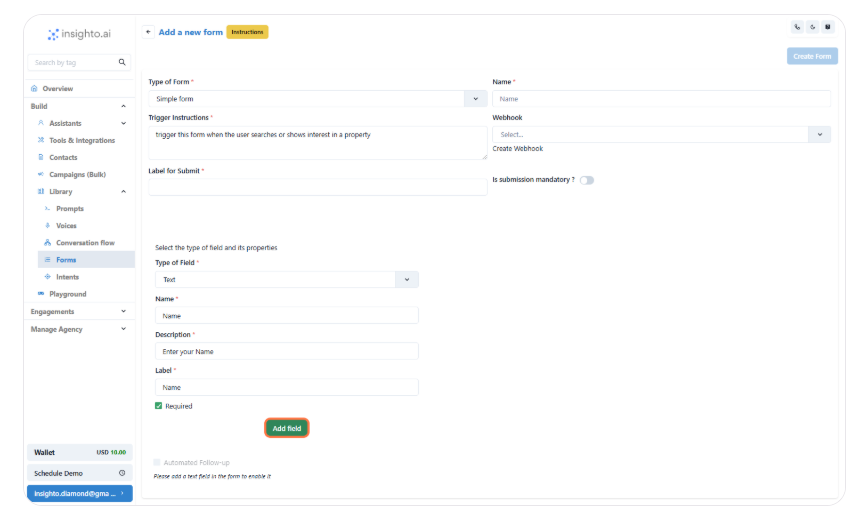

---

6.  Add a Phone Number Field

To capture a user's phone number, select **Telephone** as the field type. Fill in the following details:

- **Name**: Internal reference for the field (e.g., `PhoneNumber`). Avoid using spaces.
- **Description**: Text to guide the user (e.g., “Enter your phone number including area code”).
- **Label**: The visible field name shown to users (e.g., **Phone Number**).
- **Required**: Check this box if the phone number must be provided before form submission.
- **Show Country Code**: Enable this checkbox to allow users to select their country code.
- **Default Country Code**: Set a default country code to prefill the field (e.g., `+1` for the US).

Once all fields are filled, click **Add Field** to save it.

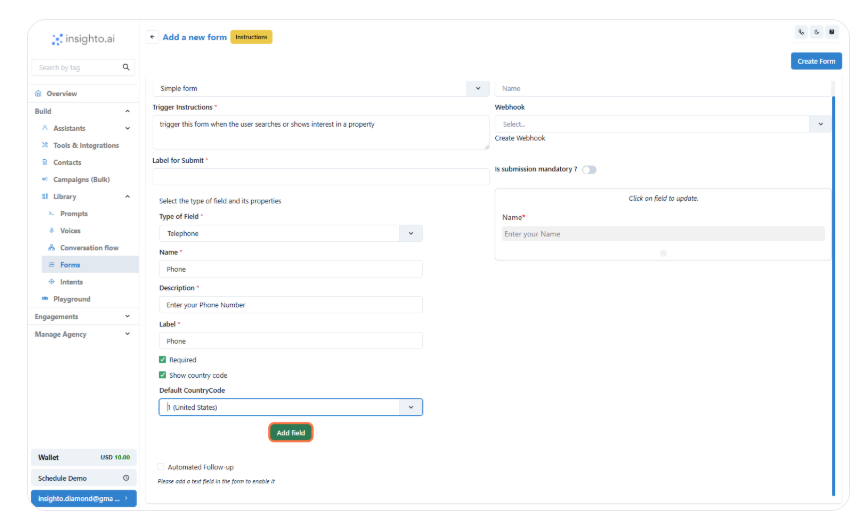

---

7.  Edit or Delete a Form Field

To edit or delete a field:

- Hover over the field and click on it.
- In the left panel, choose **Update** to edit or **Delete** to remove the field.
- Make necessary changes and save, or confirm deletion.

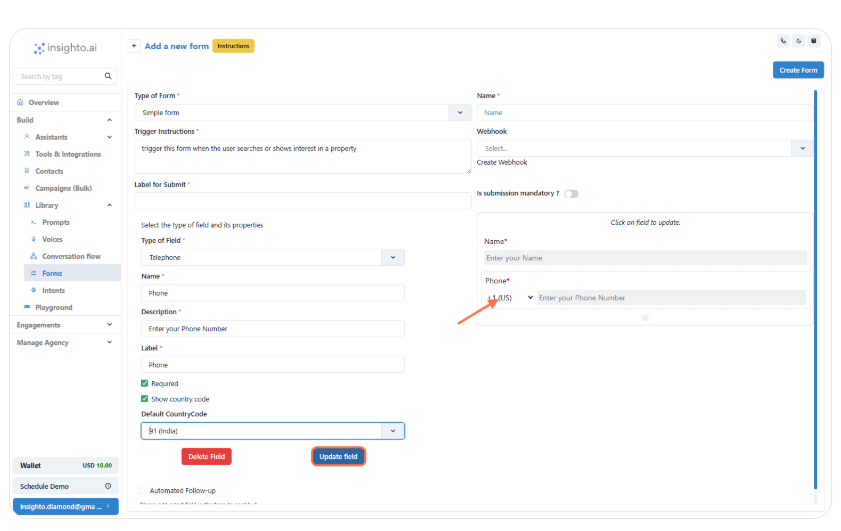

---

8.  Click on Create Form

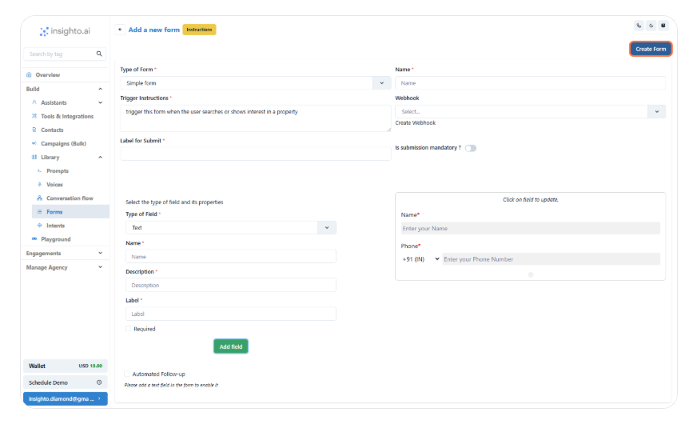

---

9.  Go to Assistants

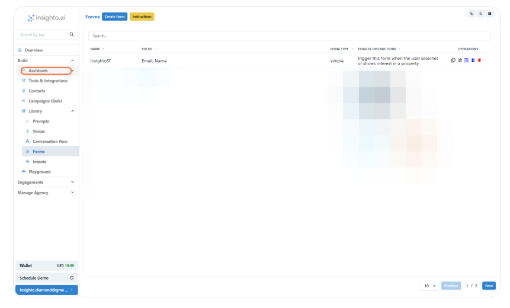

---

10. Click on Options

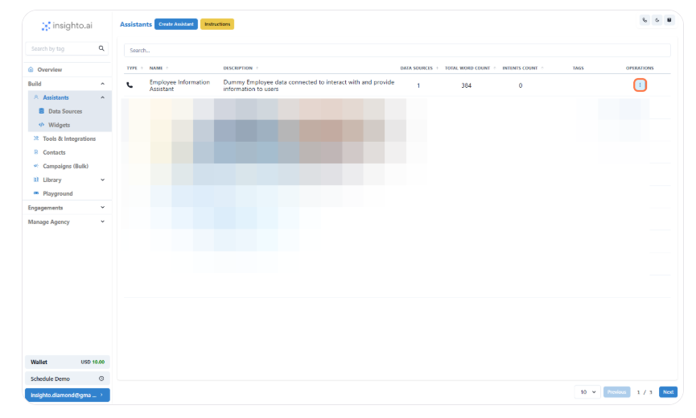

---

11.  Click on Edit Assistant

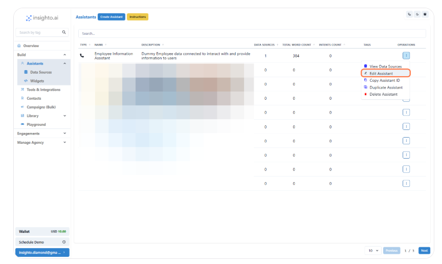

---

12.  Click on Advanced

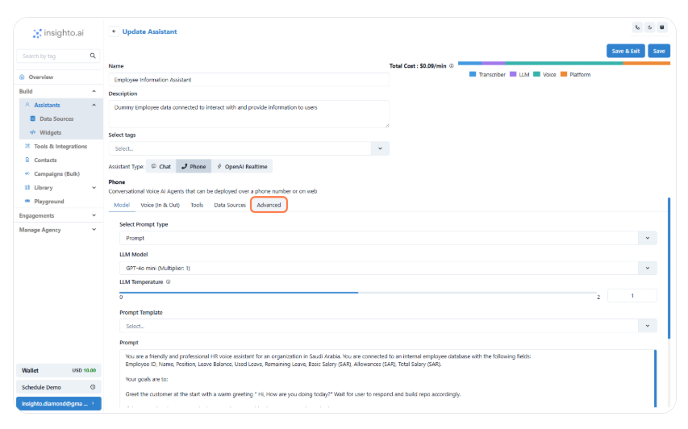

---

13.  Click on Assign Form

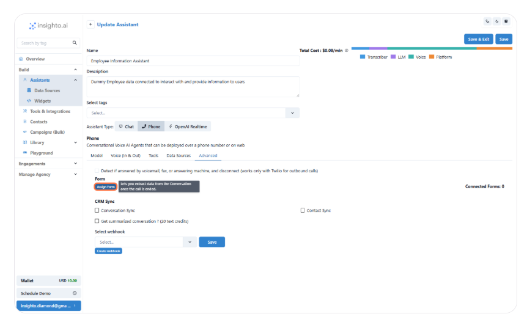

---

14.  Connect the Form

Select the checkbox next to the form you want to connect.

Once selected, click **Close** to confirm and finish the connection.

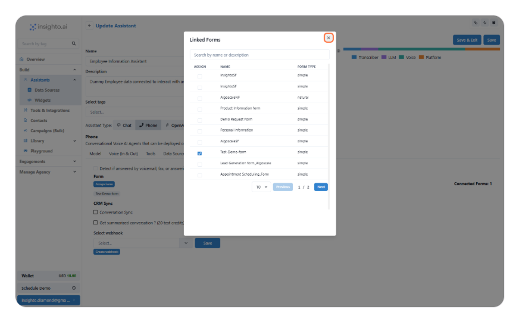
