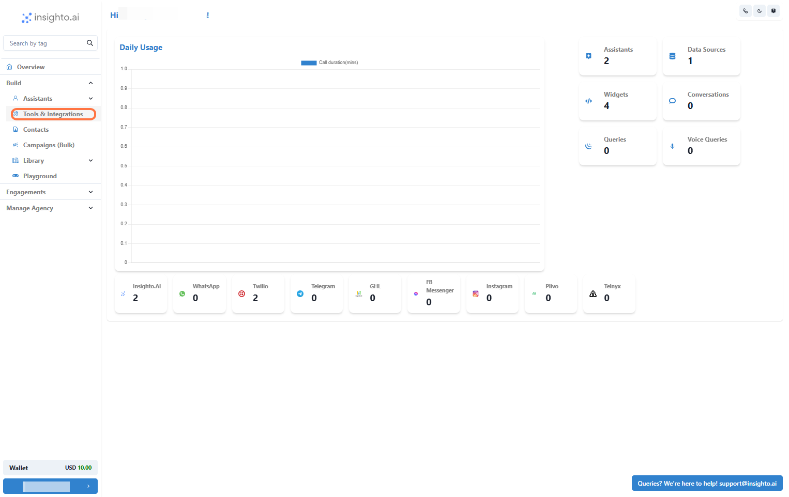
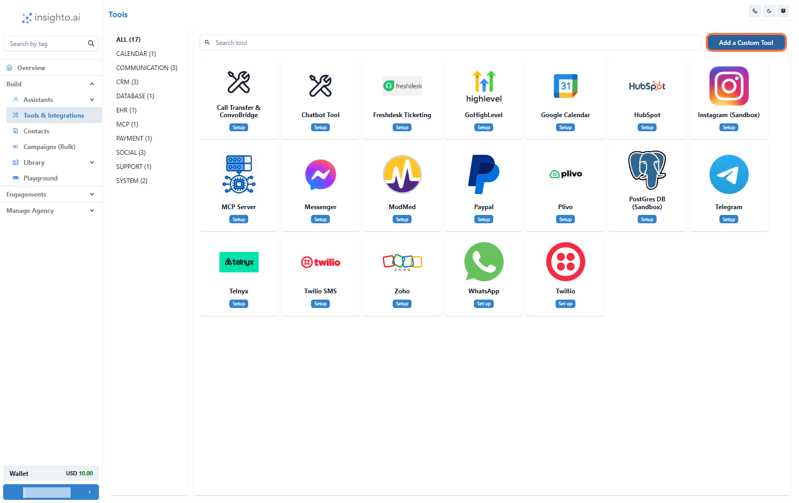
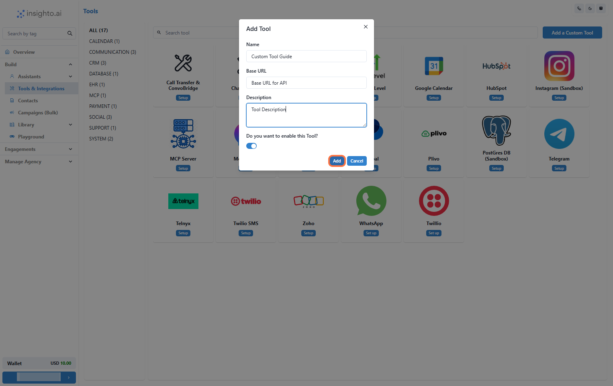
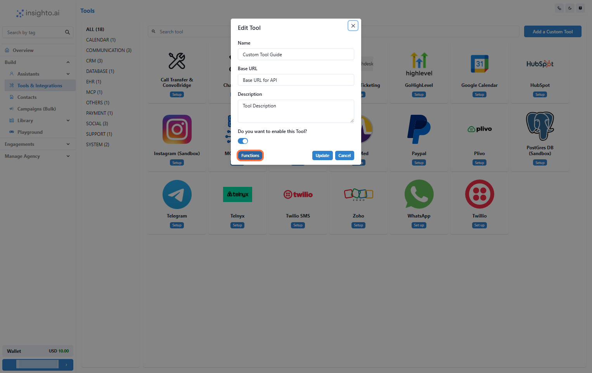
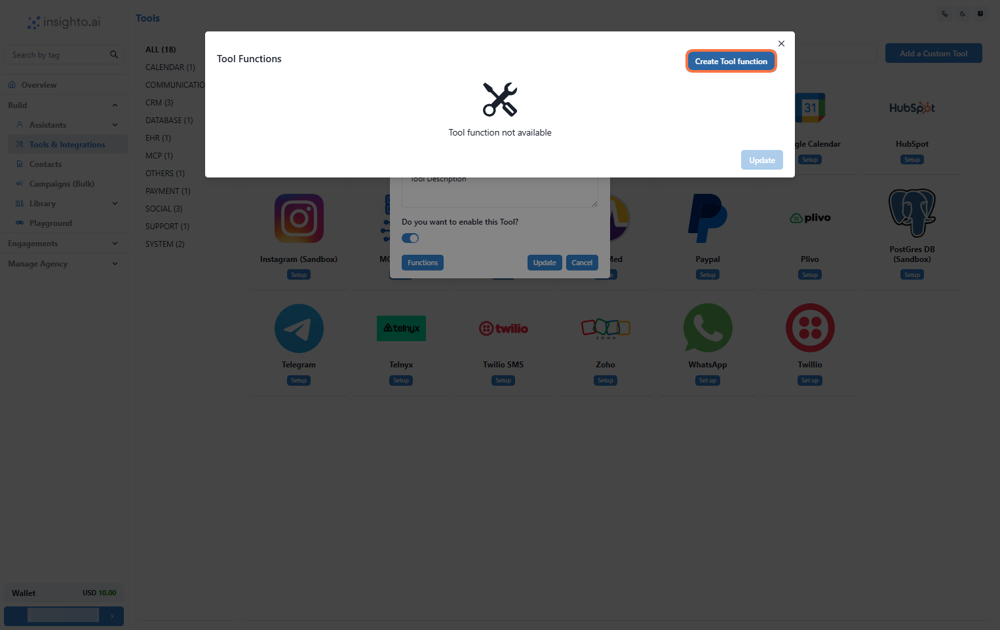
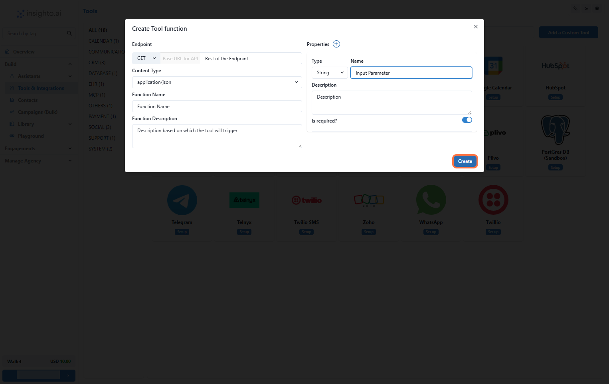
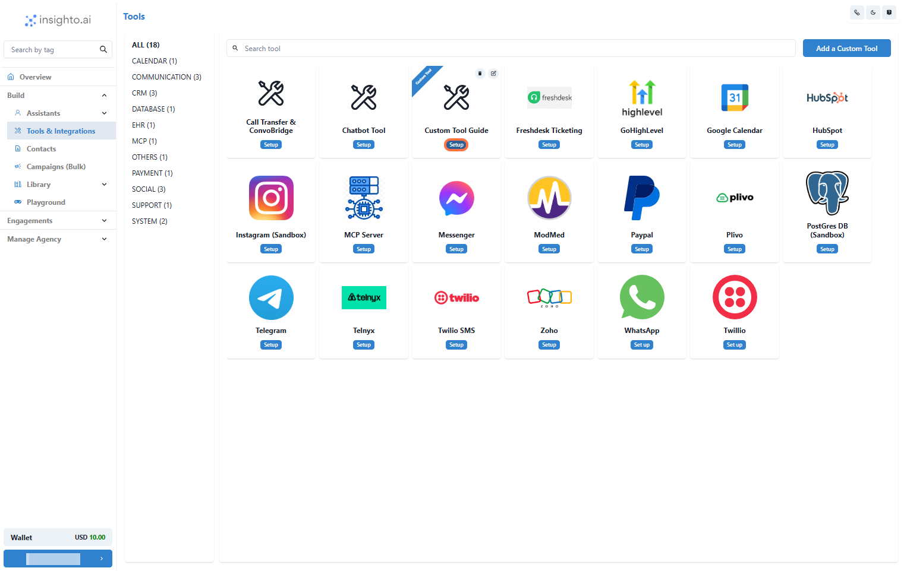
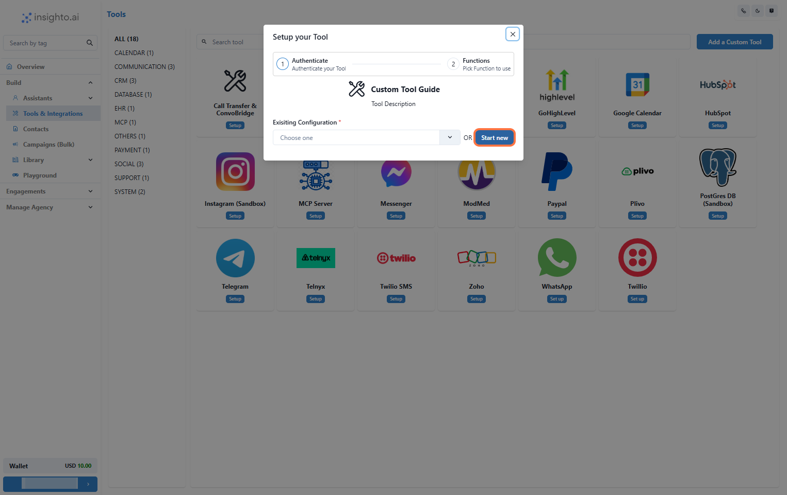
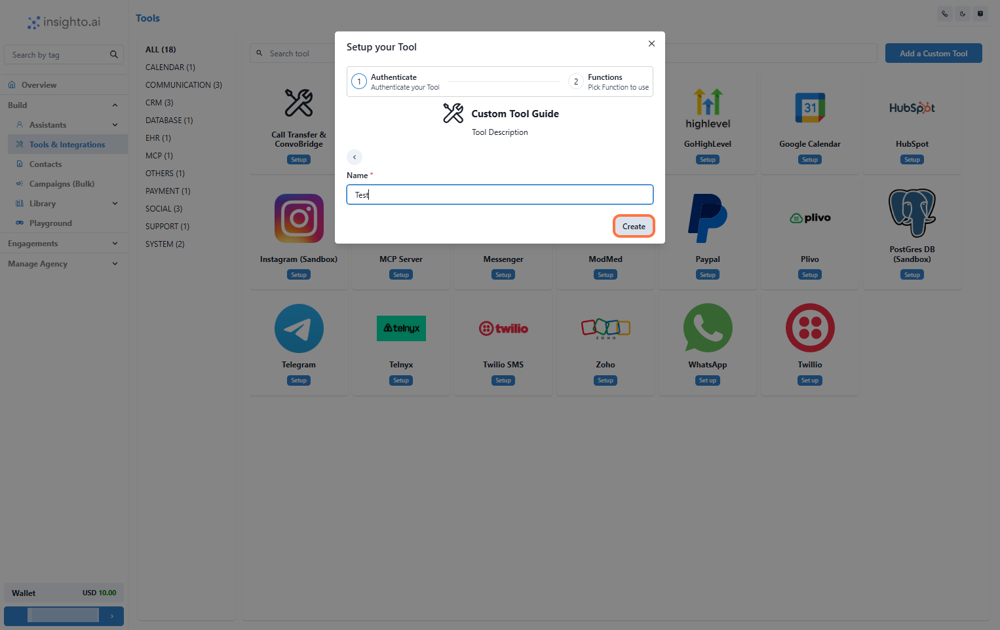
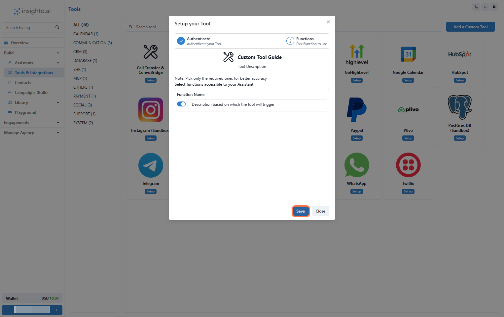

Connect any tool or platform you use with Insighto using our API. Once connected, your custom tools can work directly with the Insighto assistant to perform tasks and save you time. Whether it’s sending data, getting updates, or automating actions, you can make everything work together without extra effort.

---

## 🛠️ Create your Custom Tool

1. Go to Tools & Integration 

From the left-hand sidebar of your Insighto dashboard, click on **Tools & Integration**.

---

2. Click the "Add Custom Tool" Button

Find the **Add Custom Tool** button in the interface. Once located, click on it to start the process of creating your tool.

---

3. Fill Out the Add Tool Form

In the **Add Tool** dialog box, input all the requested details:

- **Name**: Enter a suitable name for your custom tool.  
- **Base URL**: This is the fixed part of the external API URL you want to use.  
- **Description**: Write a brief description of what your custom tool does and how you plan to use it.  

Once done, click **Add** to save your custom tool.

---

## ⚙️ Configure Functions for Your Custom Tool 

4. Locate and Edit Your Newly Created Tool

Find the custom tool you just created in the list. Click on **Edit**.

---

5. Click on the "Functions" Option

In the popup that appears after clicking **Edit**, click on the **Functions** tab.

---

6. Click on the "Create Function" Option

Click on the **Create Function** button.

---

7. Define Your Tool Function

Fill out the following fields:

- **Endpoint**: The URL endpoint this function will call.
- **Content Type**: Specify the content type (e.g., JSON).
- **Function Name & Description**: A clear name and description that will help trigger this function from prompts.

**Properties** (used as parameters):
- **Type** (e.g., string, integer)
- **Name**
- **Description**

Click **Create** to save the function.

---

## 🔗 Setting Up Your Custom Tool to Connect with the Assistant 

8. Click on Set Up

Locate the Tool and click **Set Up**.

---

9. Click on Start New

A popup will appear. Click **Start New** to create a new configuration.

---

10. Name Your Configuration and Click Create

Enter a descriptive name for your tool configuration and click **Create**.

---

11. Enable Required Functions and Save

Toggle on all the functions you want your assistant to use, then click **Save**.

---

## 🤖 Connect with Your Assistant

1. Go to the assistant you want to connect this tool with.
2. Click **Edit** on the assistant.
3. Navigate to the **Tools** tab.
4. Find and connect your newly created custom tool.
5. Add prompts that trigger your tool’s functions.
6. Use the phrase **“using the available tool”** in prompts to ensure the assistant activates it correctly.

