---

Turn form submissions into real-time conversations! This guide walks you through setting up the Embedded Form Widget with Twilio, where users fill out a form on your website—including their phone number—and instantly receive a call from your AI agent to handle their queries.

Perfect for lead capture, support, or qualification workflows, this widget bridges form interaction and voice automation seamlessly.

⚡ As soon as the form is submitted, the AI-initiated call is triggered—no delays, no manual follow-ups!

---

1. **Create Your Form with a Phone Field**

Before setting up the Embedded Form Widget with Twilio, make sure you’ve already created a form in Insighto that includes a phone number field.

🔗 [Follow this guide to learn how to create a form in Insighto](/Creating-Forms-and-Connect-them-with-Assistants.mdx)→

For this setup, we’re using a form that has already been created and includes all necessary fields—especially the Phone field, which is required to trigger the AI call.

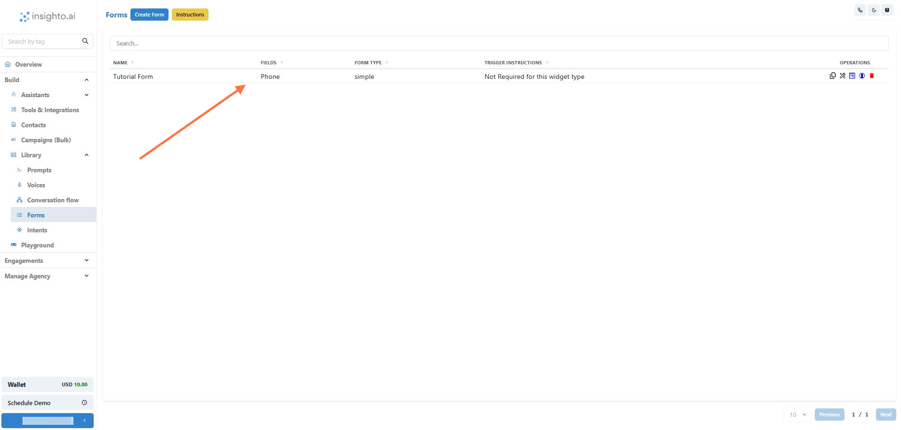

---

2.  **Set Up Your Voice Assistant**

To handle the call triggered by the form, you’ll need to have a Voice-type Assistant configured in Insighto.

🔗 [Click here to learn how to create a Voice Assistant](/Comprehensive-Guide-to-AI-Voice-Agent.mdx)→

Make sure the assistant is trained to handle the type of queries expected from users submitting the form. This assistant will be the one engaging with the user over the call initiated via Twilio.

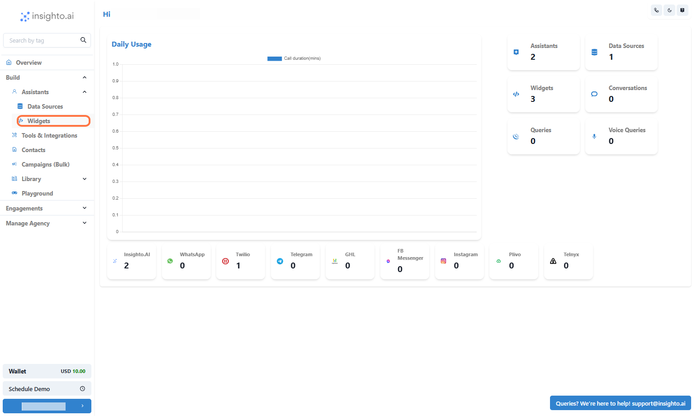

---

# 🔧 Steps to Set Up the Embedded Form Widget with Twilio

Now that you’ve created your form and configured a voice assistant, follow the steps below to deploy the Embedded Form Widget that instantly triggers AI-powered calls using Twilio.

---

3.  Click on **Widgets**

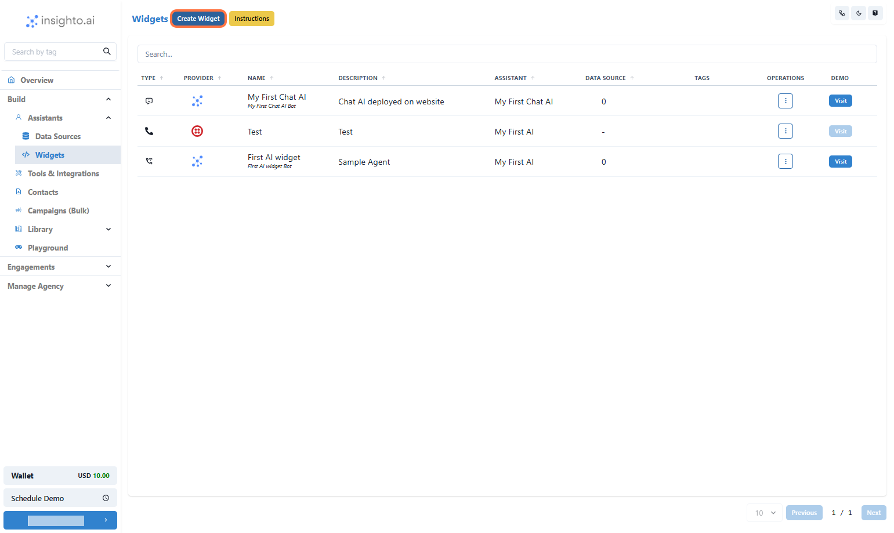

---

4.  Click on **Create Widget**

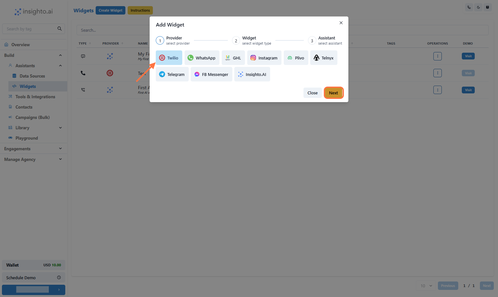

---

5.  **Select Provider Type**

Select **Twilio** as Provider type as the embedded form widgets work with Twilio only

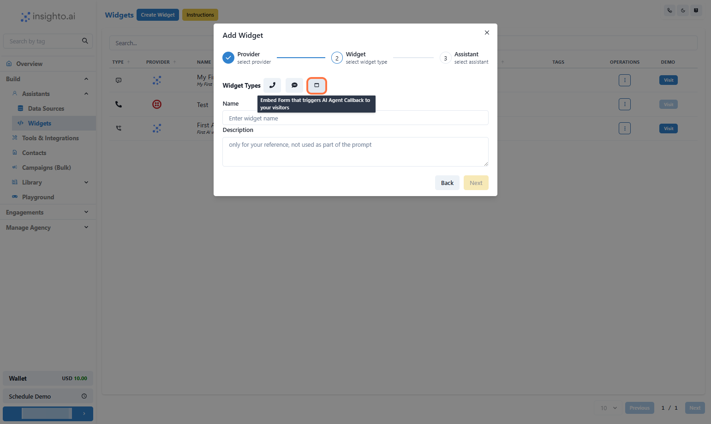

---

6.  **Select Widget Type**

Select the Widget Type as shown below

Provide Name & Description of the Widget

Click on **Next**

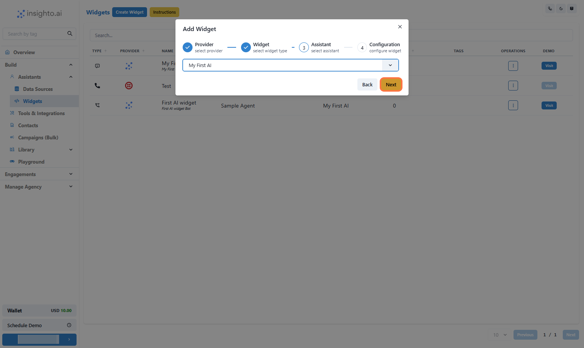

---

7.  **Select the Assistant**

Select the Assistant from the dropdown and proceed

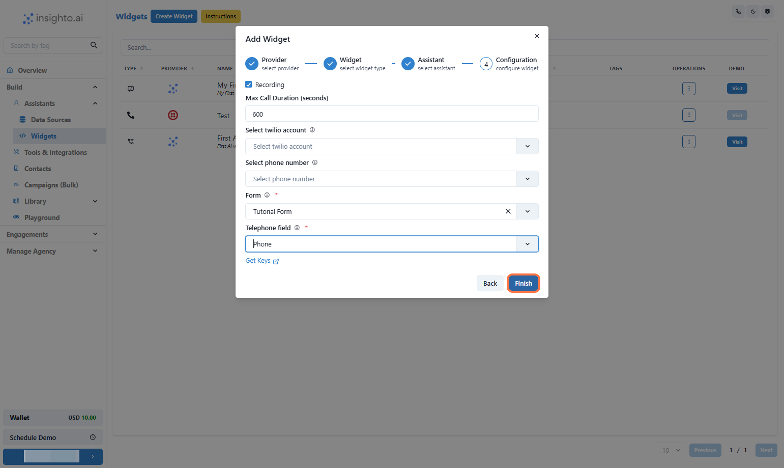

---

8.  **Configure Twilio Embedded Widget**

In this step, set the behavior for your Twilio-powered voice assistant:

- Enable **Call Recording** (optional) – Recordings will be available in your Twilio dashboard  
- Set **Maximum Call Duration** in seconds (e.g., 300 for 5 minutes)  
- Select your **Twilio Account** from the dropdown  
- Choose a **Phone Number** associated with that account  
- **Form**: Select the form created in step 1 and then select the **Phone** field from the form  

Once done, click **Finish** to complete deployment.

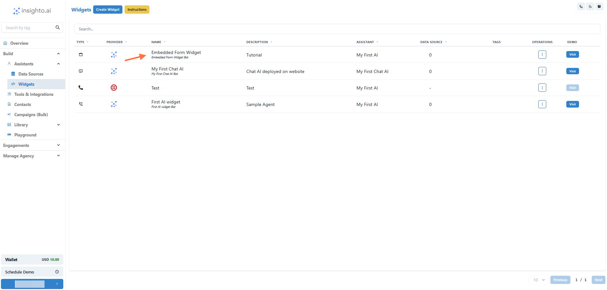

---

9.  🎉 Your Embedded Form Widget is ready!

---

##Let's try it

---

10.  Click on **Visit**

---

11.  Enter your phone number and submit to test it now!

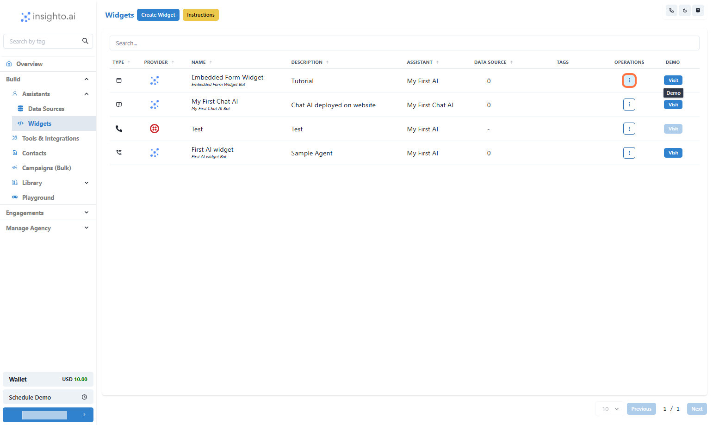

---

# Deploy it on your website now!

---

12.  Click on **Options**

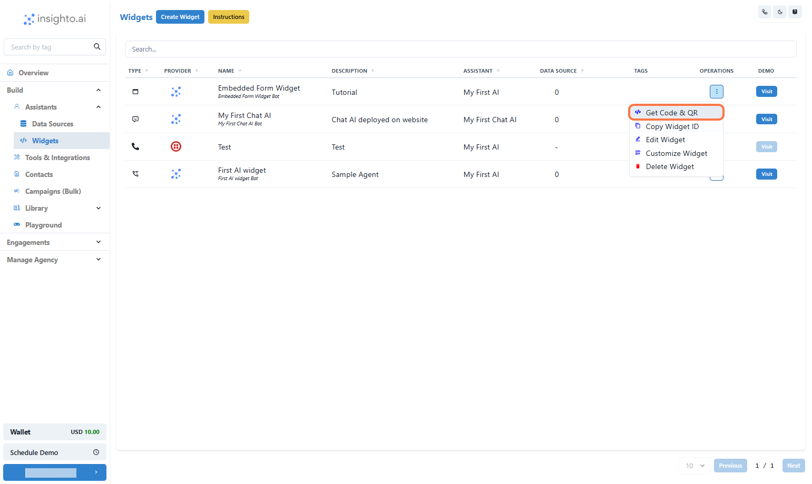

---

13.  Click on **Get Code & QR**

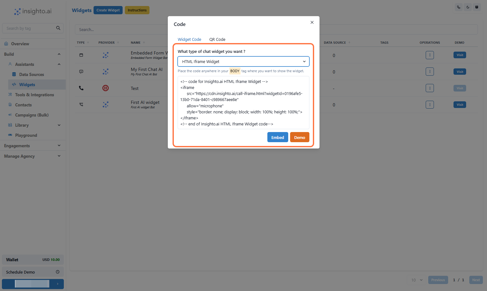

---

14.  **Copy the Widget Code and add to your website**

- **HTML iFrame (Only Supported)** – Embed the assistant directly within a specific section of your webpage; place the iFrame code within the `<body>` where you want it displayed.

