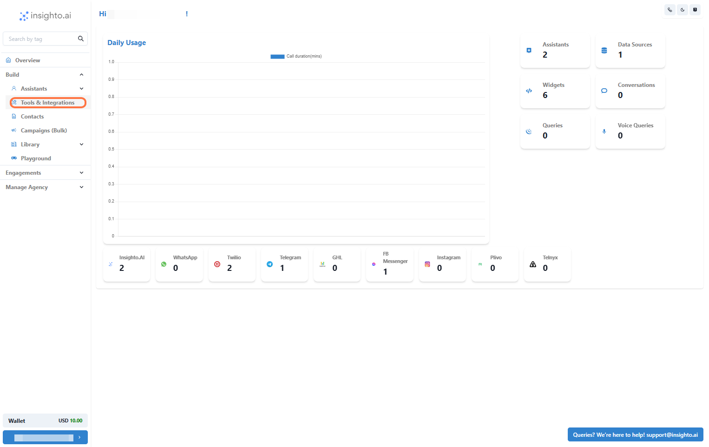
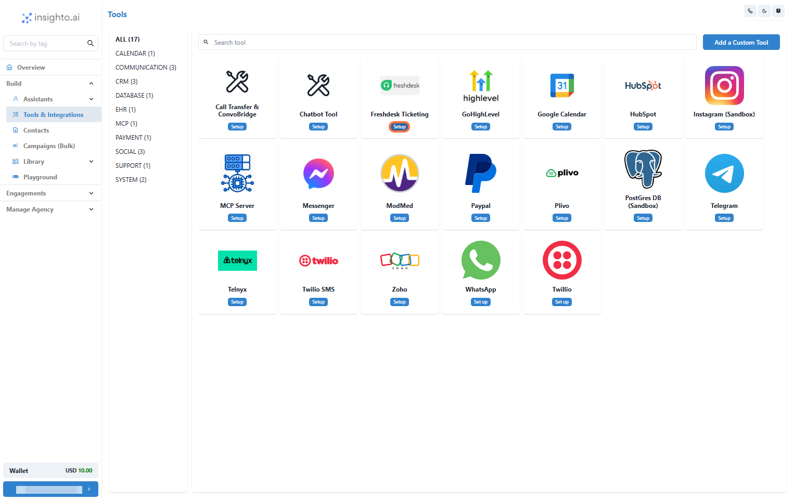
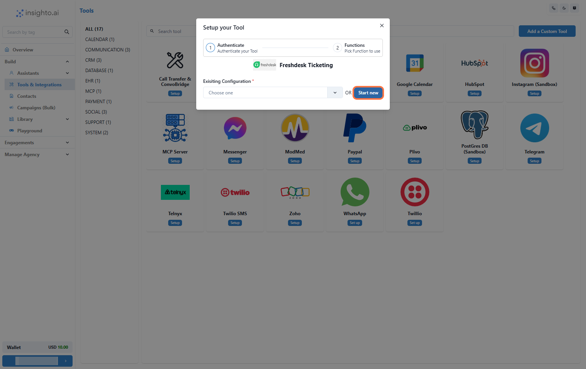
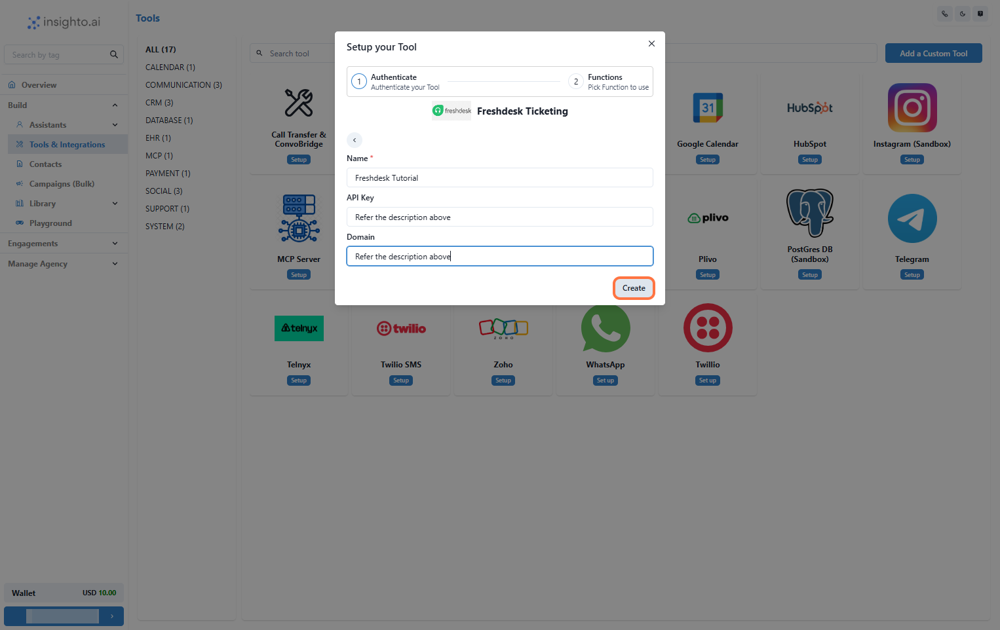
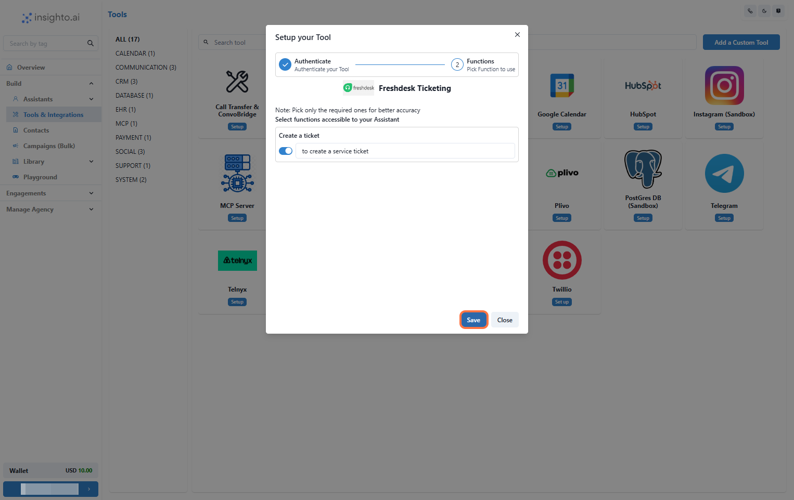
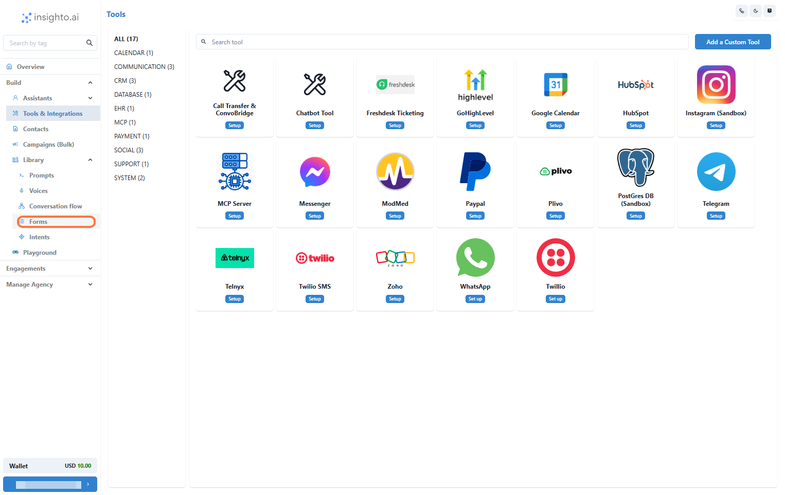
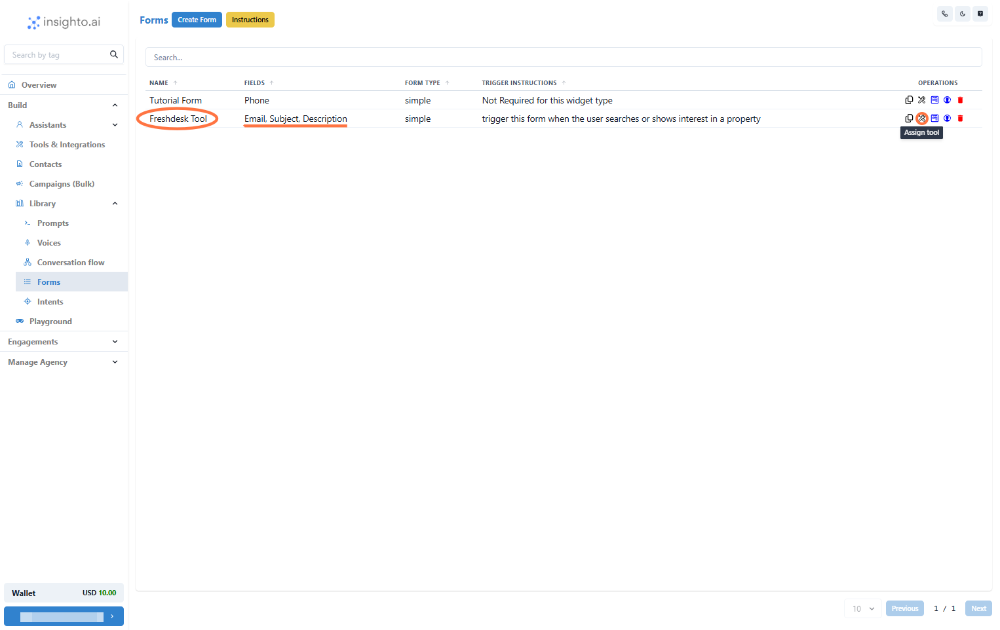
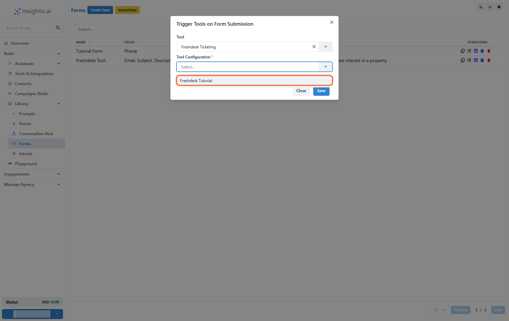
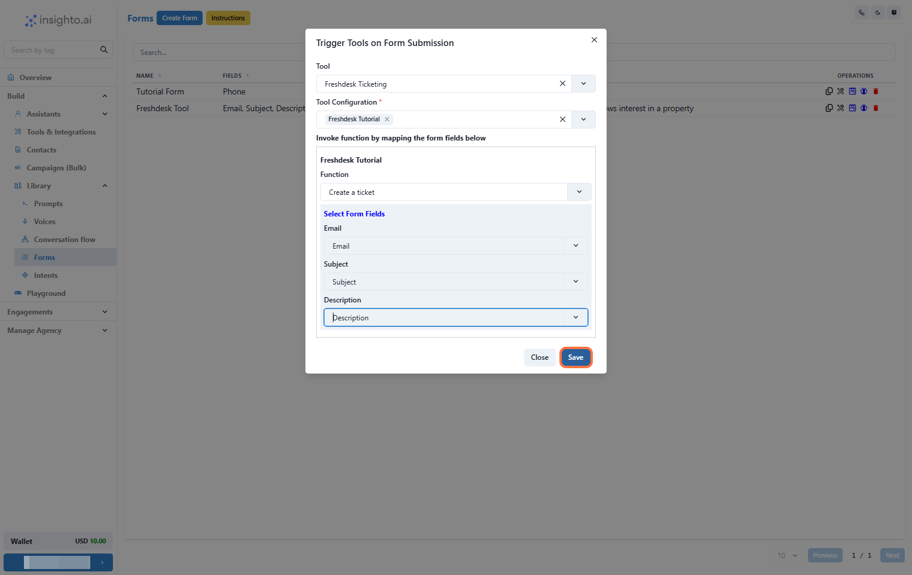

description: Learn how to integrate Freshdesk with Insighto.ai to automatically create support tickets from form submissions.
-----

## Setup Freshdesk Tool

1. Go to Tools & Integration

From the left-hand sidebar of your Insighto dashboard, click on **Tools & Integration**.

 

---

2. Locate the Freshdesk Tool and Click Set Up

---

3. Click on Start New

After clicking **Set Up**, a popup window will appear. Click the **Start New** button to begin creating a new configuration.

---

4. Configure Freshdesk Tool Settings

To set up the Freshdesk tool, enter:

- A name for the integration
- Your **Freshdesk API Key**
- Your **Freshdesk domain**

#### How to retrieve these details:

1. Log in to your Freshdesk account.
2. Go to **Profile Settings** from the top-right profile menu.
3. Copy your API Key from the **Your API Key** section.
4. Identify your domain from your Freshdesk URL (e.g., `https://yourdomain.freshdesk.com` → `yourdomain`).

🔗 [Help article](https://support.freshdesk.com/en/support/solutions/articles/237264-how-do-i-find-my-freshdesk-account-url-using-my-email-address)

---

5. Enable Create Ticket Function

Enable the **Create Ticket** function and click **Save** to complete the setup.

---

## Connect With Forms to Use on Assistant

6. Navigate to Forms Section

Go to the **Library** section in the left panel and click on **Forms** to manage or create the form.

---

7. Connect Freshdesk Tool to Form

Find or create a form that includes the required fields (**Email**, **Subject**, **Description**), then click **Assign Tool**.

---

8. Select Tool Type and Configuration

In the popup, select **Freshdesk** from the tool type dropdown, then choose the configuration you set up.

---

9. Map Form Fields and Finalize Connection

Select the **Create Ticket** function, map the form fields, and click **Save**.

---

10. Connect Form to Assistant and Trigger

Attach the form to your assistant using the **Instructions block**. When a user submits it, a Freshdesk ticket will be created.

