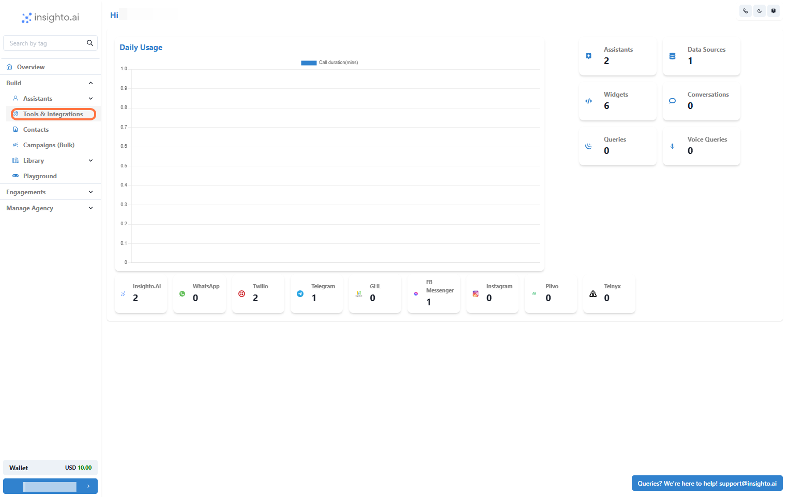
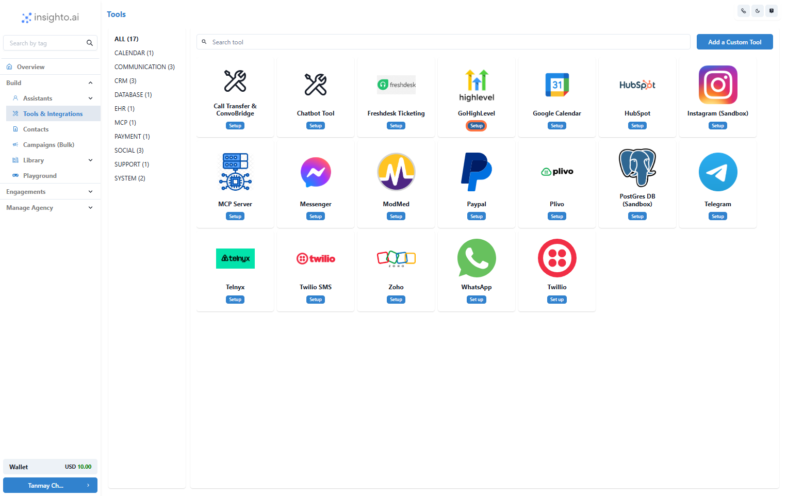
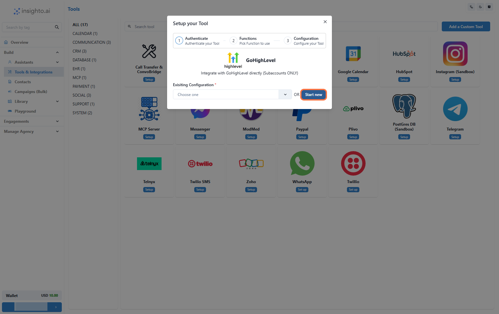
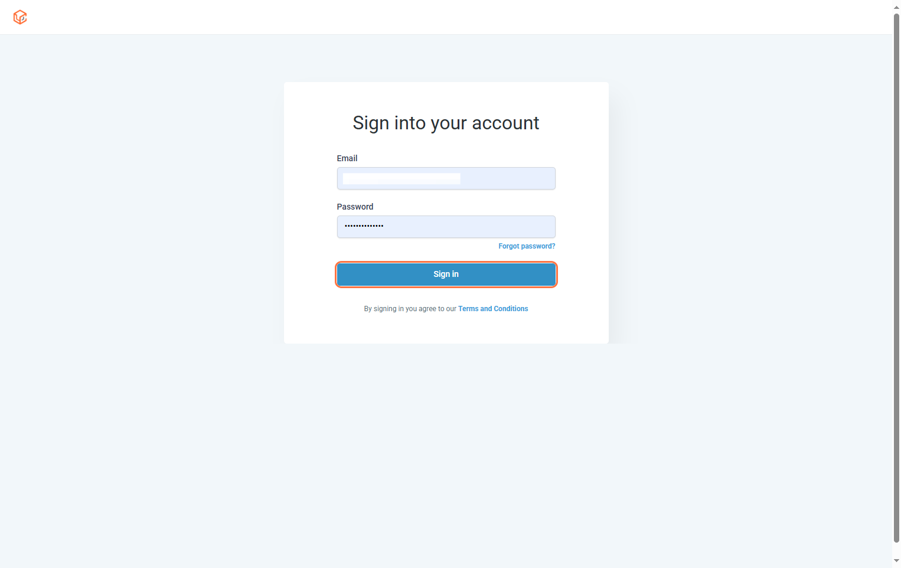
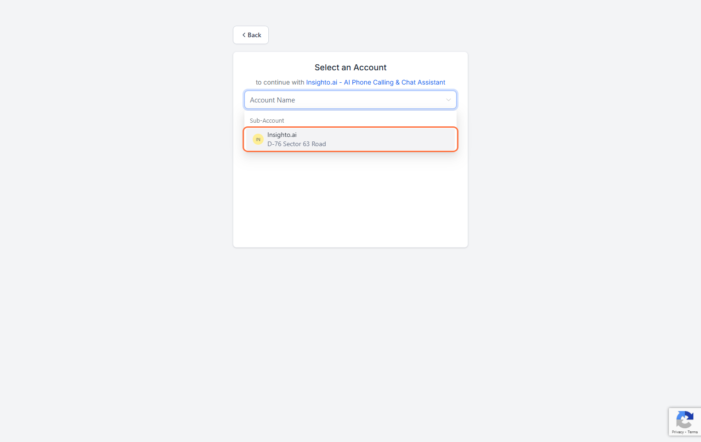
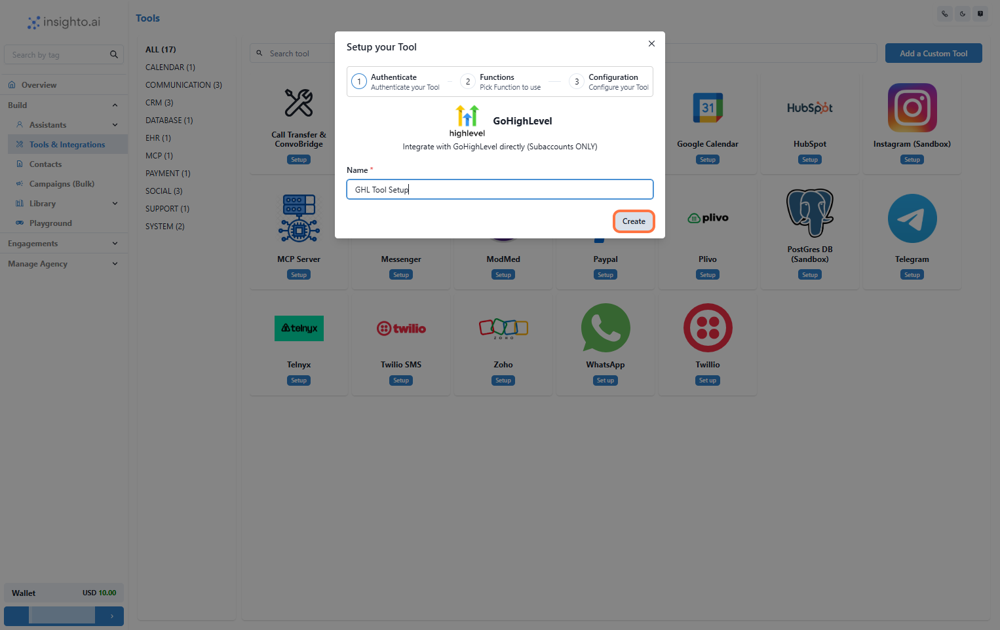
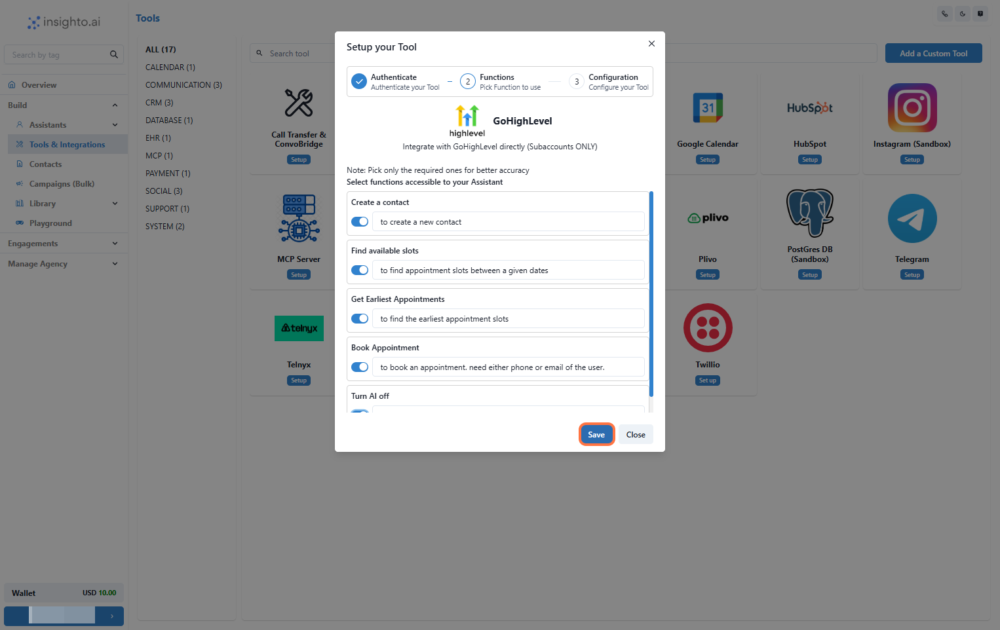
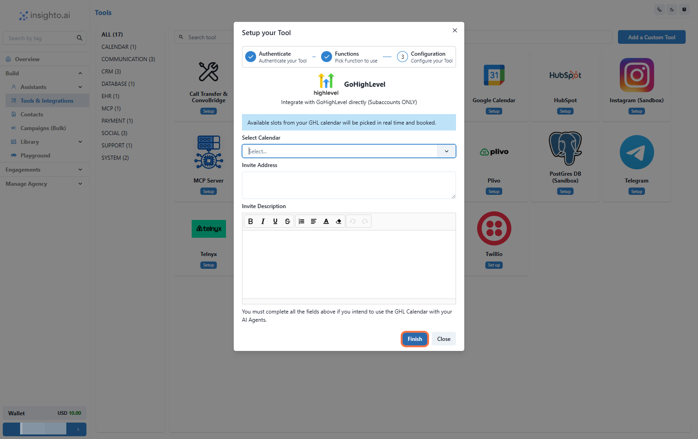
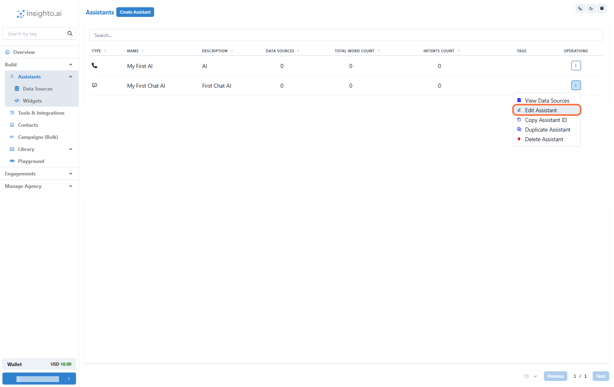
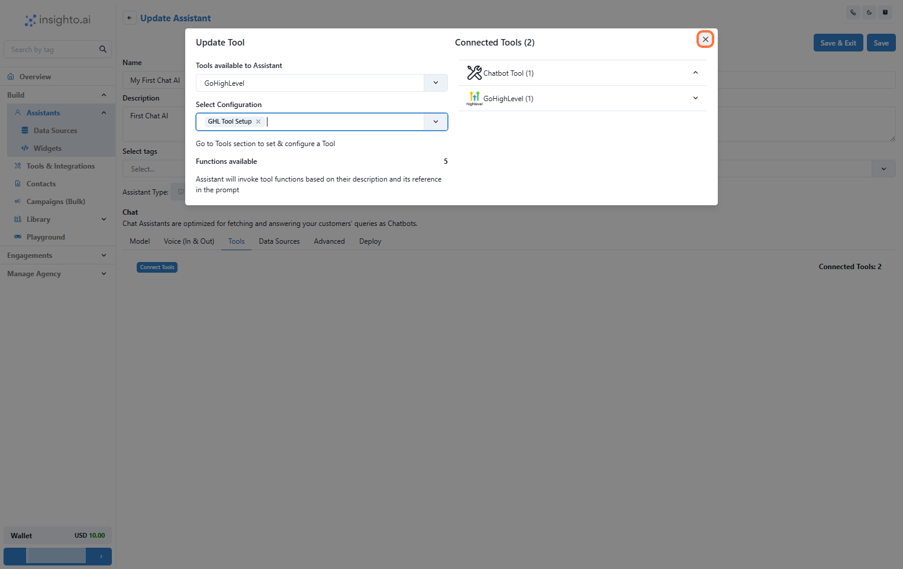

In this guide, you'll learn how to set up the Go High Level (GHL) tool inside Insighto and connect its calendar functionality with your AI assistant. This enables seamless scheduling workflows, allowing your assistant to book appointments, check availability, and manage calendar interactions using GHL’s scheduling features.

---

## Setup GHL Tool

1. Go to Tools & Integration

From the left-hand sidebar of your Insighto dashboard, click on **Tools & Integration**.

---

2. Click on Set Up

Locate the GHL Tool and click **Set Up**.

---

3. Click on Start New

After clicking **Set Up**, a popup window will appear. Click **Start New** to begin creating a new configuration.

---

4. Log In to GHL Agency Account

You’ll be redirected to the GoHighLevel Marketplace. Log in using your **GHL agency credentials** to authorize the integration between Insighto and GHL.

---

5. Select a Subaccount

Choose the appropriate subaccount you want to connect with Insighto.

> ⚠️ Note: Only subaccounts can be integrated. Agency-level accounts are not supported.

---

6. Name Your Configuration and Click Create

Enter a descriptive name for your GHL configuration, then click **Create**.

---

7. Enable Required Functions and Save

Toggle on the functions you want your assistant to use with GHL. Then click **Save**.

---

8. Configure Calendar Preferences and Click Finish

Set your calendar preferences:

- **Select a calendar**
- **Invite address**
- **Invite description**

Then click **Finish** to complete setup.

---

## Connect With Any Assistant to Use Calendar Functionality

9. Edit Any Existing Assistant

From the **Assistants** section, click the three dots next to the assistant you want to update and select **Edit Assistant**.

---

10. Click on Connect Tools

In the **Tools** tab:

- Click **Connect Tool**
- Select **GHL Tool** as the tool type
- Choose your tool configuration

The system will then connect the GHL tool to your assistant.

---

11. Use Prompts to Trigger GHL Calendar Functions

Navigate to the **Prompt** section in the assistant editor. Define instructions that allow your assistant to:

- Check availability
- Book appointments
- Use other GHL calendar actions

