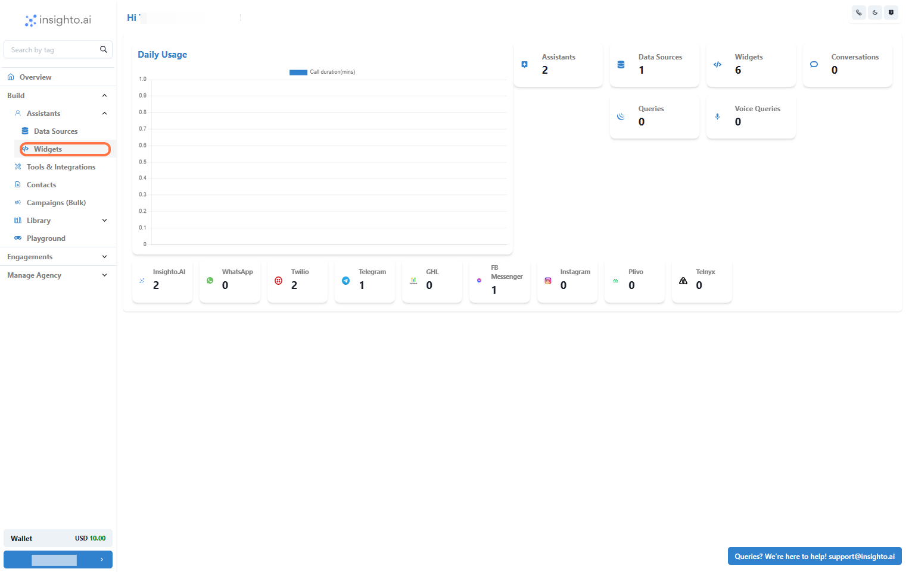
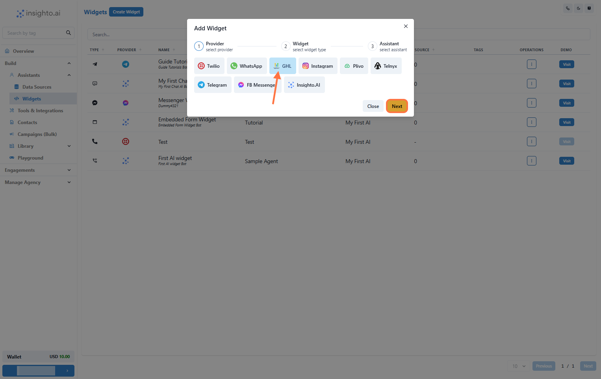
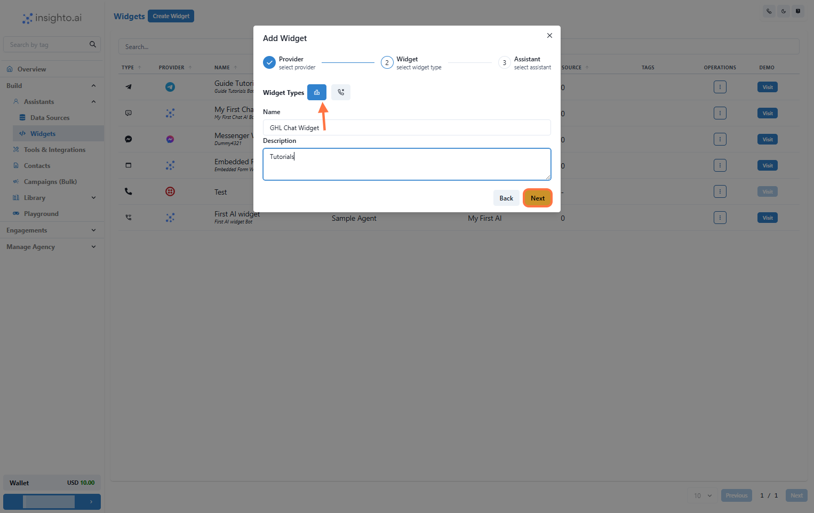
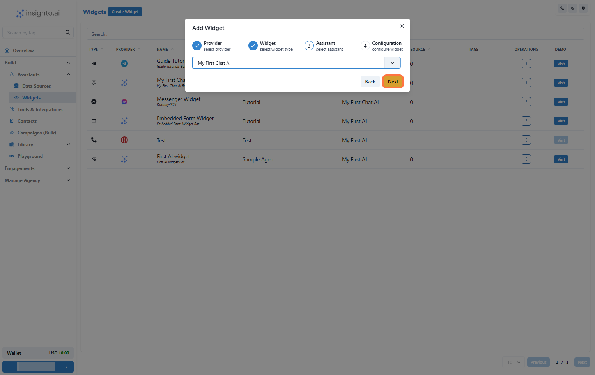
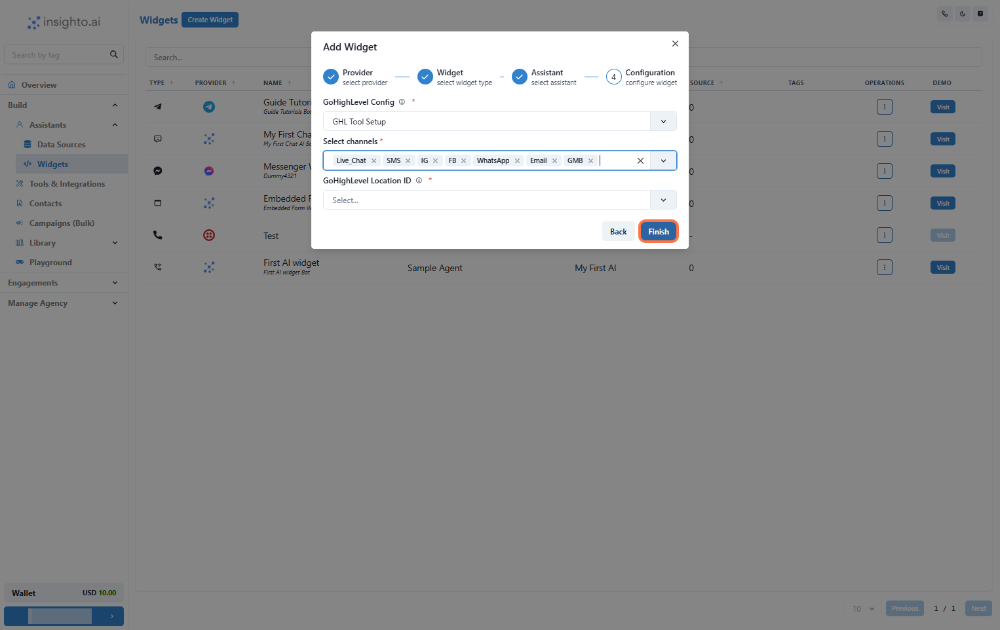

This guide walks you through setting up and deploying the GHL Chat Widget inside Insighto to enable your AI assistant to operate through GHL channels.

## Setup GHL Chat Widget

Step 1 – Prerequisites: Chat Assistant & GHL Calendar Tool Setup 

Before proceeding, make sure you have the following set up:

- ✅ A **Chat Assistant** created in Insighto  
- ✅ The **GHL Calendar Tool** properly configured and connected

---

Step 2 – Click on Widgets from the Left Panel

Go to the **Assistants** section in the left panel and click **Widgets**. This takes you to the widget setup screen where you can deploy your AI assistant.

---

Step 3 – Create a New Widget

Click **Create New Widget** to begin the widget setup process.

---

Step 4 – Select GHL as the Provider Type and Click Next

On the widget setup screen:

- Select **GHL** as the provider type  
- Click **Next** to proceed

---

Step 5 – Select Widget Type, Name, and Describe Your Widget

Fill in the following:

- **Widget Type**: Choose **Chat**  
- **Name**: Provide a meaningful name  
- **Description**: Describe the widget’s purpose briefly

Click **Next** to continue.

---

Step 6 – Select Your Chat Assistant from the Dropdown

Choose the chat assistant you created earlier from the dropdown list.

---

Step 7 – Configure GHL Chat Widget

1. Select your **GHL Configuration** from the dropdown  
2. Choose the **channels** where the assistant will handle conversations  
3. Select the **Location ID**  
4. Click **Finish** to deploy the widget

---

Step 8 – Test the Deployment

After deploying the chat widget, test it through your connected GHL channels:

- Send sample queries
- Confirm the assistant responds correctly
- Verify calendar interactions work (if enabled)

