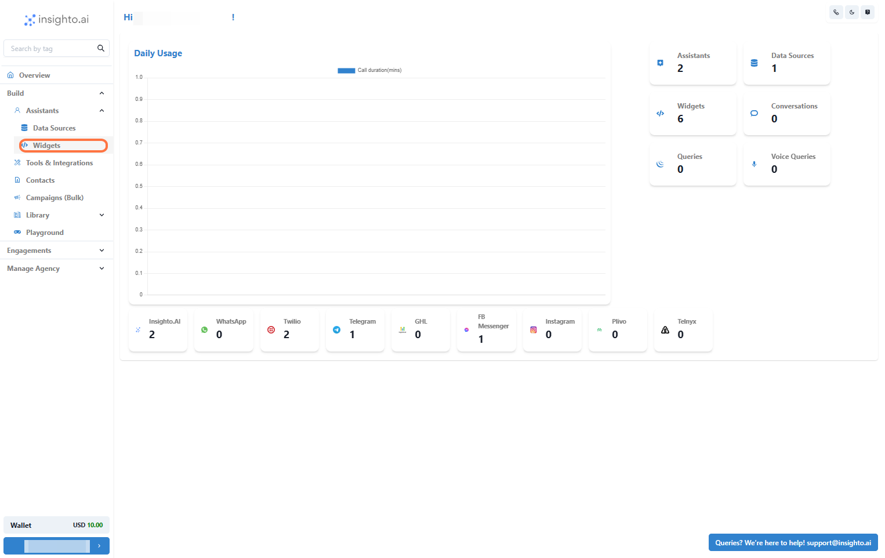
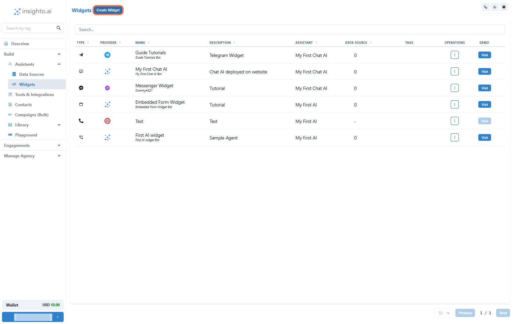
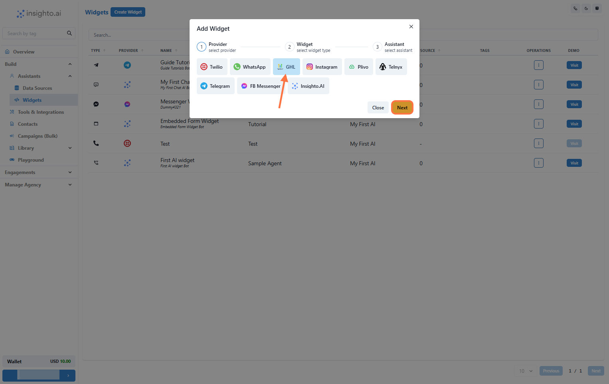
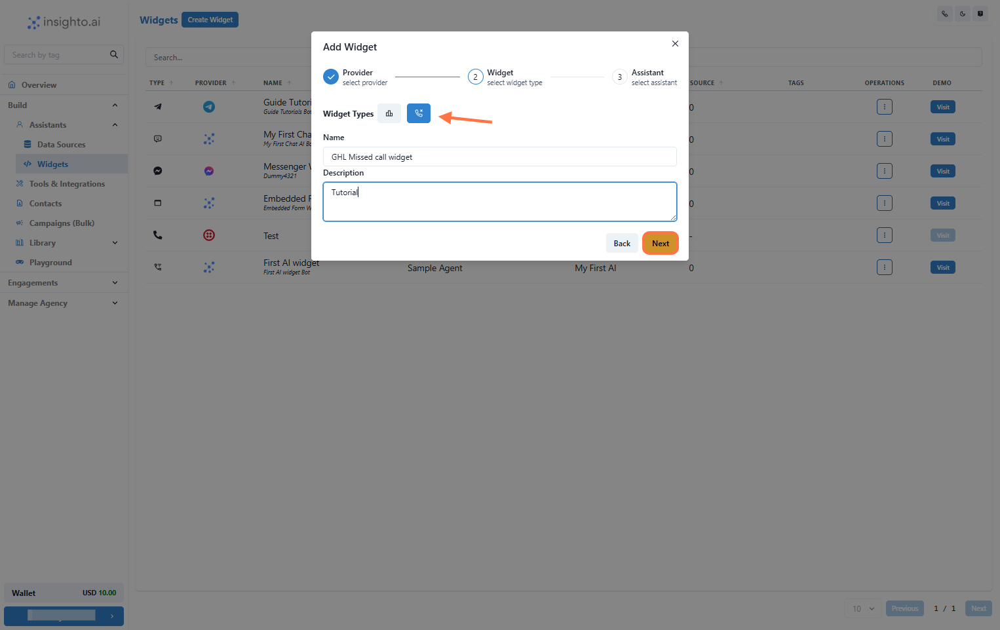
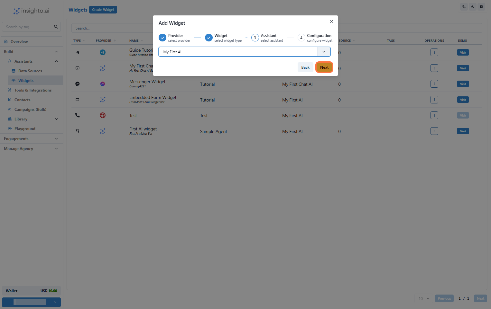
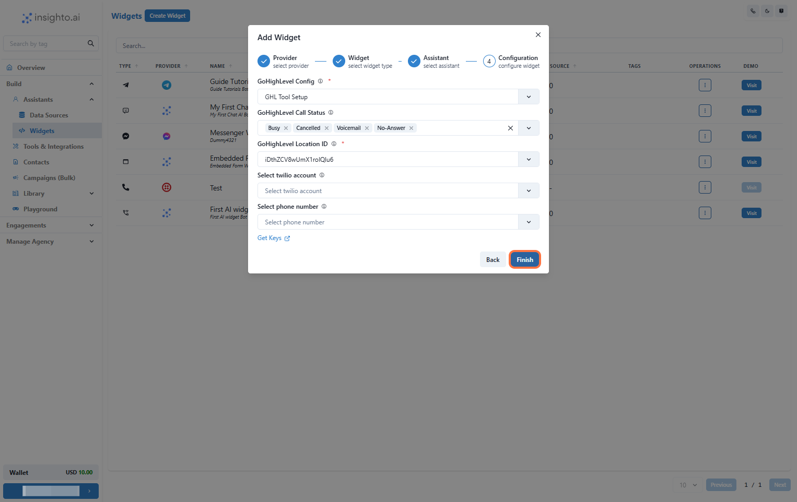

The GHL Missed Call Widget allows your AI assistant to automatically respond to missed calls by initiating a callback. This ensures you stay connected with leads and customers even when you're unavailable.

> ⚠️ **Note**: This feature works **only with Twilio** as the call provider.

## Setup GHL Voice Widget

Step 1 – Prerequisites: Assistant & Tool Setup

Before you begin:

- ✅ A **Call Assistant** must be created  
- ✅ **GHL Tool** should be set up and connected  
- ✅ **Twilio Tool** must be configured for voice

---

Step 2 – Click on Widgets from the Left Panel

From the Assistants section in the left panel, click **Widgets** to go to the widget setup screen.

---

Step 3 – Create a New Widget

Click **Create New Widget** to begin the setup process.

---

Step 4 – Select GHL as the Provider Type and Click Next

On the widget setup screen:

- Select **GHL** as the provider type  
- Click **Next**

---

Step 5 – Select Widget Type, Name, and Describe Your Widget

- **Widget Type**: Choose the **Chat** type  
- **Name**: Enter a descriptive name  
- **Description**: Add a brief purpose

Then click **Next**.

---

Step 6 – Select Your Phone Assistant from the Dropdown

Choose the AI phone assistant you created earlier from the dropdown list.

---

Step 7 – Click on Configure GHL Chat Widget

In this configuration step:

1. Select your **GHL Configuration**  
2. Choose the **Call Status** to trigger the call  
3. Select the appropriate **Location ID**  
4. Choose the **Twilio account** and **Phone Number**

Click **Finish** to deploy the widget.

---

Step 8 – Test the Deployment

After the widget is deployed:

- Simulate a missed call
- Ensure the AI assistant triggers a callback via Twilio
- Confirm correct integration with your GHL account

