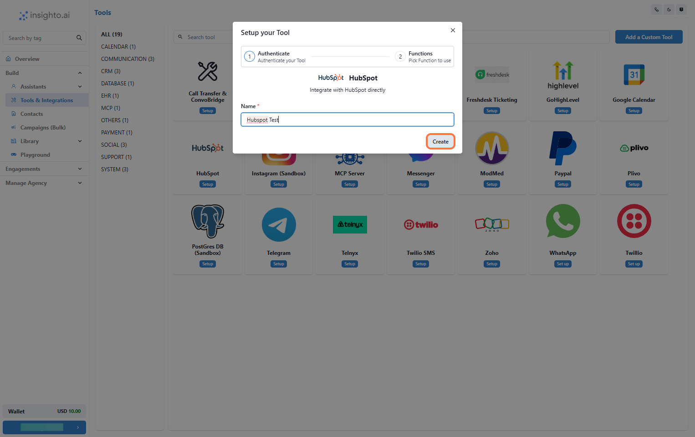
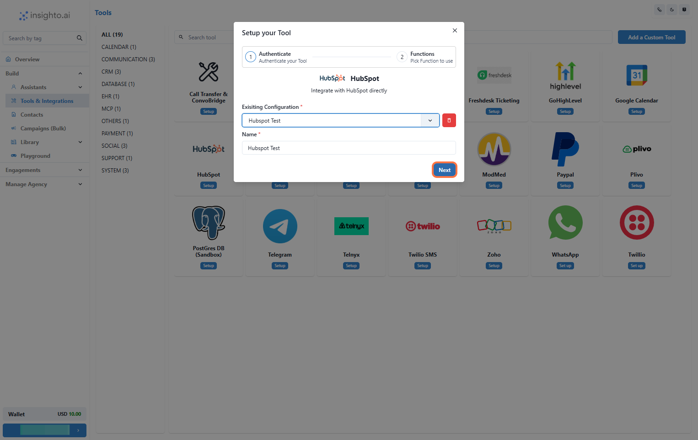

Learn how to integrate **HubSpot** with Insighto.ai to automatically create support tickets or leads from form submissions and assistant interactions.

---

## 🔌 Connect HubSpot Account

1. Go to Tools & Integration

From the left-hand sidebar of your Insighto dashboard, click on **Tools & Integration**.

---

2. Locate the HubSpot Tool and Click Set Up

Find the **HubSpot Tool** in the list and click **Set Up**.

---

3. Click on Start New

A popup window will appear. Click the **Start New** button to begin creating a new configuration.

---

4. Log In to HubSpot Account

A popup will prompt you to sign in to your HubSpot account. Once logged in, you’ll be redirected back to Insighto, ready to finalize the connection.

---

5. Name Your Configuration and Click Create

Enter a name for your configuration and click **Create**.

---

6. Select the Configuration and Click Next

From the dropdown under **Existing Configurations**, select the one you just created and click **Next**.

---

7. Enable Required Functions and Save

Toggle **ON** the functions your assistant should use (e.g., Create Contact, Create Ticket), then click **Save**.

---

## 📝 Connect with Forms

8. Connect the Tool to an Existing Form

You can connect the HubSpot tool you created to an existing form in Insighto.

- Use the **Connect Tool** option in the form’s settings to link it to HubSpot.  
- Map the form fields (like name, email, issue details) to the corresponding fields in HubSpot.

This allows Insighto to automatically push submitted data to HubSpot and create either a **contact** or a **ticket** seamlessly.

---

## 🤖 Connect with Assistant 

9. Connect the Tool to an Assistant

You can also connect your HubSpot tool directly to an assistant in Insighto.

- Go to the assistant’s settings and open the **Tools** tab.  
- Select your **HubSpot Tool** from the list to connect it.  
- Add prompts in the assistant that gather user information during conversations.

Insighto will then push this data to HubSpot based on your configuration—creating a **contact** or **ticket** automatically.

