In this guide, you'll learn how to deploy your AI chat assistant on Instagram by connecting it to a professional Instagram account. Once connected, the assistant will automatically handle incoming direct messages, enabling real-time responses to your followers' queries.

> ⚠ **Note:** Only Professional Instagram accounts (Business or Creator) can be connected for this integration. Personal accounts are not supported.

---

## Instagram Tool Setup

1.  **Select Tools & Integration from the Sidebar**

To begin setting up your Instagram integration, navigate to the Tools & Integration section from the left-hand menu of your dashboard.

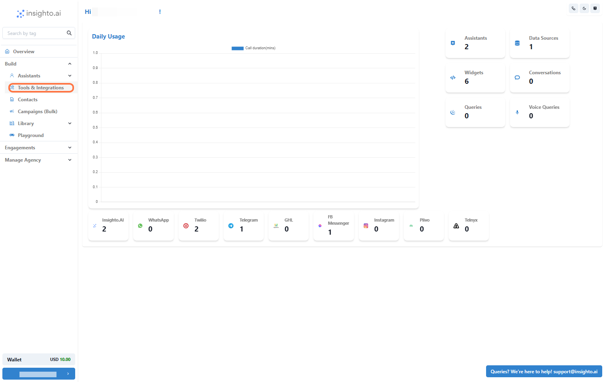

2.  **Click Set Up Next to the Instagram Tool**

In the Tools & Integration section, locate the Instagram from the list of available tools. Click the Set Up button.

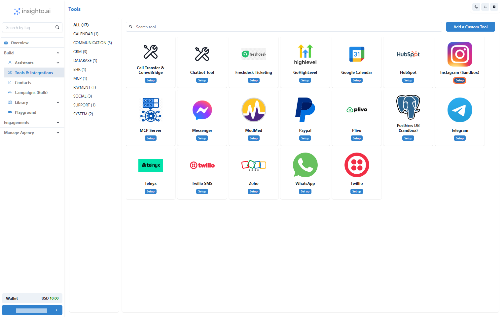

3.  **Click Start New**

Click the Start New button to initiate the tool setup.

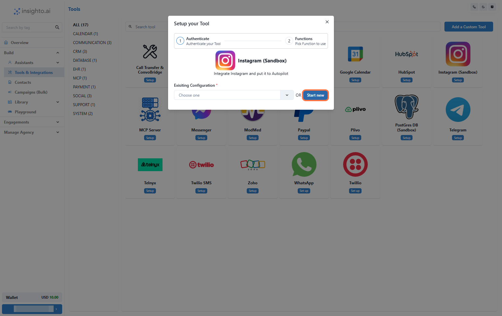

4.  **Log In to Your Professional Instagram Account**

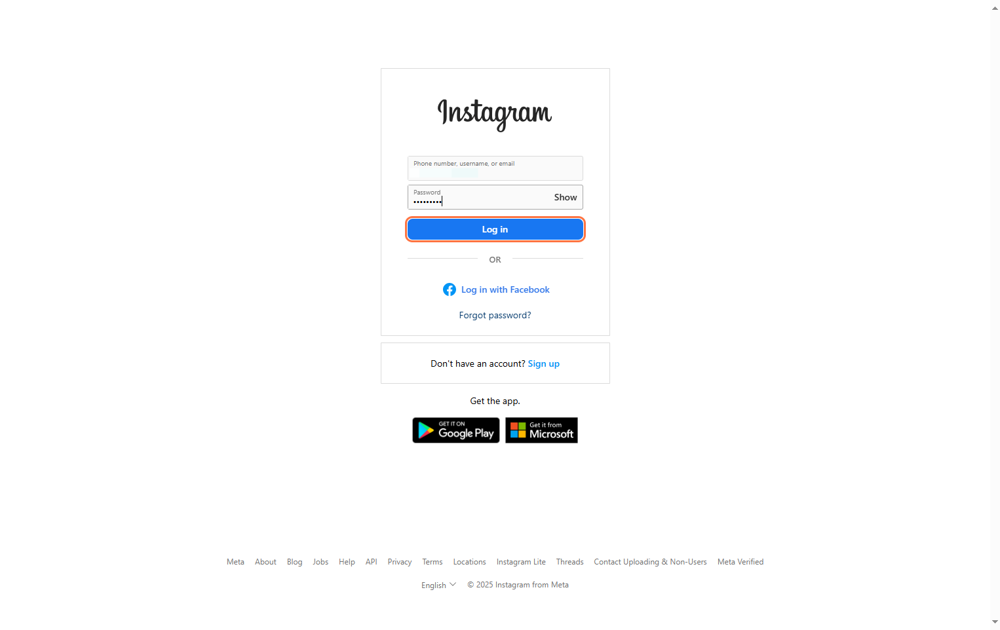

5.  **Allow Permissions and Return to the Platform**

Allow the permissions required and you’ll be redirected back to Insighto.

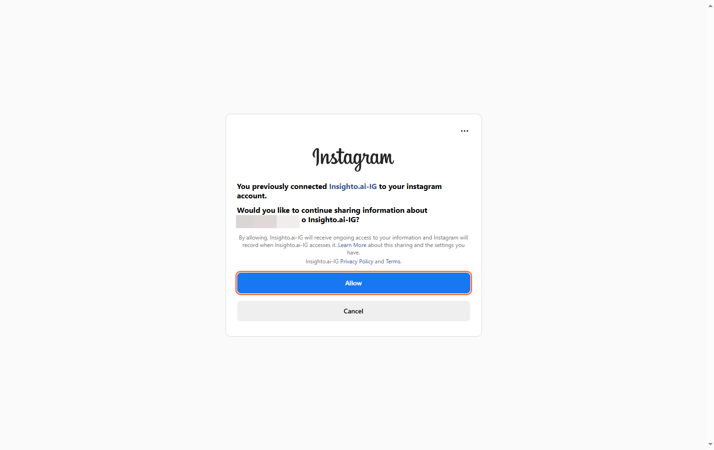

6.  **Name Your Integration and Complete Setup**

You’ll be brought back to the Instagram Tool Setup page on Insighto. Enter a name for your integration—something that helps you easily identify the connected Page—and click Create to finalize the setup.

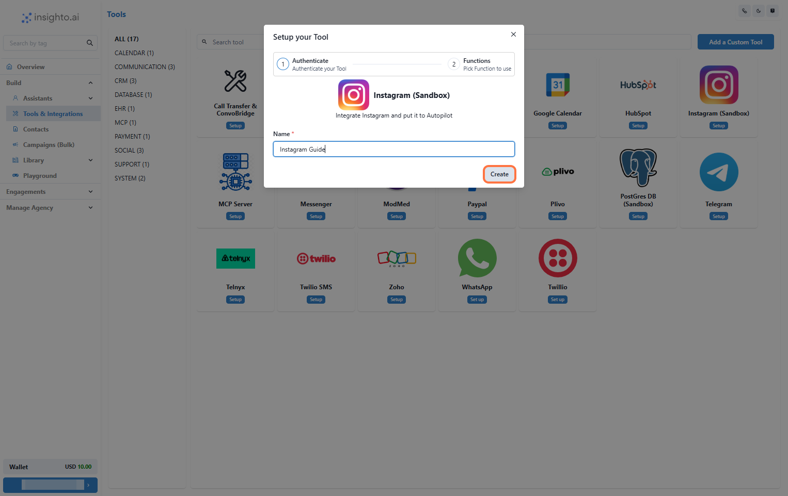

7.  **Finalize Setup by Clicking Save**

On the next page, you may see a message that says “Nothing to set up here” — this is expected. The Instagram tool doesn’t require additional configuration at this stage because it serves as a simple integration point.

> 💡 **Why This Happens:**  
> It is used solely to link your Instagram account. The actual deployment of your AI chat assistant will be handled separately via Instagram Widget during the agent setup process.

To complete the integration, simply click Save.

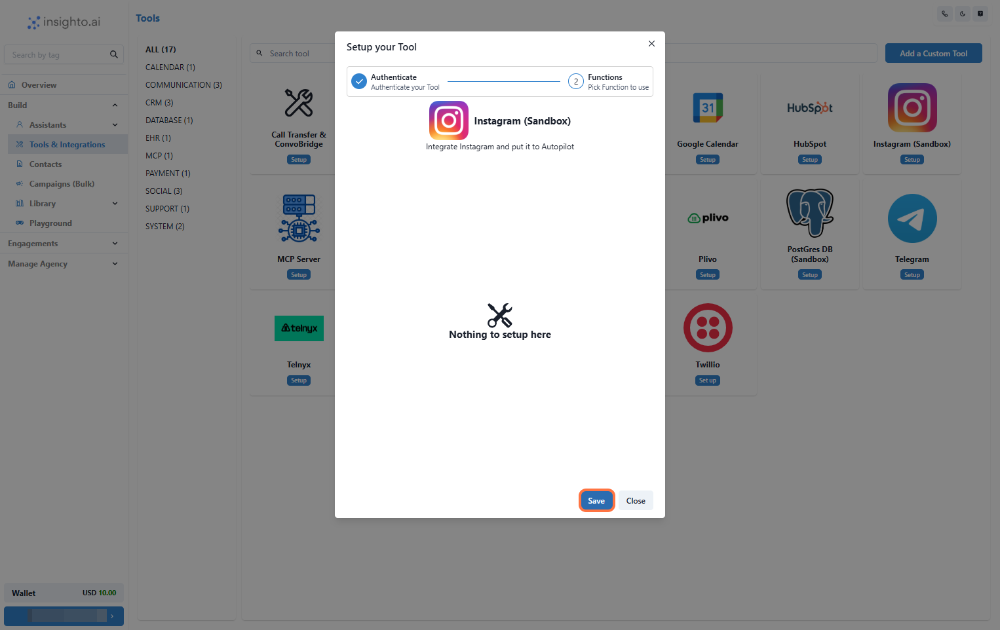

---

## Create Instagram Widget

Now that the integration is complete, it’s time to deploy your AI chat assistant on Instagram. To do this, you need to create an Instagram Widget that will link your AI agent to your account and handle incoming messages in DM.

8.  **Click on Widgets from the Left Panel**

In the Assistants section of the left panel, click on Widgets. This will take you to the widget setup page where you can deploy your AI assistant.

> 🔔 **Note:**  
> Ensure you have already created an AI chat assistant before proceeding. If you haven’t, please follow the previous guides to create and configure your assistant first.

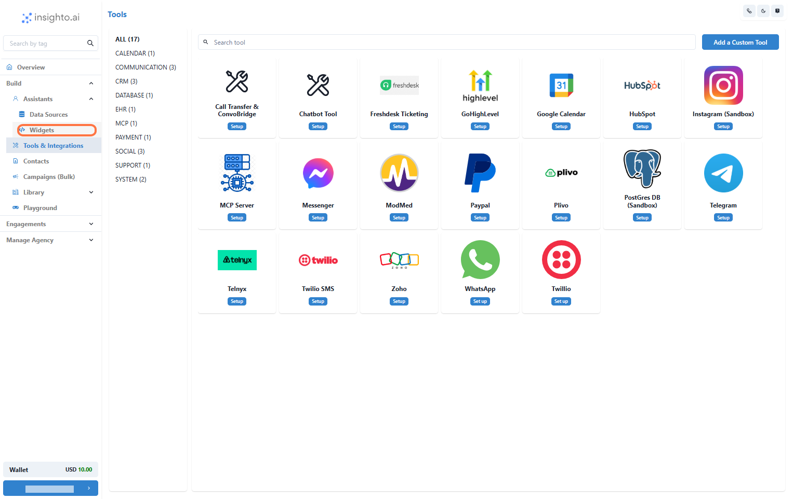

9.  **Create a New Widget**

Click Create New Widget to start the setup process.

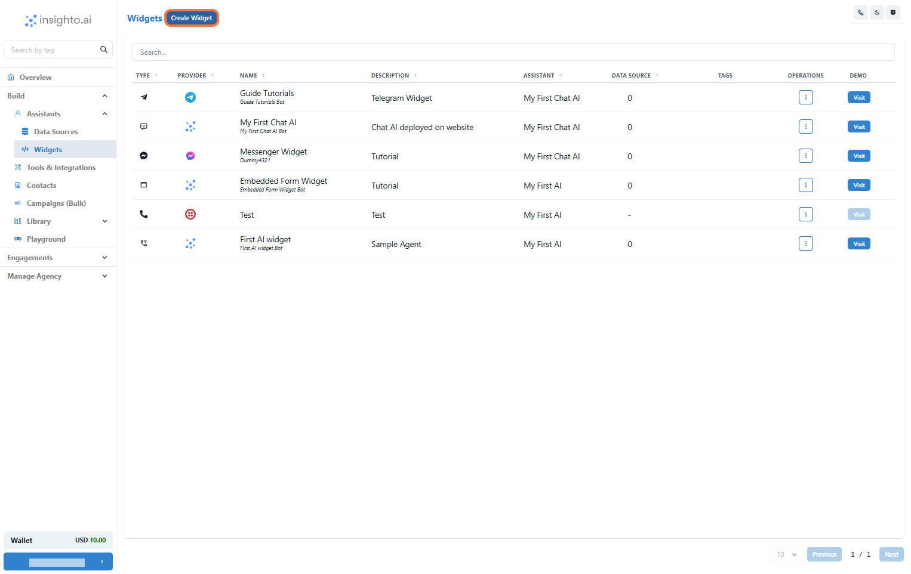

10.  **Select Instagram as the Provider Type and Click Next**

In the widget setup screen, choose Instagram as the provider type. Once selected, click Next to proceed.

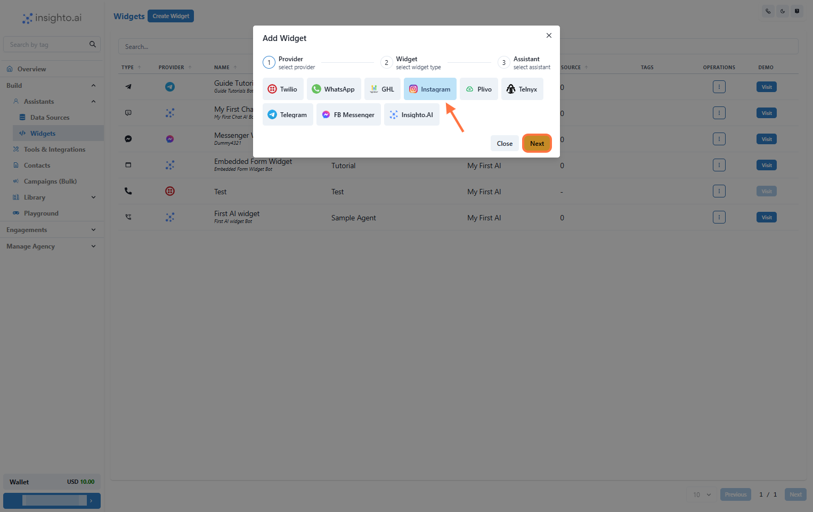

11.  **Select Widget Type, Name, and Describe Your Widget**

- **Widget Type**: Choose the appropriate type.  
- **Name**: Choose a descriptive name for easy identification (e.g., Customer Support Chat).  
- **Description**: Provide a brief description of the widget’s purpose (e.g., Handles customer support inquiries via Instagram).

Once you’ve filled in these details, click Next to move on.

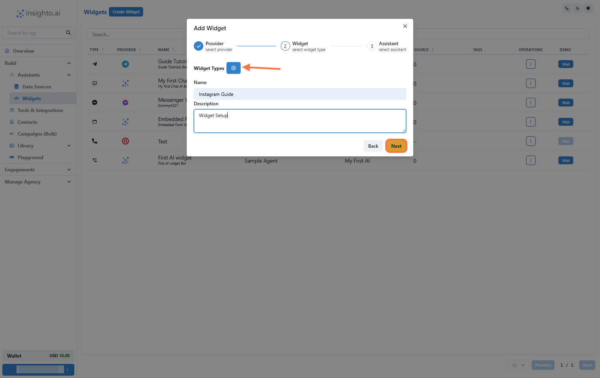

12.  **Select Your Chat Assistant from the Dropdown**

In this step, select the AI chat assistant you created earlier from the dropdown list.

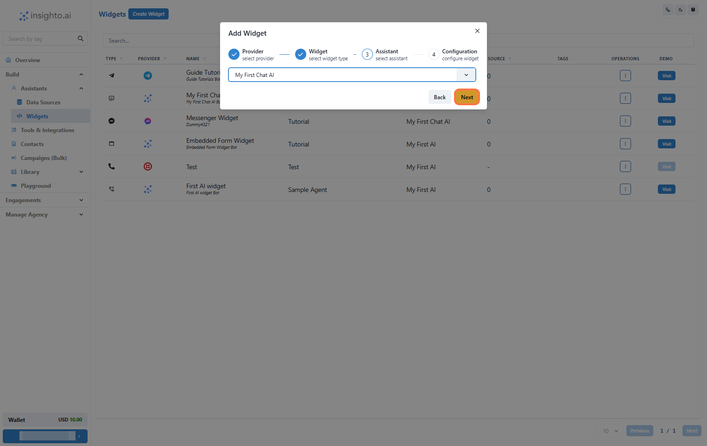

13.  **Select the Instagram Configuration**

From the dropdown, select the Instagram Tool you integrated earlier.

Once selected, click Finish to complete the widget setup and deploy the assistant.

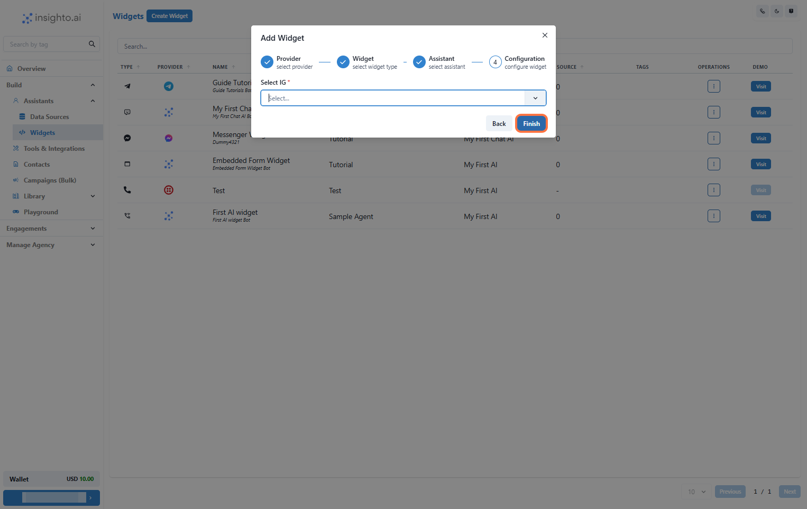

> 🎉 **Success!**  
> Your AI chat assistant is now active on your Instagram Account and ready to handle user messages via DM.

14.  **🧪 Test Your Widget**

To test the widget, you have two options:

- Click the Visit button next to your widget to open it in a new window and interact with the assistant directly.
- Visit your Instagram account as a visitor, send a message, and see how the AI assistant responds.

