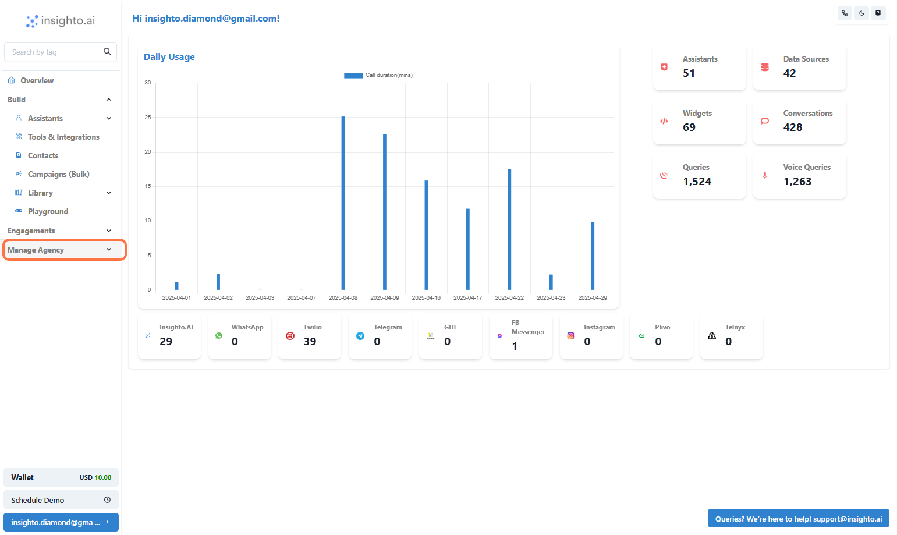
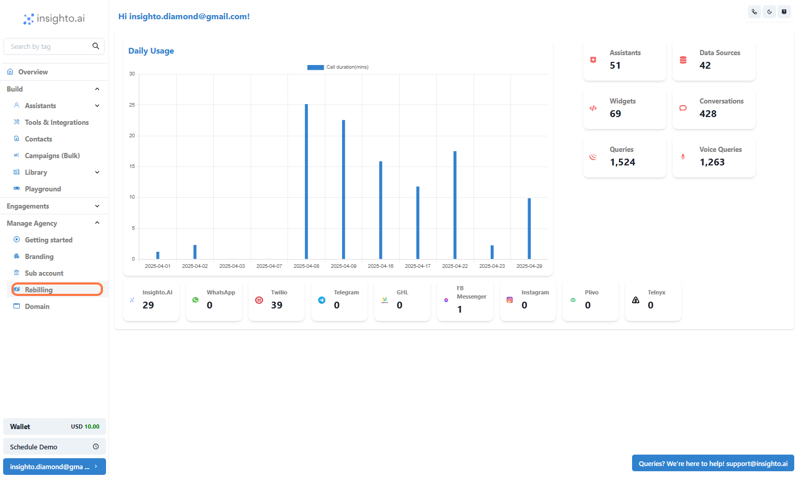
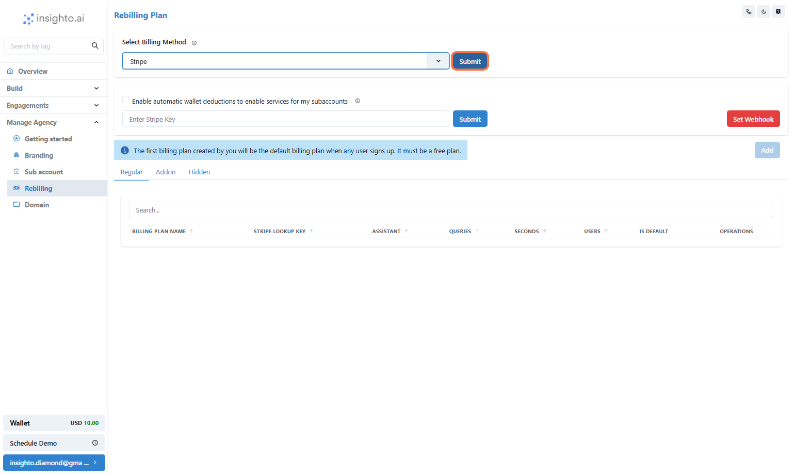
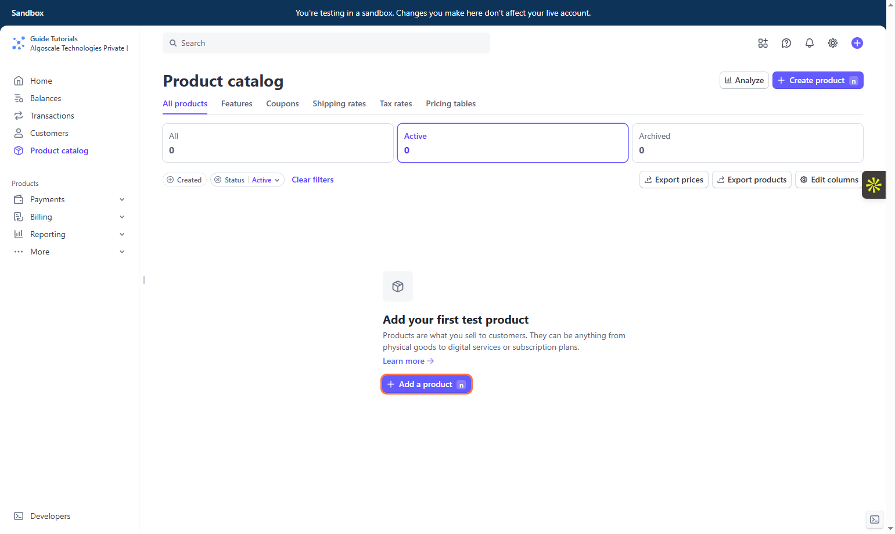
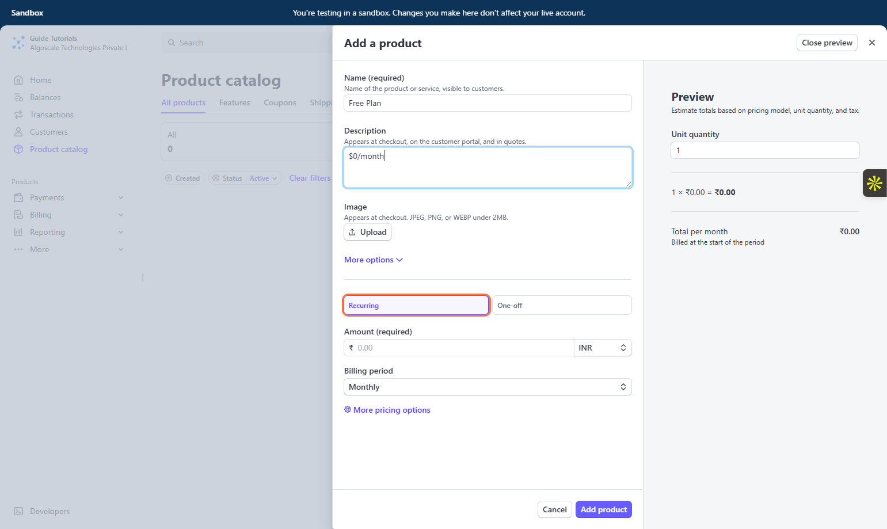
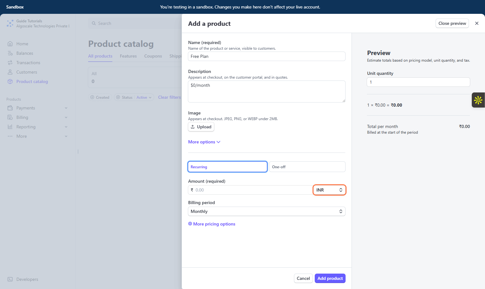
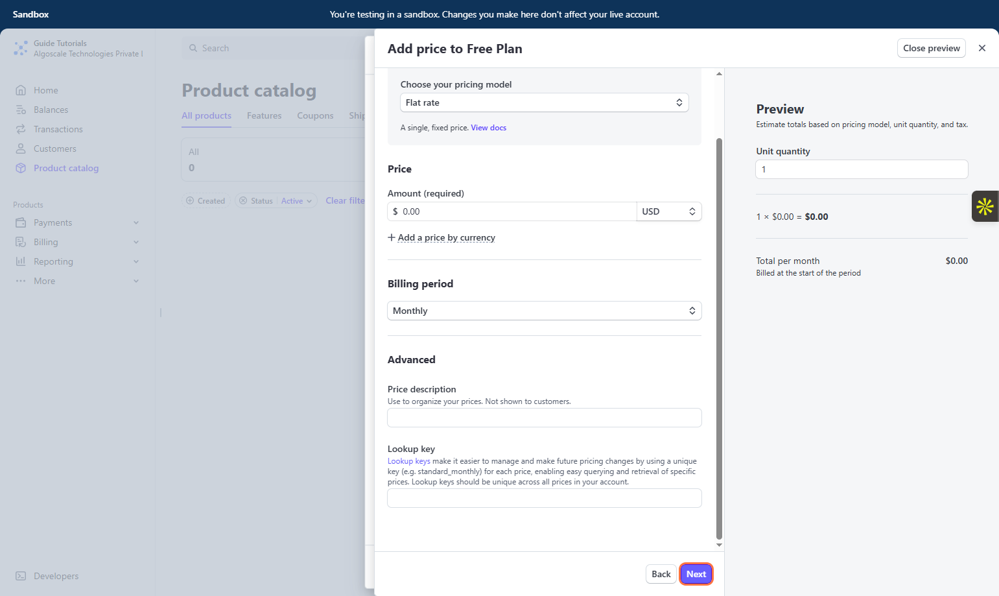
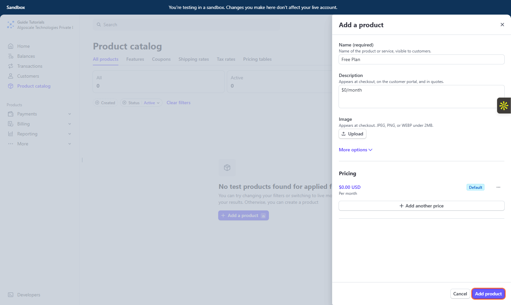

# Integrating Stripe with Insighto: Creating Products and Pricing in Stripe

In this guide, we walk you through the process of integrating Stripe with Insighto, setting up your first product, and defining pricing plans. You’ll learn how to create and manage products in Stripe.

---

 1.  Click on **Manage Agency**

 2.  Click on **Rebilling**

 

 3.  Choose Your Billing Method

 

Select how you'd like to handle customer billing. You can either:

- Connect Stripe to automate billing directly through the platform.  
- Use a Custom Provider to handle billing manually outside the platform, and you can refresh subscription usage or credits manually or via API.

**In this guide we will use Stripe as Billing Method**

 4.  Click on **Submit**

 

 5. Enable Usage Billing via Main Wallet

Allow your customers’ consumption usage (LLM, Voice, and Speech Recognition) to be billed through your main account wallet.  
This enables you to purchase credits from Insighto at standard rates ([Article here](#)), calculate your own markup, and offer them as part of your pricing plans.

💳 **Don’t Want to Use wallet/Purchase Credits from Us?**

If you prefer to use your own API keys and bypass purchasing credits from Insighto, follow this [BYOK guide](#) to set up your API keys.

🔑 **Note:** This option allows you to use your own keys for processing instead of using platform credits.  
**PS:** Keep in mind that with BYOK, not all provider keys may be supported at this time.

 6.  Connect Your Stripe Account

To integrate Stripe with Insighto.ai, you'll need to generate and input your Stripe API key.  
Follow the steps mentioned [here](#) to generate your secret key.

 7.  Click on **Submit & Set Webhook** button

---

## Before You Create Plans on Insighto

Ensure you've set up your Products and Prices in your Stripe account—these are required to link and activate billing plans within Insighto.

🚀 The first plan you create will be the default Free Plan set at $0/month. This acts as the baseline offering for your customers.

👉 Let’s go to Stripe and get your products and pricing ready!  
🔗 [Stripe Dashboard](https://dashboard.stripe.com)

---

# Setup Product & Prices on Stripe

 8. Click on **Product catalog** on Stripe Dashboard

 9. Click on **Add a product**

 10. Name Your Plan in Stripe

Add a clear and recognizable name for your plan while setting up the product and pricing in Stripe.  
If you're configuring a free plan, you can name it “Free Plan” — otherwise, choose a name that reflects the offering you're creating.

📝 This name will appear to your customers, so use something descriptive and easy to understand.

 11.  Add Plan Description

In the plan description field, simply mention the pricing details—this helps communicate the cost clearly to your customers.  
For example: $0/month, $49/month, etc.

💡 Keep it short and focused on the price. Feature details can be added within Insighto during plan setup.

 12.  Select **Recurring**

 13.  Select Currency

Choose the currency you want to bill your customers in from the dropdown menu.  
For this tutorial, we’re selecting USD ($).

🌍 You can choose other currencies based on your customer base and business needs.

 14.  Set the Price

For the Free Plan, set the price to $0 to ensure it's offered at no charge to your customers.

💡 If you’re setting up other plans, enter the appropriate amount here (e.g., $49/month) based on your pricing structure.

 15.  Click on **More pricing options**

 16.  Define a Unique Lookup Key

Add a Lookup Key for the price you're creating. This key must be unique for every price you set up to help identify and map it correctly in Insighto.

📝 Make sure to use a simple, consistent naming convention (e.g., `free_plan_0usd`, `basic_plan_49usd`) to keep things organized.

 17.  Click on **Next**

 18.  Click on **Add product**

