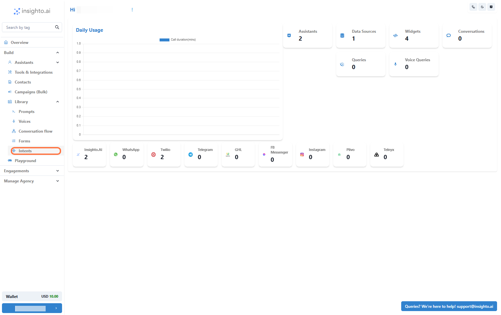
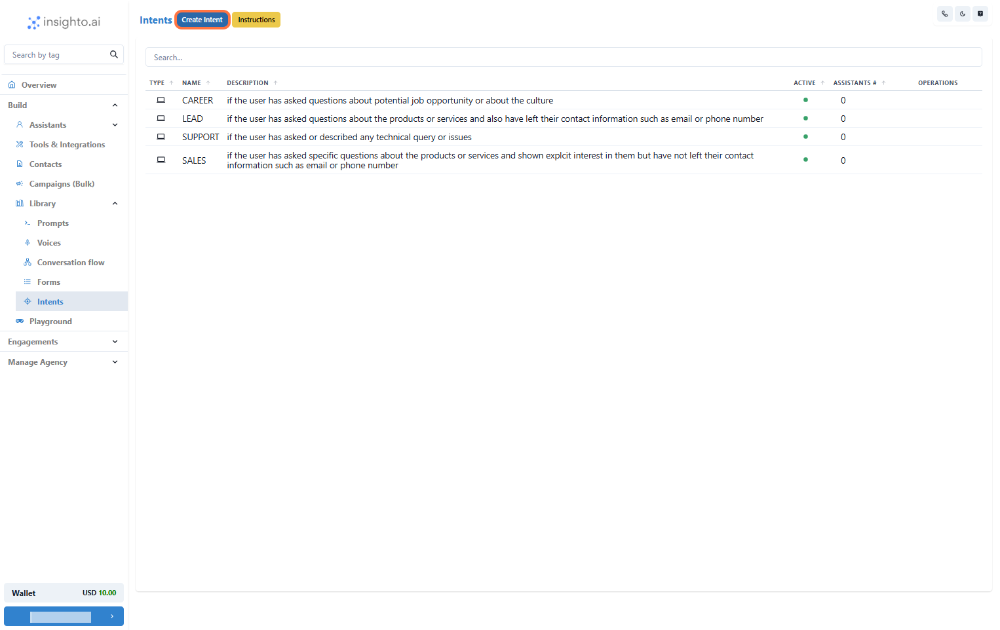
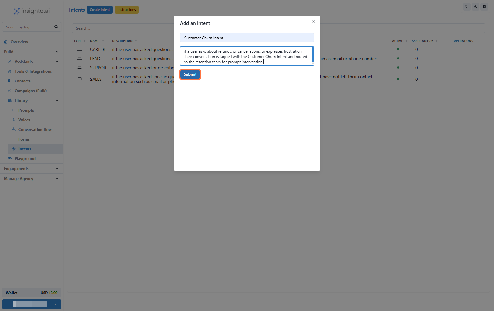
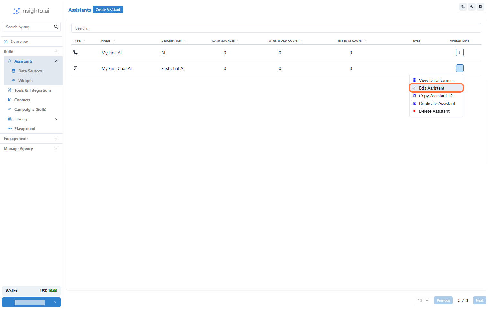
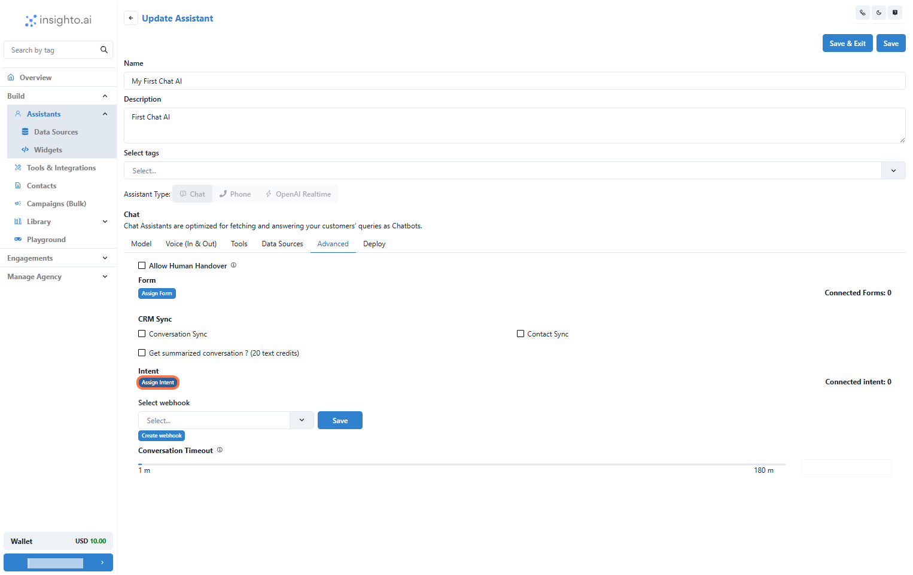
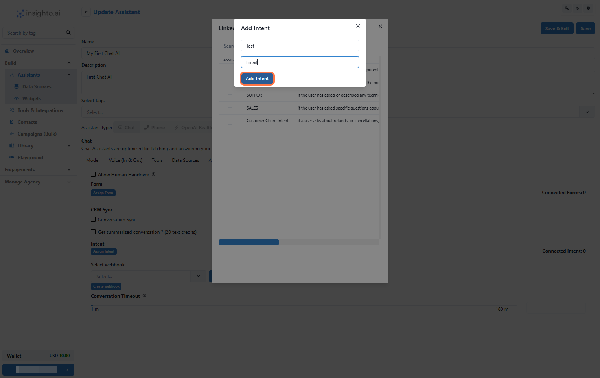

Intents help Insighto automatically label conversations once they end—either when the user closes them or they become inactive. When connected to a chat assistant, Insighto.ai identifies the intent behind each conversation and sends it by email to the right team or department. This ensures the right people get the information they need quickly.

> ❗ Note: The Intents feature works only with chat assistants.

---

## ⚡ Auto Intents
 
1. Understand and Use Auto Intents

Insighto offers four pre-defined Auto Intents that you can use right away to categorize conversations:

- **CAREER**:  
  Tagged when someone asks about job openings or the application process. Sent to the HR team.

- **SALES**:  
  Tagged for questions about product pricing, availability, or features. Routed to the sales team.

- **LEAD**:  
  Triggered when a user asks about pricing and shares contact details (like email or phone). Sent to the right person for follow-up.

- **SUPPORT**:  
  Used when someone reports a problem or asks for technical help. Directed to the support team.

These intents help route conversations efficiently with no additional setup.

---

## 🎯 Advanced Intents

2. Explore Advanced Intents and How to Create Your Own

Insighto lets you create **custom Intents** tailored to your specific needs.

To get started:
- Go to the **Library** section in Insighto.
- Click on **Intents** to open the Intent management area.

---

3. Click on "Create Intent"

In the Intents section, click the **Create Intent** button.

---

4. Name and Describe Your Intent

Enter a clear **name** for your new Intent.  
Add a **description** explaining when this Intent should be used (just like Auto Intents).  
This helps keep everything organized and easy to manage.

---

5. Edit the Chat Assistant

Go to the **Assistants** section and open the chat assistant you want to connect the Intent to.  
Click **Edit** to modify its settings.

---

6. Access the Advanced Tab and Select "Assign Intent"

Inside the assistant settings:
- Navigate to the **Advanced** tab.
- Click **Assign Intent** to manage your Intent connections.

---

7. Select Your Intent and Set Notification Details

After selecting an Intent from the list, a popup will ask you to:
- Enter a unique **name** for the Intent connection.
- Provide the **email address** where notifications should be sent.

Click **Add Intent**, then **Save** the assistant to apply changes.

