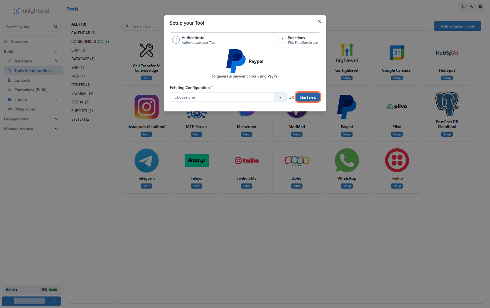

Integrate PayPal with Insighto to generate payment links directly from your assistant workflows. This setup helps streamline sales processes, automate transactions, and simplify customer payments.

---

## 🔧 Setup PayPal Tool

1. Go to Tools & Integration

From the left-hand sidebar of your Insighto dashboard, click on **Tools & Integration**.

---

2. Locate the PayPal Tool and Click Set Up

Find the **PayPal Tool** in the tools list and click **Set Up**.

---

3. Click on Start New

After clicking **Set Up**, a popup window will appear. Click **Start New** to begin creating a new configuration.

---

4. Enter the Required Details

Fill in the configuration form:

- **Name**: Choose a name for this integration.  
- **Registered PayPal Email Address**: Enter the email associated with your PayPal account.  
- **Currency**: Select the currency your customers will use to make payments.

Click **Create** to save.

---

5. Enable Generate Payment Link Function

Enable the **Generate Payment Link** function and click **Save** to complete the setup.

---

## 🤖 Connect with Assistant 

6. Edit Any Existing Assistant

From the **Assistants** section, click the three dots next to the assistant you want to update and select **Edit Assistant**.

---

7. Click on Connect Tools

In the **Tools** tab:

- Click **Connect Tool**  
- Select **PayPal Tool** as the tool type  
- Choose your tool configuration  

---

8. Prompt Example to Trigger the Tool

Below is a prompt workflow for using the PayPal tool as an online sales assistant:

#### 🛒 Task  
You are an online sales assistant for a premium wine store. Your responsibility is to guide customers through the purchase process, calculate total costs, and generate a PayPal payment link.

#### 💬 Greeting Message  
Hi there! Welcome to our wine store. I'm here to help you with your purchase. How many bottles of wine would you like to order today?

#### 🧮 Ask for Quantity  
How many bottles of wine would you like to order?

#### 💵 Calculate the Total  
Multiply the number of bottles by $30. For example, if the customer orders 5 bottles, the total will be $150.  
Respond with:  
`Great! Your total comes to $[total] USD. Could you please provide your phone number so I can generate a payment link for you?`

#### 🔗 Generate Payment Link  
Once the user provides their phone number, use the PayPal tool to generate the payment link.  
Say:  
`Thank you! Generating your payment link now.`

#### ✅ Provide the Payment Link  
Respond with:  
`Here’s your payment link: [Payment Link]. Please complete your purchase at your convenience. If you need any further assistance, feel free to ask!`

---

9: Sample Conversation Example

