Connect your Insighto voice assistant to a Plivo phone number and let users interact via real phone calls.  
This guide will walk you through setting up Plivo, integrating it with Insighto, and deploying your assistant.

> ☁ Ideal for users who want to enable call-based interactions using Plivo.

---
## Plivo Set Up Process
1.  Click on Request Trial on Plivo Website

To get started with Plivo, you'll first need to sign up for a trial account.  
Click on the “Request Trial” button—this will take you to the signup page.  
Fill in the required details to create your account.

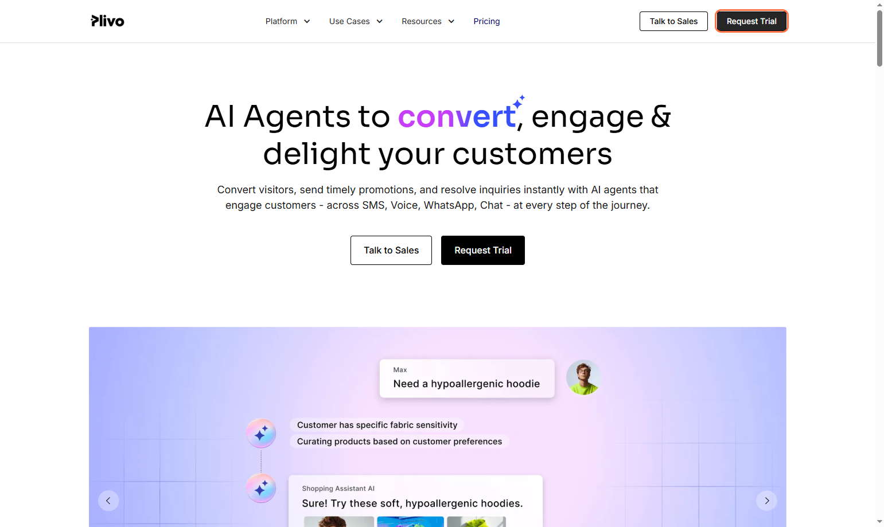

---

2.  Log In to Your Plivo Account

Once you’ve completed the sign-up process and your account is approved:

- Go to the Plivo Login Portal.  
- Enter your credentials and sign in to access your dashboard.

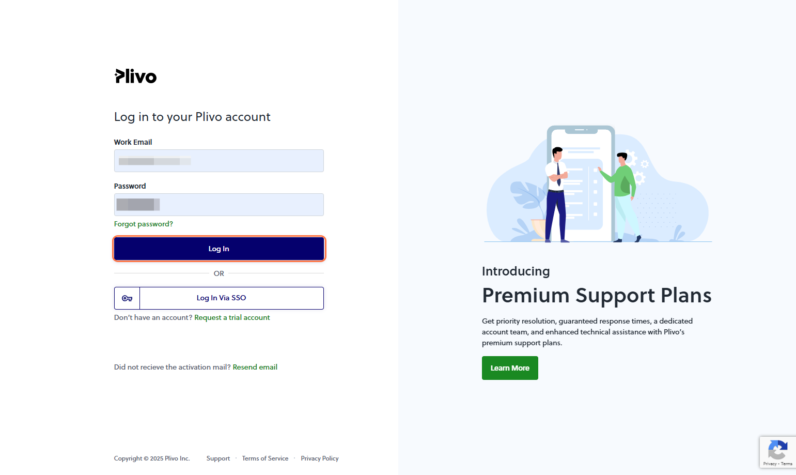

---

3.  Copy Auth ID and Auth Token

On the Plivo Console homepage, locate your Account SID and Auth Token.  
Copy and keep them handy — you’ll need these to integrate Plivo with Insighto.

> 🔒 Treat these as sensitive credentials. Don’t share them publicly.

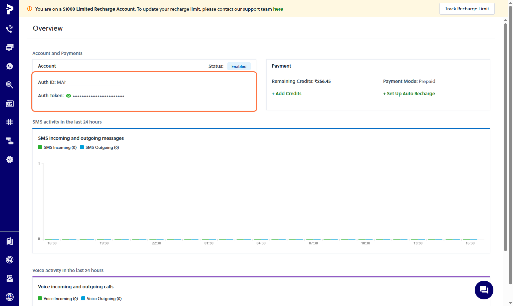

---

4.  Buy a Plivo Phone Number

- Go to the Phone Numbers section in your Plivo Console and click Buy a Number.  
- Use filters to select your country and ensure the number has Voice capability.

🔗 [Buy a Plivo Phone Number](https://www.plivo.com/docs/numbers/guides/buy-a-number)

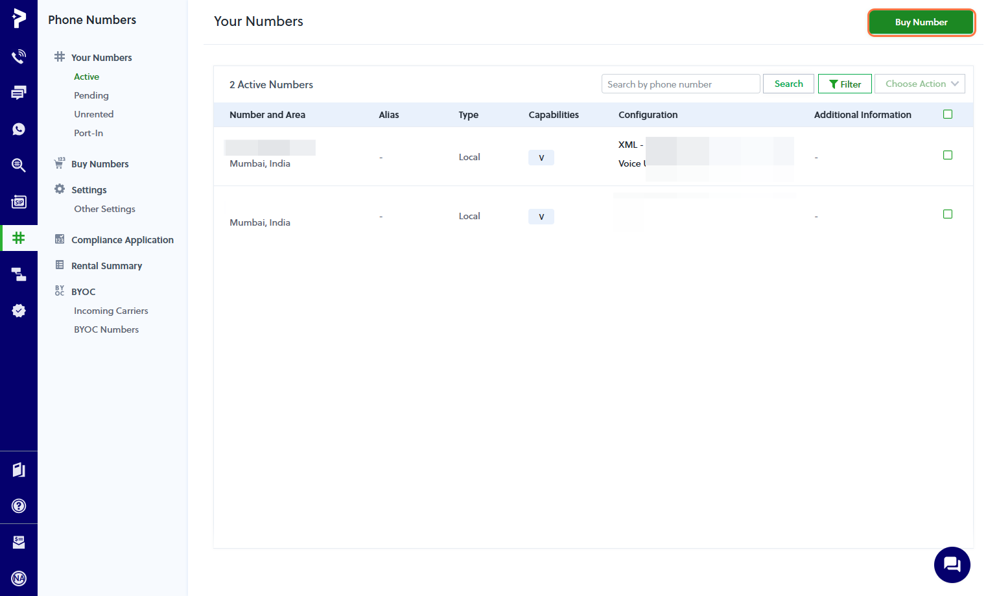

---

✅ Plivo Setup Complete

---
## Plivo Integration with Insighto.ai

5.  Click on Tools & Integrations

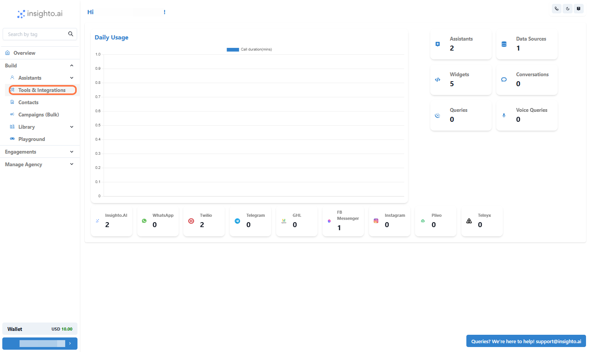

---

6.  Click on Plivo Tool Setup

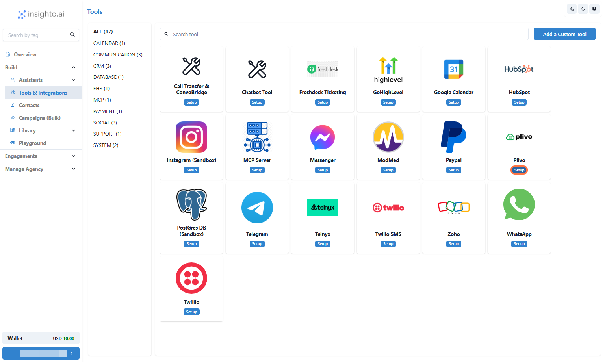

---

7.  Click on Start new

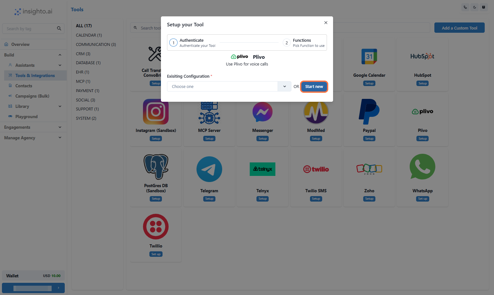

---

8.  Click on Submit

- Provide a Name  
- Input your Auth ID and Auth Token  
- Click on Submit

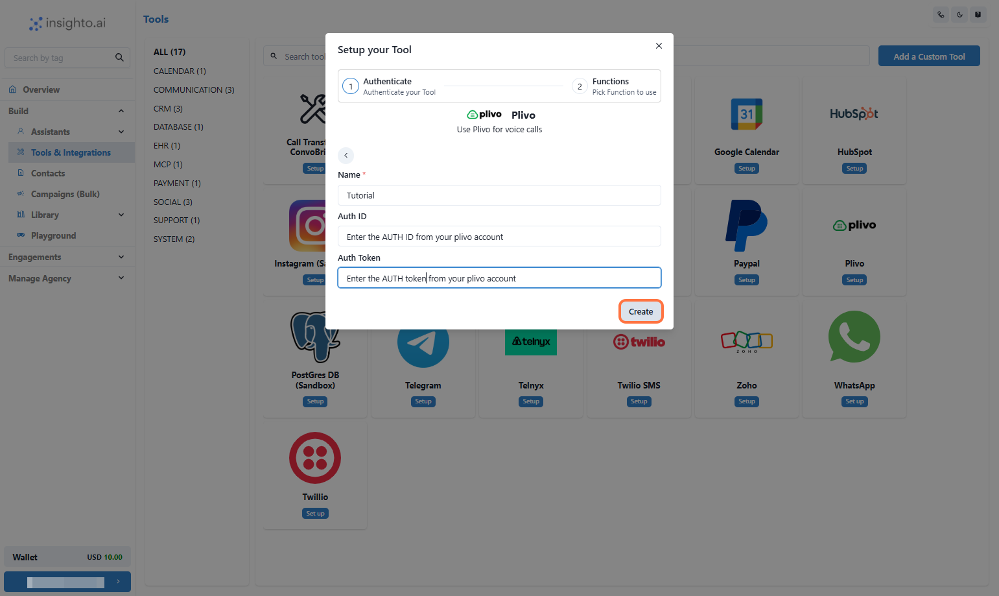

---

9.  Click on Save

On the next page, you may see a message that says “Nothing to set up here”—this is expected.  
The tool doesn’t require additional configuration at this stage because it serves as a simple integration point.

Click on Save

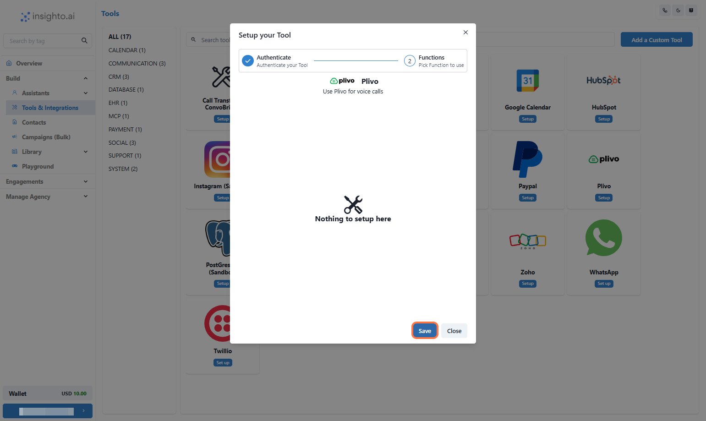

---

🔗 Plivo Integration Complete

Your Plivo account is now successfully connected to Insighto.  
Let’s move on to the final step — deploying your voice assistant on the Plivo number.

---

## Plivo Widget Set Up Process

---

10.  Click on Widgets

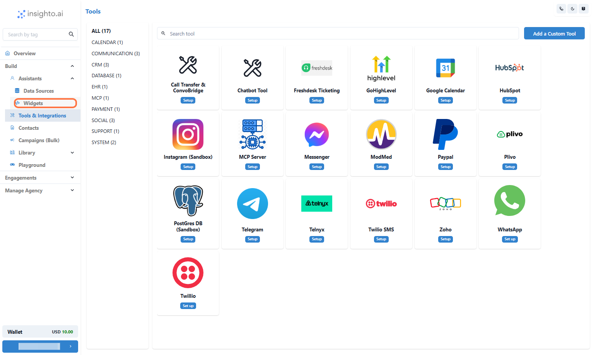

---

11.  Click on Create Widget

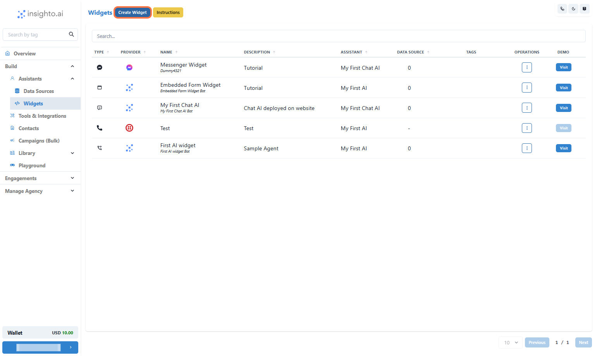

---

12.  Select Provider Type

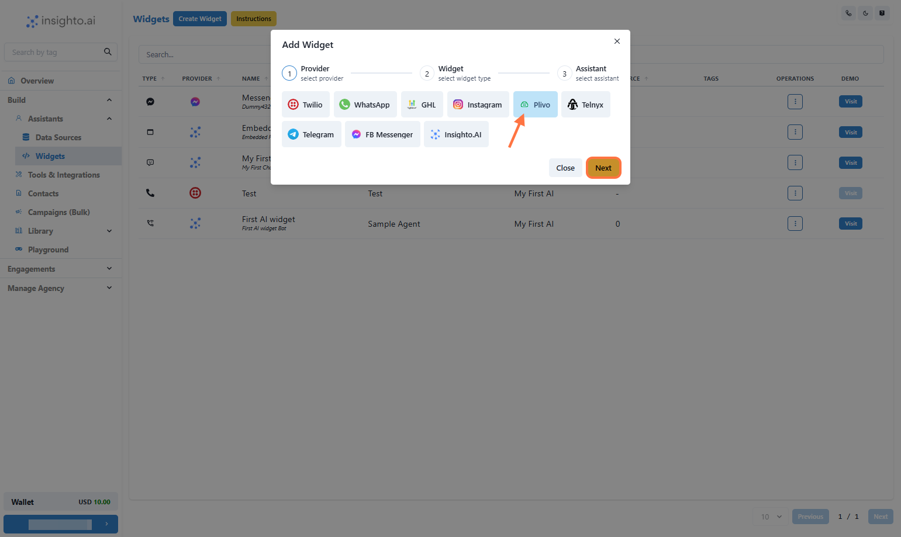

---

13.  Select Widget Type

Select the Widget Type as shown below  
Provide Name & Description of the Widget  
Click on Next

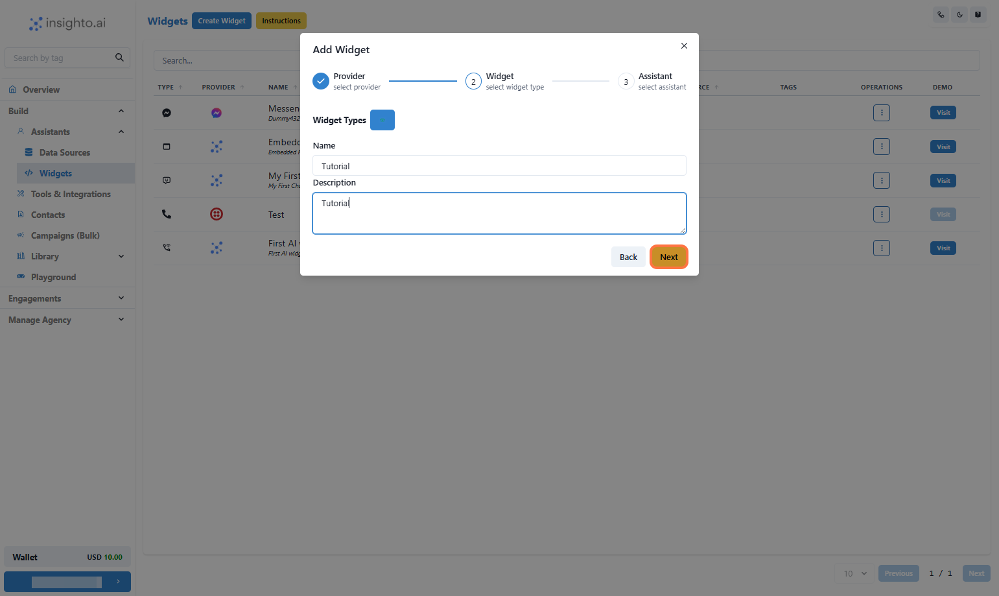

---

14.  Select the Assistant

Select the Assistant from the dropdown and proceed

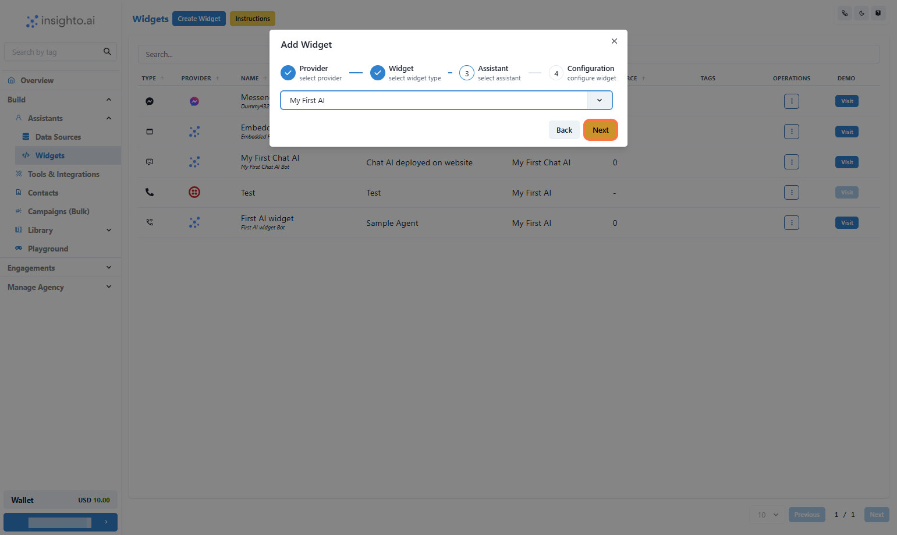

---

15.  Configure Plivo Widget

In this step, set the behavior for your Plivo-powered voice assistant:

- Enable Call Recording (optional) – Recordings will be available in your Plivo dashboard  
- Set Maximum Call Duration in seconds (e.g., 300 for 5 minutes)  
- Select Your Plivo Account from the dropdown  
- Choose a Phone Number associated with that account  

Once done, click Finish to complete deployment.

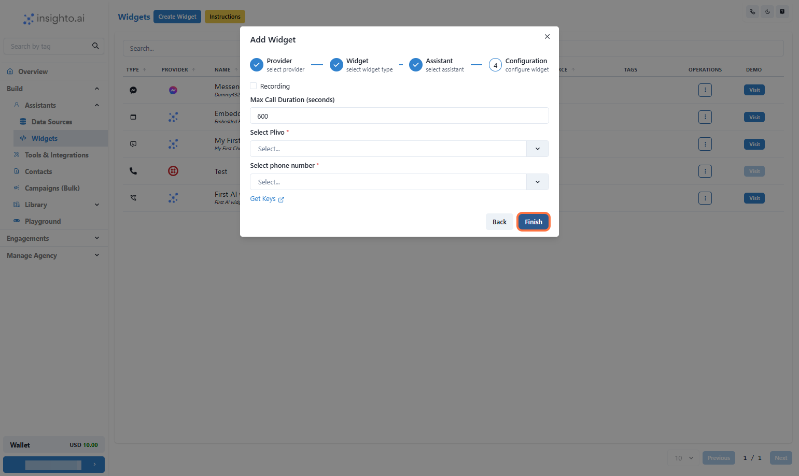

---

16.  Test Your Voice Assistant

Call the Plivo number you just configured to test your AI voice assistant in action.  
Make sure the conversation flows as expected based on your prompt and voice settings.

---

# 🛠️ Troubleshooting Tips

If your voice assistant isn’t working as expected, here are a few ways to identify the issue:

| Issue                         | What to Do                                                                                                                                  |
|-------------------------------|---------------------------------------------------------------------------------------------------------------------------------------------|
| Check the Logs Tab            | Go to the bottom-left corner of your Insighto dashboard where your name or email appears. Click it to open settings → select System Logs. |
| Plivo Account Not Upgraded    | Ensure your Plivo account is upgraded — free trial accounts may block live calls.                                                           |
| Invalid Auth Token or ID      | Verify that the Auth Token & ID used in Insighto are correct.                                                                               |
| Call Diagnostics              | Check call recordings and call status in your Plivo console.                                                                                |

