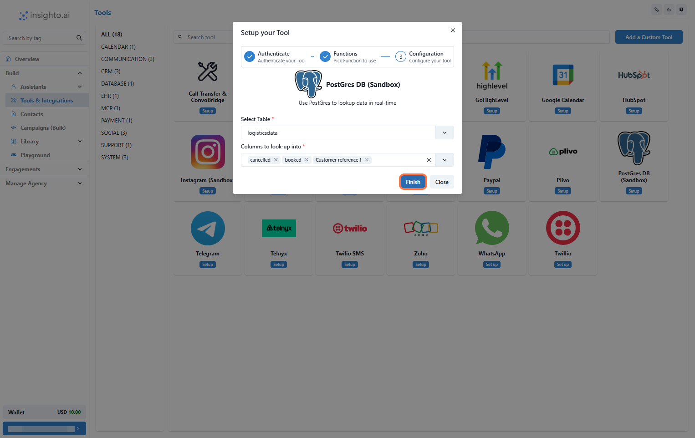

The Postgres DB tool lets you connect your existing **PostgreSQL** database directly to Insighto and run **SQL queries** to fetch information in real-time.

For example, if you have a logistics table in your database, you can connect it, select the columns you want to access, and use them to fetch details based on user input during conversations. This helps you provide **precise answers** and **data-driven insights** to your users—directly from your database.

---

## 🔧 Setup Postgres DB Tool

1. Go to Tools & Integration

From the left-hand sidebar of your Insighto dashboard, click on **Tools & Integration**.

---

2. Click on Set Up

Locate the **Postgres Tool** in the list and click **Set Up**.

---

3. Click on Start New

After clicking **Set Up**, a popup window will appear. Click the **Start New** button to begin creating a new configuration.

---

4. Enter Details and Click Create

Fill in the following fields:

- **Name**: A descriptive name for your connection.  
- **Database Host Server**  
- **Database User**  
- **Database Password**  
- **Database Name**

Click **Create** to save.

---

5. Enable Required Functions and Save

Toggle ON the functions your assistant should use, then click **Save**.

---

6. Select the Table & Columns to Look-Up

Pick the table and the specific columns you want your assistant to access when querying the database.

---

## 🤖 Connect with Assistant 

7. Connect the Tool to an Assistant

To finish setup:

1. Go to the **Assistants** section.
2. Click **Edit** on the assistant you want to connect.
3. In the **Tools** tab, click **Connect Tool** and select your **Postgres DB Tool** configuration.

Once connected, you can write prompts that trigger database queries using user inputs. This allows your assistant to pull **real-time data** from your database and deliver **personalized, accurate responses**.

