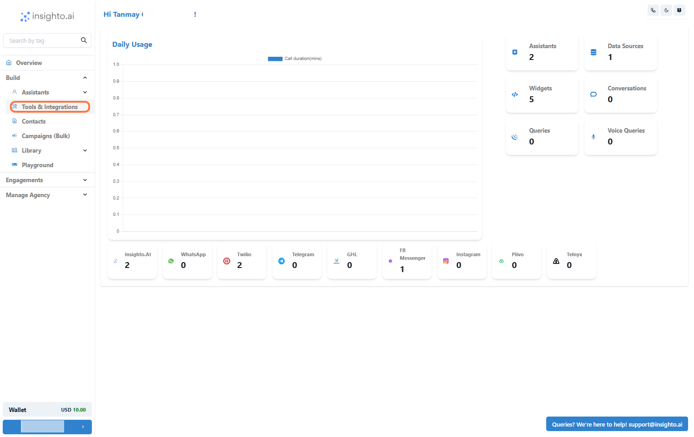
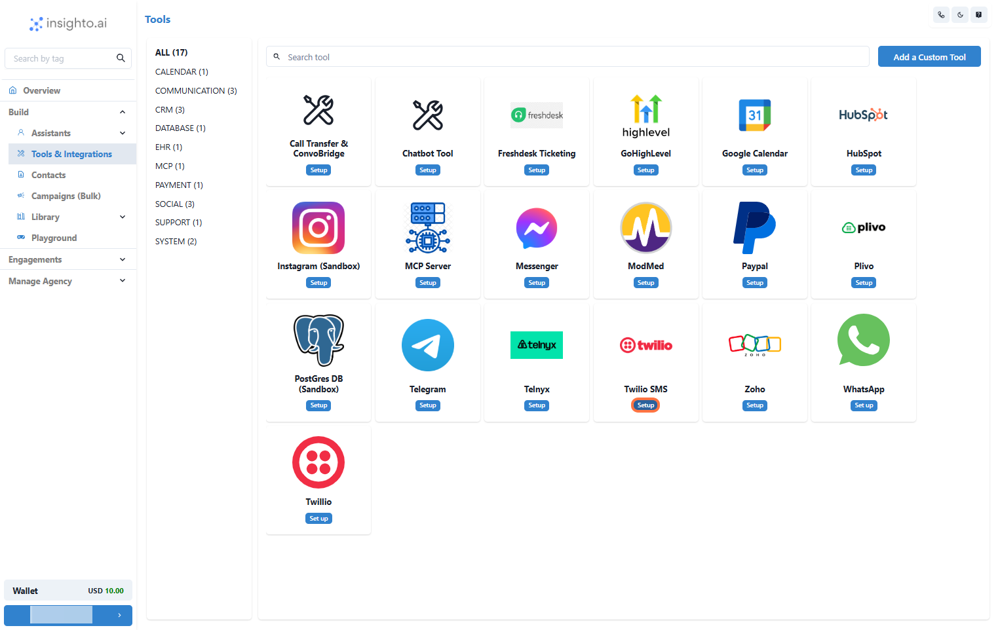
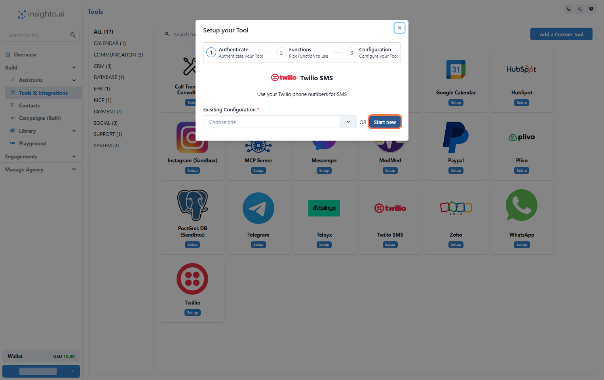
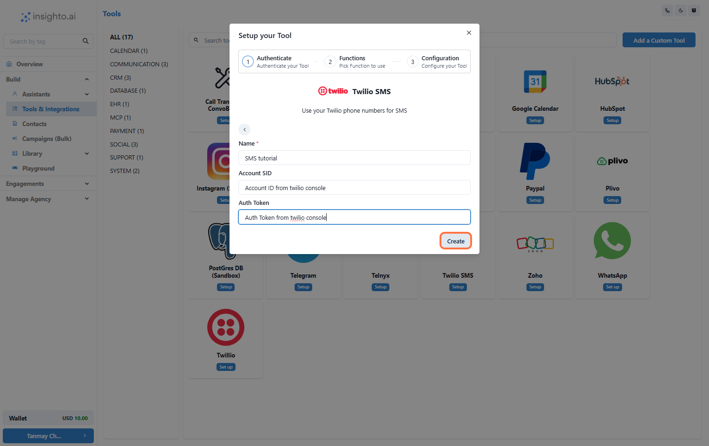
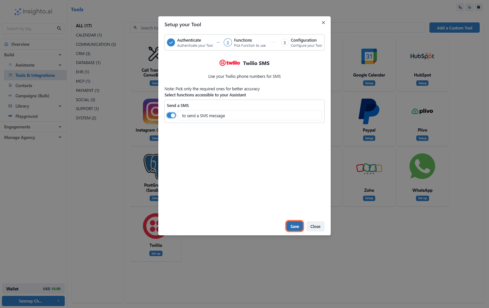
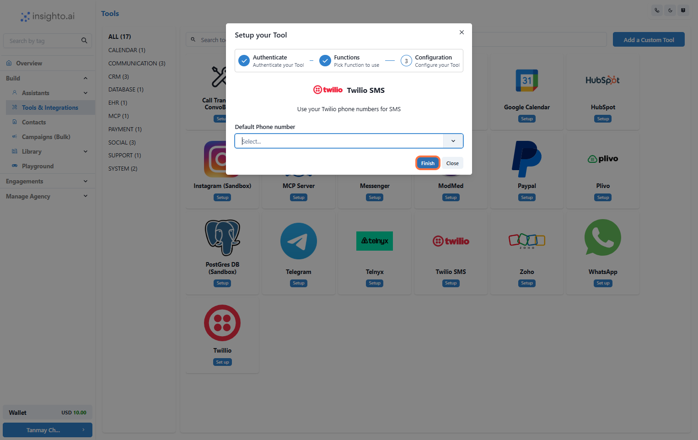
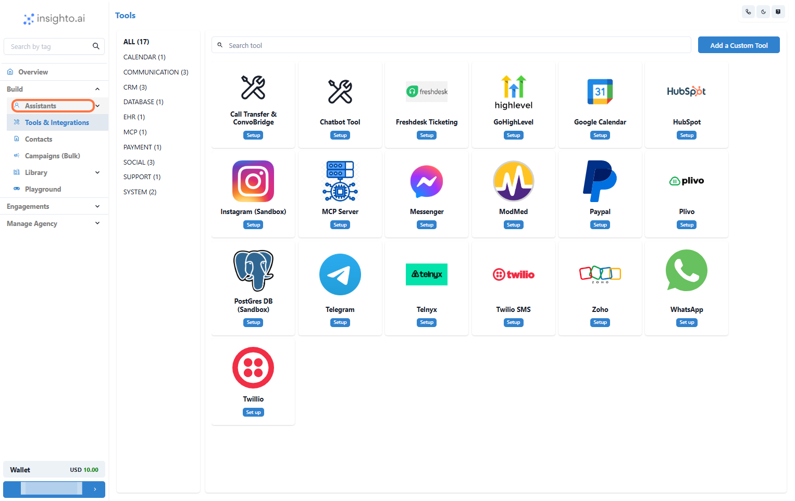
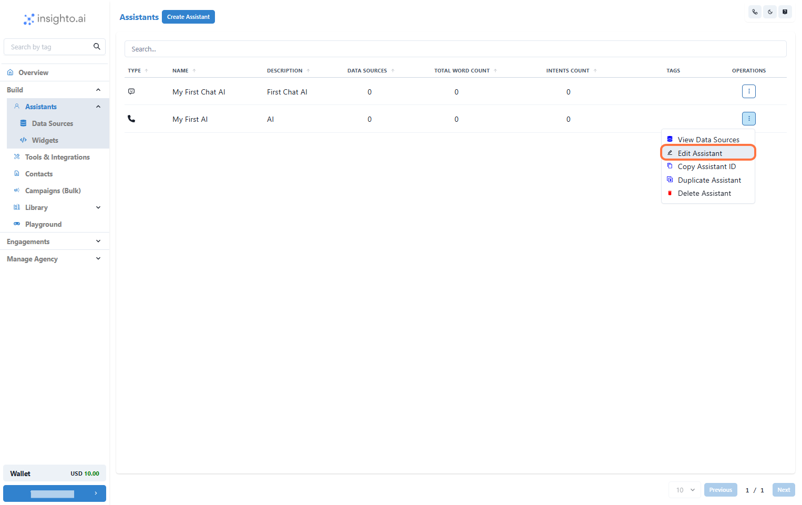
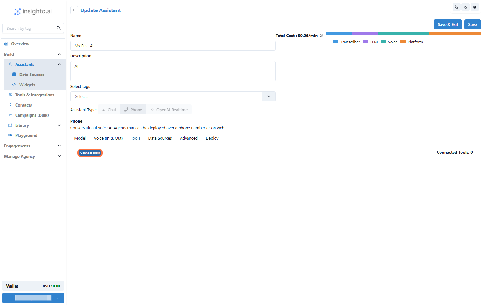
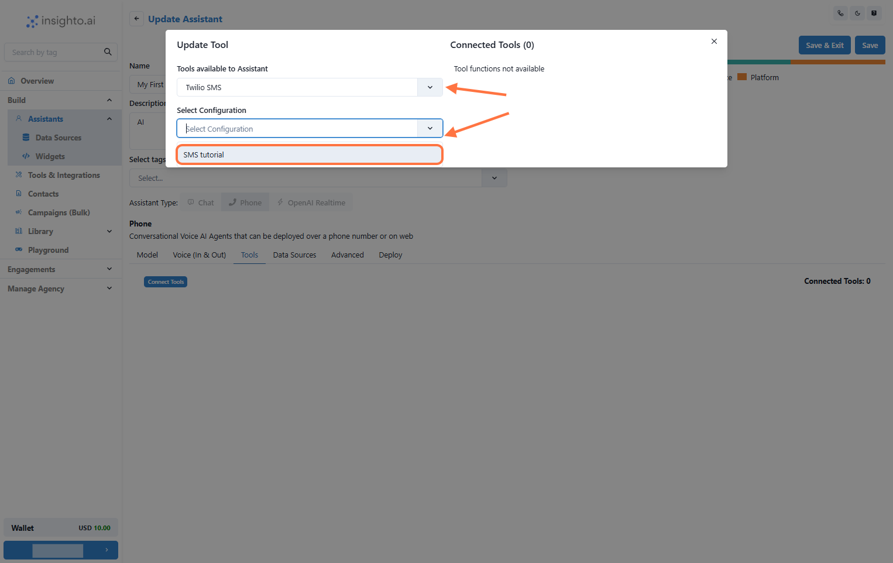

This guide will walk you through how to set up the SMS Tool in Insighto and connect it to your AI assistant.

Once configured, your assistant will be able to send SMS messages during an ongoing chat or call conversation, allowing for seamless communication beyond the immediate session.

---

## ⚙ SMS Tool Setup  

1. Go to Tools & Integration

From the left-hand sidebar of your Insighto dashboard, click on **Tools & Integration**.

2. Locate the Twilio SMS Tool and Click Set Up

3. Click on Start New

After clicking Set Up, a popup window will appear. Click the **Start New** button to begin creating a new configuration for the Twilio SMS Tool.

📌 **Before You Proceed**  
To complete the SMS Tool setup, you'll need to provide the following details:

- **Name** for the configuration  
- **Auth SID**  
- **Auth Token**

🔑 The Auth SID and Auth Token can be obtained from your Twilio account.

👉 For step-by-step instructions on how to find these credentials, please refer to this guide:  
**How to Get Your Twilio Auth SID and Token** (insert link here)

4. Enter Details and Click Create

In the setup popup, fill in the required fields:

- **Name**: Give your SMS tool configuration a recognizable name.  
- **Auth SID** and **Auth Token**: Paste the credentials from your Twilio account.

Once all details are entered, click the **Create** button.

5. Enable the "Send a SMS" Function and Click Save

In the configuration screen, toggle on the SMS function.  
This allows your assistant to send SMS during ongoing conversations.

6. Select a Number and Click Finish

Select a **phone number** from your Twilio account and click **Finish**.

> ⚠ **Note**:  
> If no numbers appear, check your Twilio Auth SID and Auth Token for errors.

🎉 **Congratulations!**  
Your Twilio SMS Tool is now ready to use.

---

## 🤖 Connect with Assistant  

7. Go to Assistants from Left Panel

In the left panel, click on **Assistants**.

8. Edit any existing Assistant

Find the assistant you want to connect. Click the three-dot menu and choose **Edit Assistant**.

9. Click on Connect Tools

Inside the assistant editor, go to the **Tools** tab and click **Connect Tools**.

10. Select Tool Type and Configuration

In the popup:

- Select **Tool Type**: `Twilio SMS Tool`  
- Choose the configuration you created earlier

11. Confirm the Tool Connection and Save Changes

Close the popup and click **Save** in the assistant editor.

✅ Your tool is now linked to the assistant.

---

## 🚀 How to Trigger this Tool  

12. Trigger the SMS Tool

During a conversation, use a prompt like:

> **Instruction Example:**  
> Ask for their mobile number with the prefix `+1`. If it's the same number they are calling from, request confirmation.  
>  
> Use the available tool to send an SMS:  
> `"Your Message Here."`

