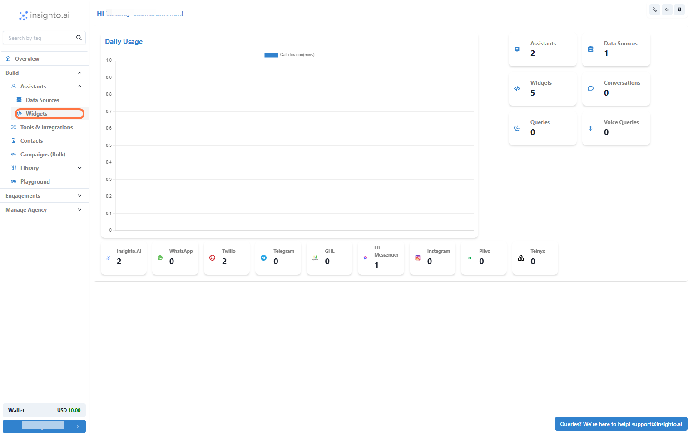
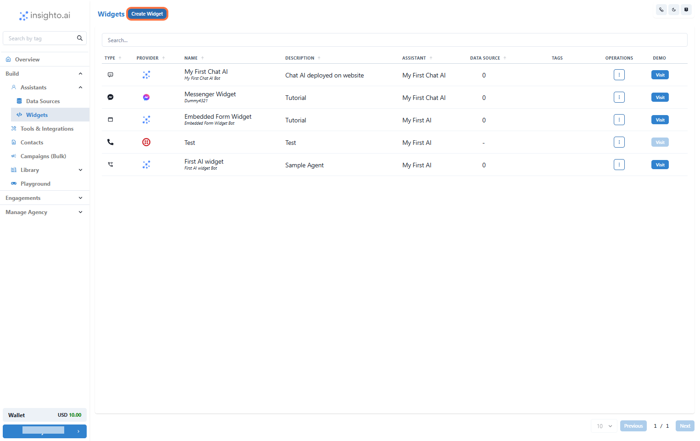
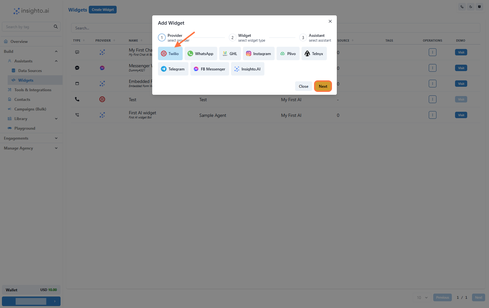
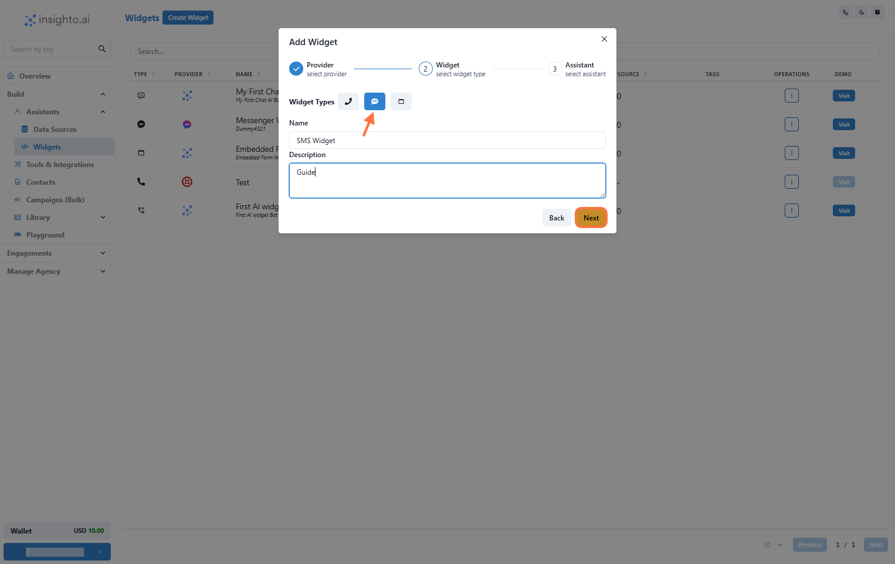
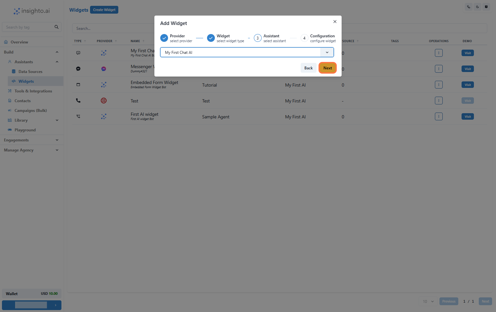
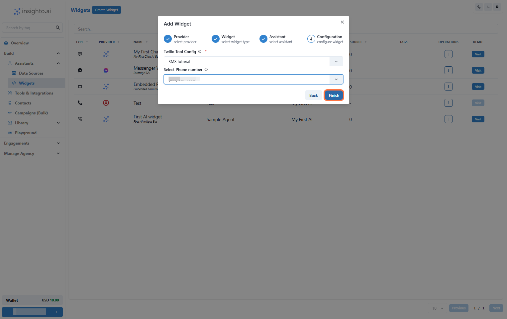

This guide will walk you through deploying your AI chat assistant on an SMS number, enabling it to respond to inbound text messages automatically. Once set up, the assistant will handle user queries received via SMS in real time.

⚠ Note: SMS deployment supports inbound messages only. Your assistant cannot send an initial message unless triggered by a user.

#

🧩 Prerequisite:  

To begin, complete the SMS tool setup to connect your Twilio number to the platform.

🔗 Follow this step-by-step guide to set up the SMS Tool:  
Set Up SMS Tool with Twilio →

Once done, return to this guide to continue with deploying your assistant using an SMS widget.

1.  Follow the SMS Tool Setup Guide

To begin, complete the SMS tool setup to connect your Twilio number to the platform.

🔗 Follow this step-by-step guide to set up the SMS Tool:  
Set Up SMS Tool with Twilio →

Once done, return to this guide to continue with deploying your assistant using an SMS widget.

#

Create SMS Widget

2.  Click on Widgets from the Left Panel

In the Assistants section of the left panel, click on Widgets. This will take you to the widget setup page where you can deploy your AI assistant.

🔔 Note:  
Ensure you have already created an AI chat assistant before proceeding. If you haven’t, please follow the previous guides to create and configure your assistant first.

3. Create New Widget

Click Create New Widget to start the setup process.

4. Select Twilio as the Provider Type and Click Next

In the widget setup screen, choose Twilio as the provider type. Once selected, click Next to proceed.

5. Select Widget Type, Name, and Describe Your Widget

Widget Type: Choose the SMS type.

Name: Choose a descriptive name for easy identification (e.g., Customer Support Chat).

Description: Provide a brief description of the widget’s purpose (e.g., Handles customer support inquiries via WhatsApp).

Once you’ve filled in these details, click Next to move on.

6. Select Your Chat Assistant from the Dropdown

In this step, select the AI chat assistant you created earlier from the dropdown list.

7. Configure Twilio SMS Widget

In this step, set the behavior for your Twilio-powered SMS assistant:

Select Your Twilio Account from the dropdown  
Choose a Phone Number associated with that account  
Once done, click Finish to complete deployment.

8. Test Your SMS Assistant

Send a message to Twilio number you just configured to test your AI chat assistant in action.

