Connect your Insighto voice assistant to a Twilio phone number and let users interact via real phone calls.  
This guide will walk you through setting up Twilio, integrating it with Insighto, and deploying your assistant.

> ☁ Ideal for users who want to enable call-based interactions using Twilio.

---

## 📞 Twilio Setup Process

### 1. Sign Up on Twilio

If you're new to Twilio, click **Sign Up** on the login page to create a new account.

> 🔄 Already have an account? Skip to Step 3.

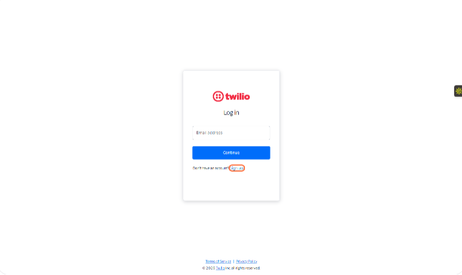

---

### 2. Complete the Sign-Up Process

Fill in your details on the sign-up page and click **Continue** to finish creating your account.

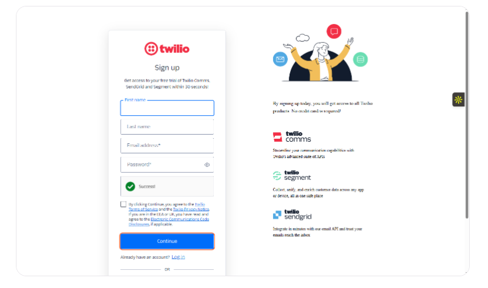

---

### 3. Log In to Your Twilio Account

Enter your credentials, and access your dashboard.

✅ Once logged in, you'll land on the Twilio Console homepage.

> ⚠ **Important: Upgrade Your Twilio Account**  
New Twilio accounts start on a free trial, which may prevent your voice assistant from working properly after deployment.  
To avoid issues, it's recommended to verify and upgrade your account before proceeding.

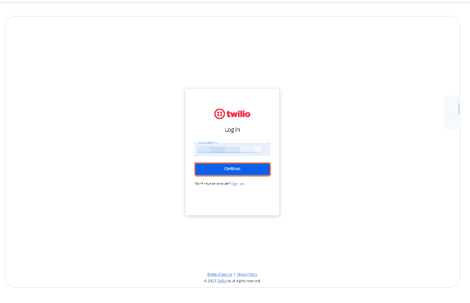

---

### 4. Copy Account SID and Auth Token

On the Twilio Console homepage, locate your **Account SID** and **Auth Token**.  
Copy and keep them handy — you’ll need these to integrate Twilio with Insighto.

> 🔒 Treat these as sensitive credentials. Don’t share them publicly.

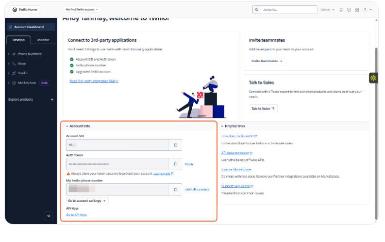

---

### 5. Buy a Twilio Phone Number

Go to the **Phone Numbers** section in your Twilio Console and click **Buy a Number**.  
Use filters to select your country and ensure the number has **Voice** capability.

> 🔁 Already have a number? Refer to this guide to **Port your existing number on Twilio**.

---

✅ **Twilio Setup Complete — Final Checks Before Integration**

---

### 6. Click on Tools & Integrations

Click on **Tools & Integrations**

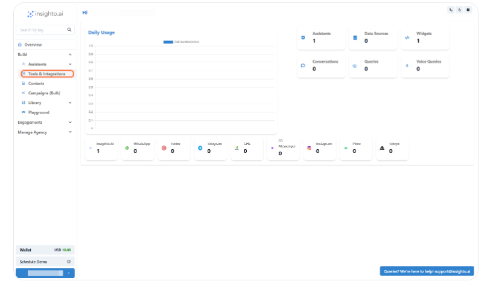

---

### 7. Click on Twilio Set up

Click on **Twilio Set up**

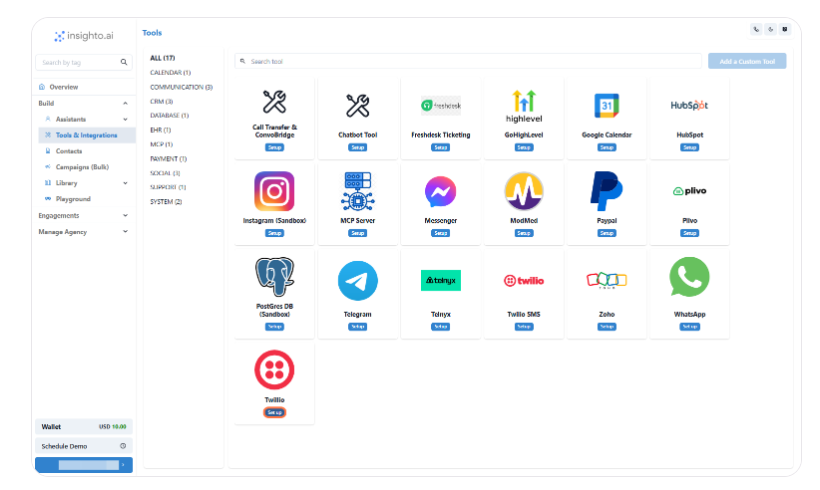
---

### 8. Click on Create New

Click on **Create New**

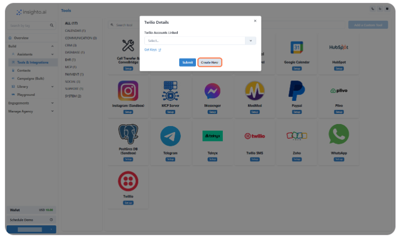

---

### 9. Click on Submit

- Provide a Name  
- Input your **Account SID** and **Auth Token**  
- Click on **Submit**

---

🔗 **Twilio Integration Complete**  
Your Twilio account is now successfully connected to Insighto.  
Let’s move on to the final step — deploying your voice assistant on the Twilio number.

---

### 10. Click on Widgets

Click on **Widgets**

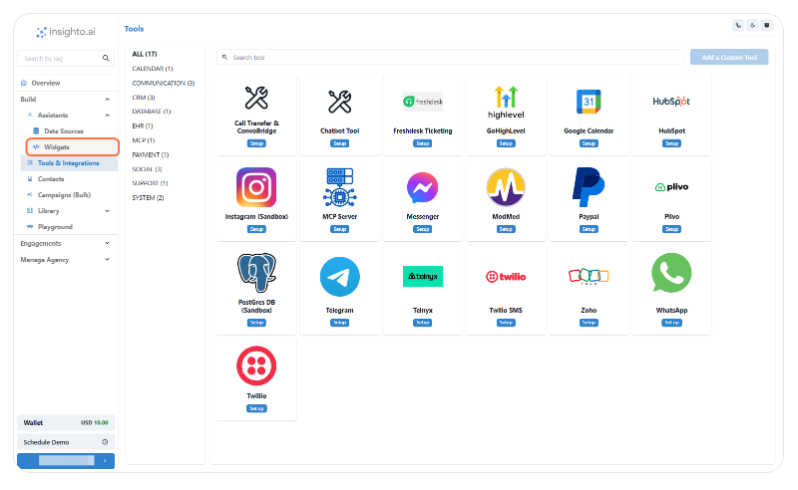

---

### 11. Click on Create Widget

Click on **Create Widget**

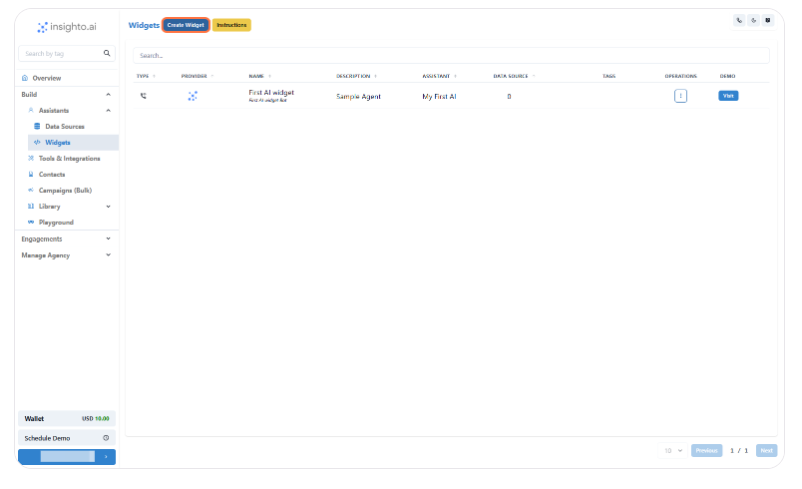

---

### 12. Select Provider Type

Select **Provider Type**

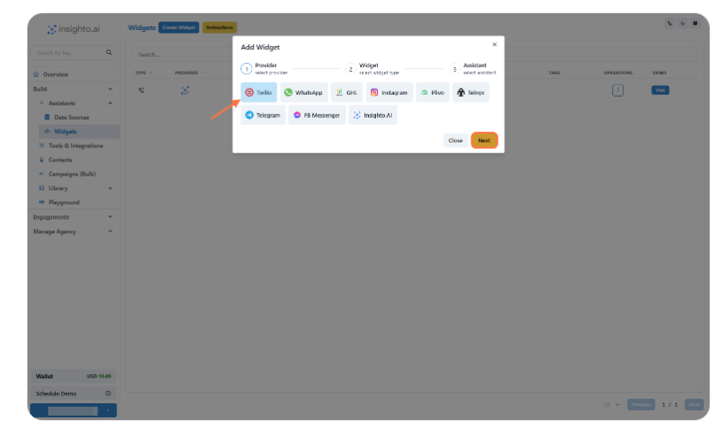

---

### 13. Select Widget Type

- Select the **Widget Type** as shown below  
- Provide **Name** & **Description** of the Widget  
- Click on **Next**

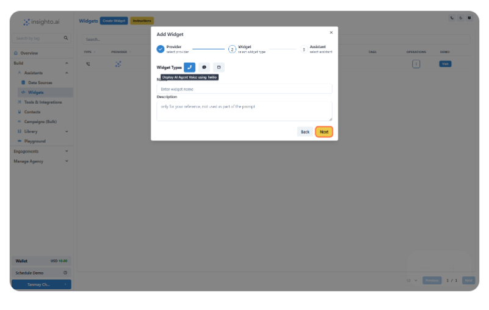

---

### 14. Select the Assistant

Select the **Assistant** from the dropdown and proceed

---

### 15. Configure Twilio Widget

In this step, set the behavior for your Twilio-powered voice assistant:

- Enable Call Recording (optional) – Recordings will be available in your Twilio dashboard  
- Set Maximum Call Duration in seconds (e.g., 300 for 5 minutes)  
- Select Your **Twilio Account** from the dropdown  
- Choose a **Phone Number** associated with that account  

Once done, click **Finish** to complete deployment.

---

### 16. Test Your Voice Assistant

Call the Twilio number you just configured to test your AI voice assistant in action.  
Make sure the conversation flows as expected based on your prompt and voice settings.

---

## 🛠️ Troubleshooting Tips

If your voice assistant isn’t working as expected, here are a few ways to identify the issue:

  

    
Check the Logs Tab

    

      Go to the bottom-left corner of your Insighto dashboard where your name or email appears. Click it to open the settings menu, then select <code>System Logs</code>. Here, you'll find detailed logs and error messages to help identify any issues with your assistant.
    

  
 

  

    
Ensure Twilio account is upgraded

    

      Free trial accounts may block live calls.
    

  
 

  

    
Confirm voice routing is set to US1

    

      Confirm that voice routing is set to <code>US1</code> in your Twilio phone number settings.
    

  
 

  

    
Verify Auth Token & SID

    

      Verify that the <code>Auth Token</code> and <code>SID</code> used in Insighto are correct.
    

  

 

Check call recordings and call status

Check call recordings and call status in your Twilio console

 
