# Deploy Your AI Chat Assistant on Facebook Messenger

Learn how to seamlessly integrate your custom AI chat agent with Facebook Messenger. This guide walks you through connecting your Facebook Page and deploying your assistant to automatically handle user messages in real-time.

---

## 🔧 First Step: Set Up the Tool and Connect Insighto with Facebook

We’ll start by integrating Insighto with Facebook Messenger.

 1. Select Tools & Integration from the Sidebar

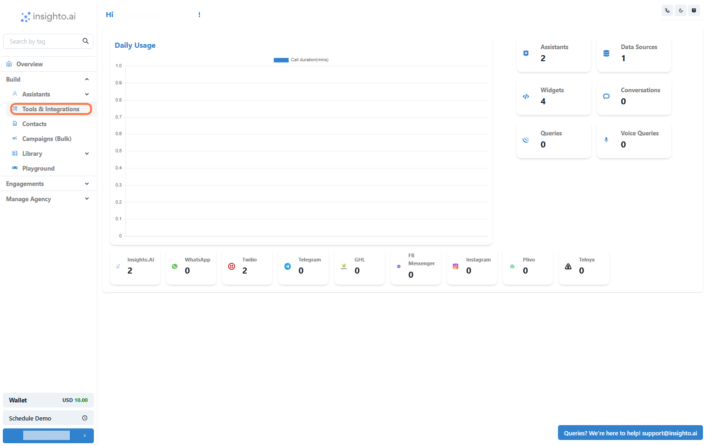

To begin setting up your Facebook Messenger integration, navigate to the **Tools & Integration** section from the left-hand menu of your dashboard.

 2. Click Set Up Next to the Messenger Tool

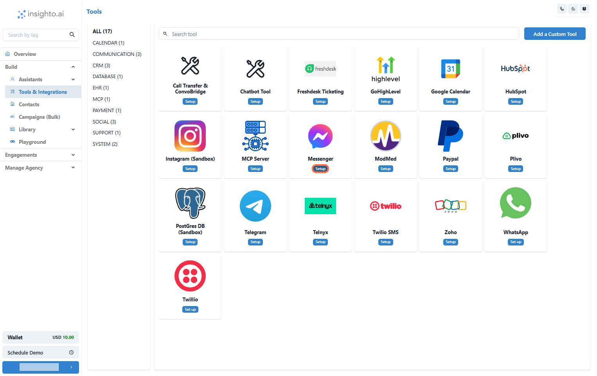

In the Tools & Integration section, locate the **Messenger** integration from the list of available tools. Click the **Set Up** button to start connecting your AI assistant to Facebook Messenger.

 3. Click S
 
 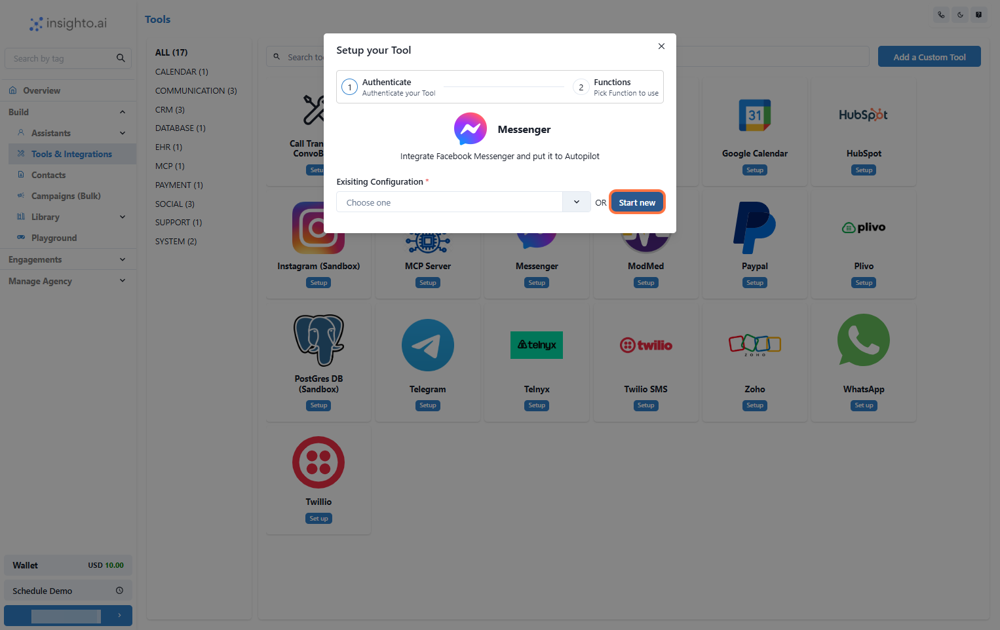

Click the **Start New** button to initiate the Messenger integration setup. You’ll be redirected to Facebook to log in with the account that has admin access to your desired Facebook Page.

 4. Choose Which Facebook Pages to Connect

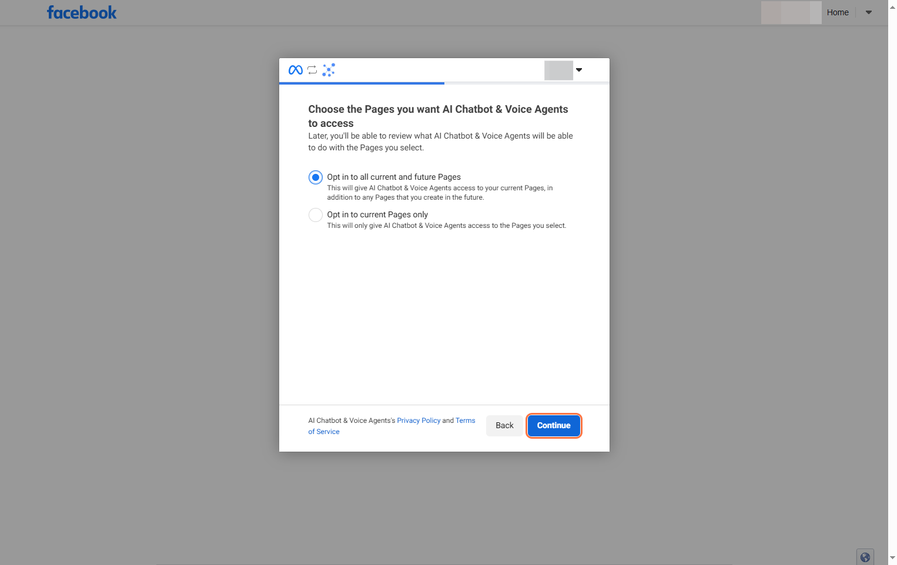

After logging in, you'll be prompted to select how you'd like to connect your Facebook Pages. You’ll see two options:

- **Opt in to all current and future Pages**  
  This allows your AI assistant to be deployed on all Pages you currently manage, as well as any new ones you add in the future.

- **Opt in to current Pages only**  
  This lets you manually select which Pages you want to connect now. Choose this if you prefer more control over which Pages should show up while deploying the AI assistant.

 5. Confirm Integration and Return to the Platform

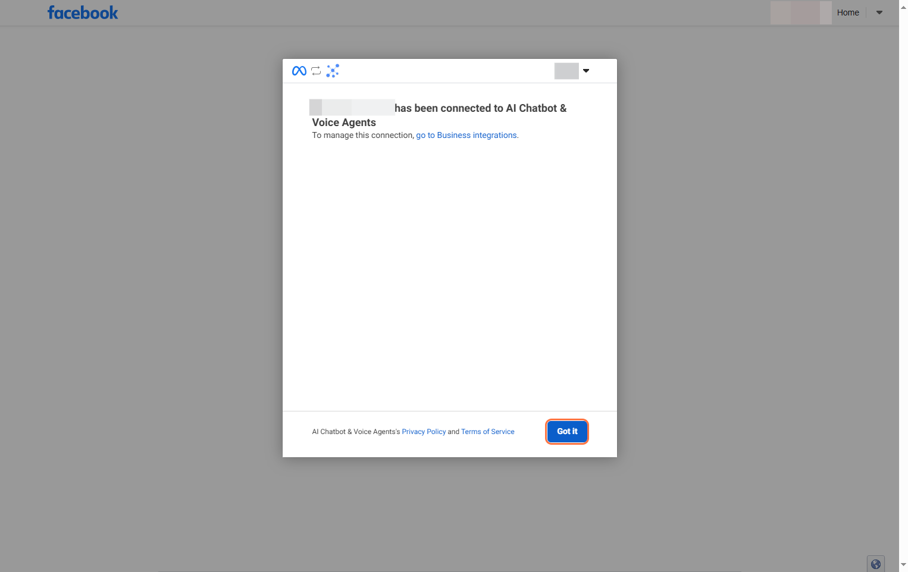

Once the connection is successful, Facebook will display a confirmation message. Simply click the **Got It** button to complete the process and you’ll be redirected back to Insighto.

 6. Name Your Integration and Complete Setup

You’ll be brought back to the Messenger Tool Setup page on Insighto. Enter a name for your integration—something that helps you easily identify the connected Page—and click **Create** to finalize the setup.

> 📝 **Best Practice:**  
> Use a clear and descriptive name like `Support Bot – Brand Page` to quickly recognize your integrations later.

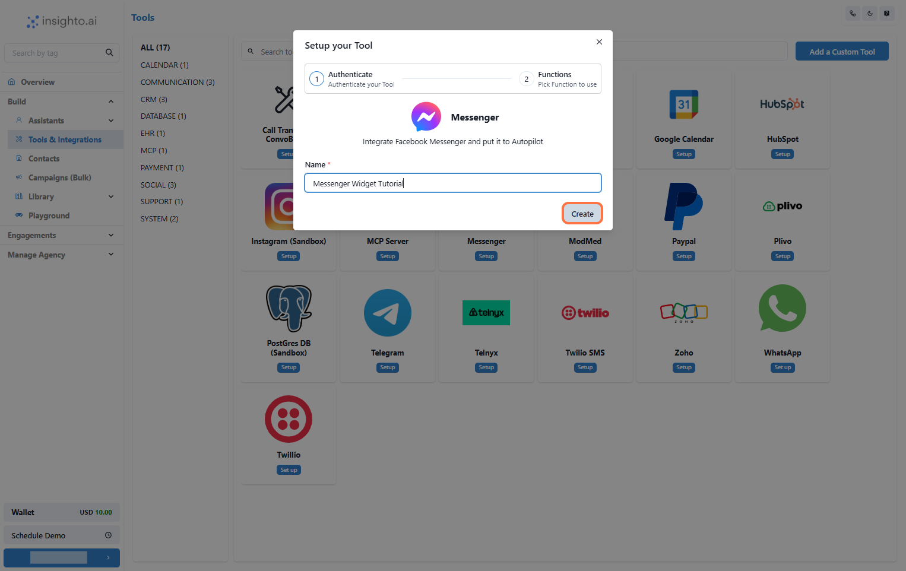

 7. Finalize Setup by Clicking Save

On the next page, you may see a message that says **“Nothing to set up here”** — this is expected. The Messenger tool doesn’t require additional configuration at this stage because it serves as a simple integration point.

> 💡 **Why This Happens:**  
> Messenger is used solely to link your Facebook Page. The actual deployment of your AI chat assistant will be handled separately via a Messenger Widget during the agent setup process.

To complete the integration, simply click **Save**.

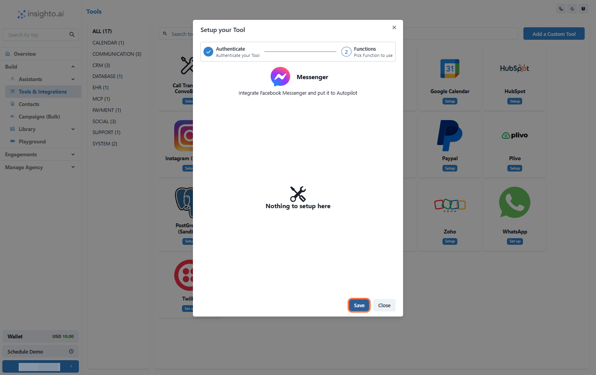

---

## Next Step: Create a Messenger Widget to Deploy Your AI Chat Assistant

Now that the integration is complete, it's time to deploy your AI chat assistant on Messenger. To do this, you need to create a **Messenger Widget** that will link your AI agent to your connected Facebook Page and handle incoming messages from users.

 8. Click on Widgets from the Left Panel

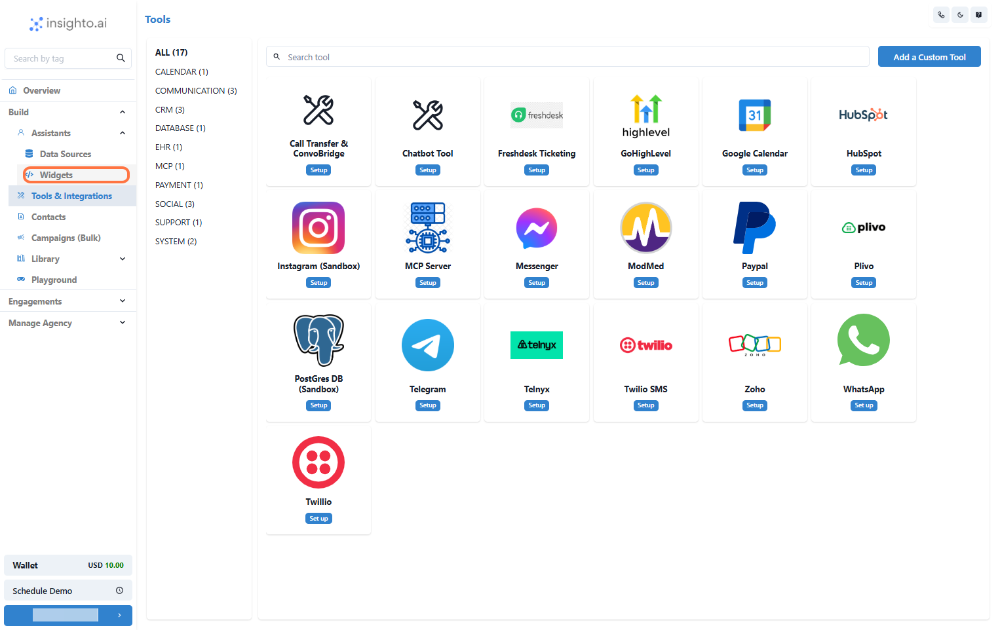

In the **Assistants** section of the left panel, click on **Widgets**. This will take you to the widget setup page where you can deploy your AI assistant.

> 🔔 **Note:**  
> Ensure you have already created an AI chat assistant before proceeding. If you haven’t, please follow the previous guides to create and configure your assistant first.

 9. Create a New Widget

Click **Create New Widget** to start the setup process.

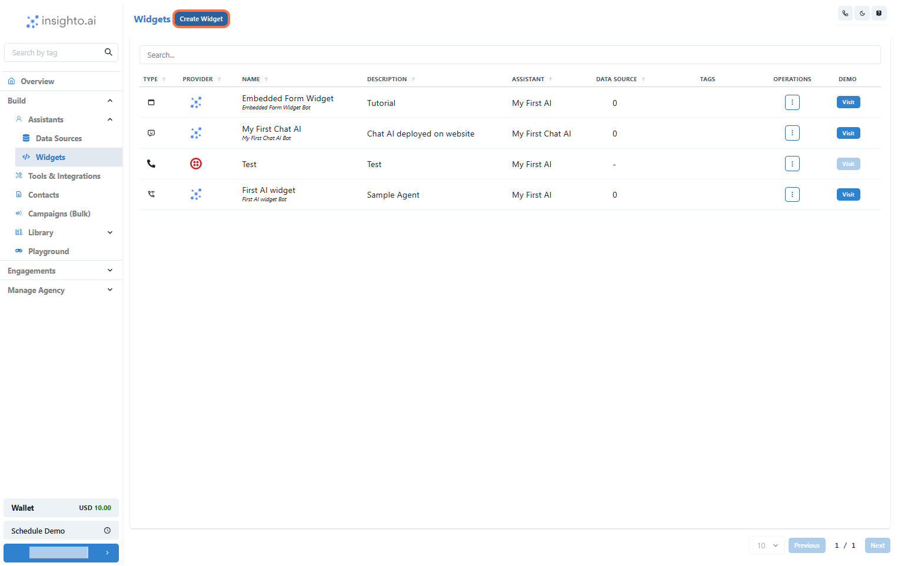

 10. Select Messenger as the Provider Type and Click Next

In the widget setup screen, choose **Messenger** as the provider type. This ensures your widget will be linked to Facebook Messenger for handling user messages. Once selected, click **Next** to proceed.

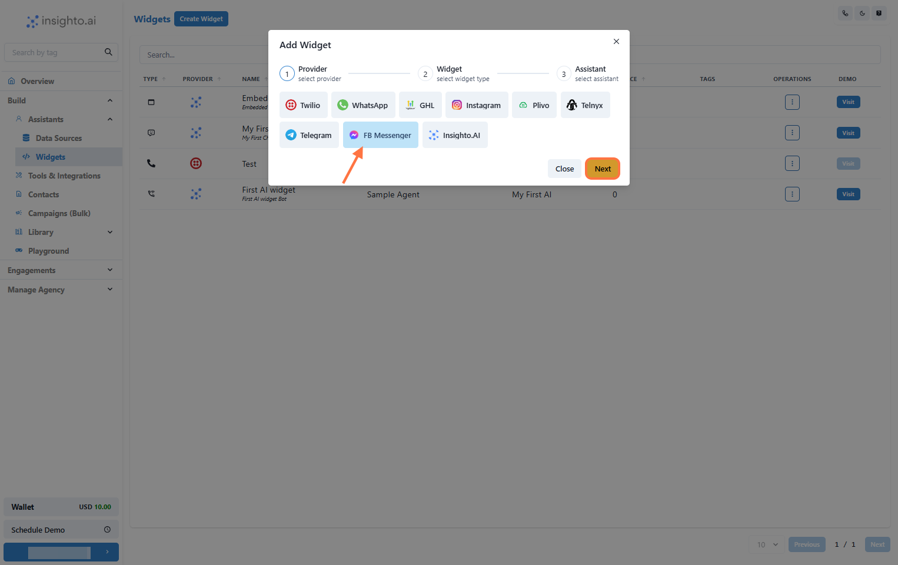

 11. Select Widget Type, Name, and Describe Your Widget

- **Widget Type:** Choose the appropriate type.
- **Name:** Choose a descriptive name for easy identification (e.g., `Customer Support Chat`).
- **Description:** Provide a brief description of the widget’s purpose (e.g., `Handles customer support inquiries via Messenger`).

Once you’ve filled in these details, click **Next** to move on.

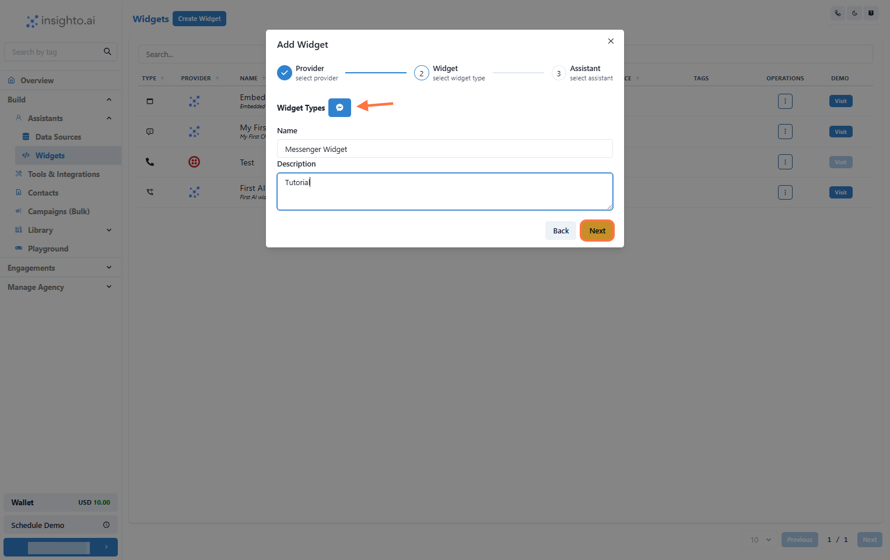

 12. Select Your Chat Assistant from the Dropdown

In this step, select the AI chat assistant you created earlier from the dropdown list.

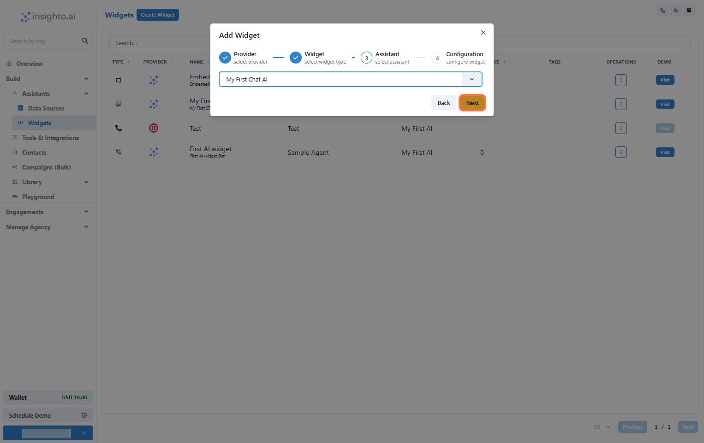

 13. Select the Messenger Tool and Choose the Page for Deployment

From the dropdown, select the Messenger Tool you integrated earlier. This will prompt another option where you can choose the specific Facebook Page where you want to deploy your AI chat assistant.

Select the desired Page from the list.

Once selected, click **Finish** to complete the widget setup and deploy the assistant.

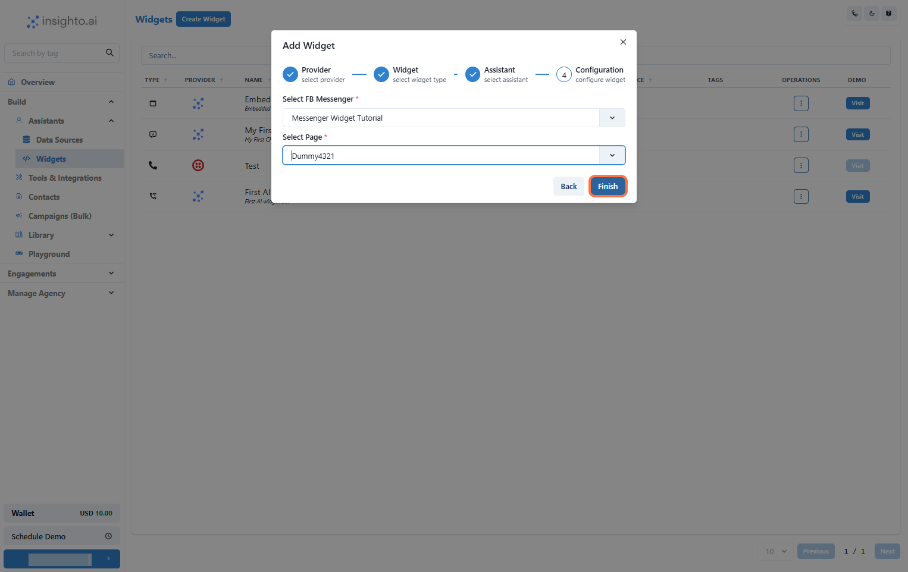

> 🎉 **Success!**  
> Your AI chat assistant is now active on your Facebook Page and ready to handle user messages via Messenger.

 14. 🧪 Test Your Widget

To test the widget, you have two options:

- Click the **Visit** button next to your widget to open it in a new window and interact with the assistant directly.
- Visit the Facebook Page as a user, send a message, and see how the AI assistant responds.
