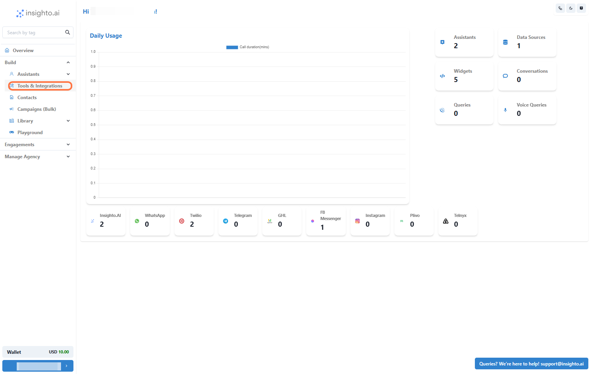
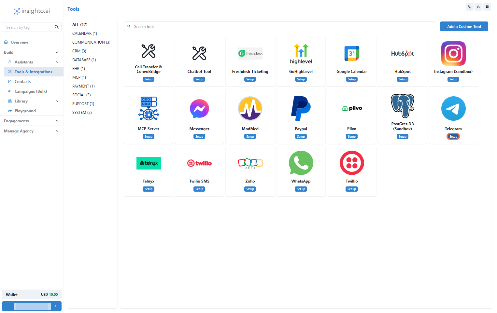
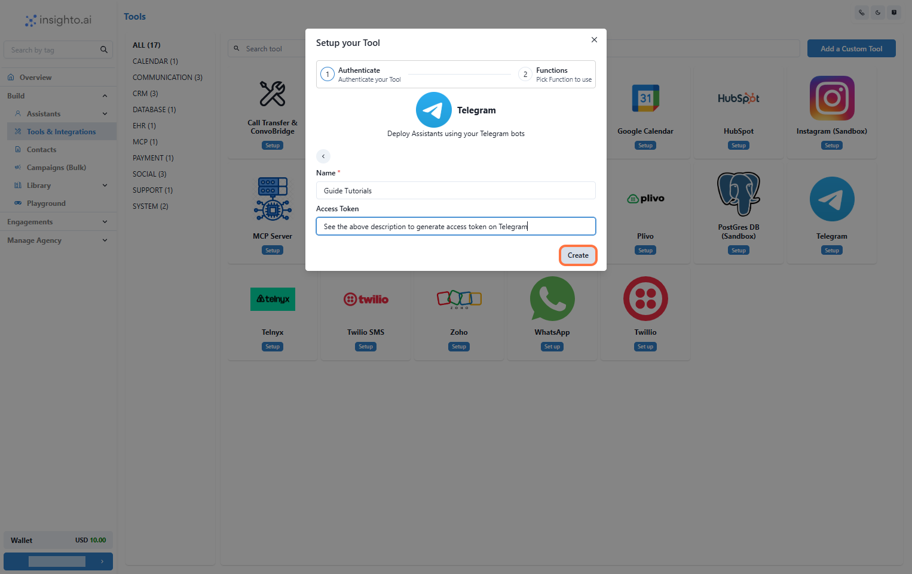
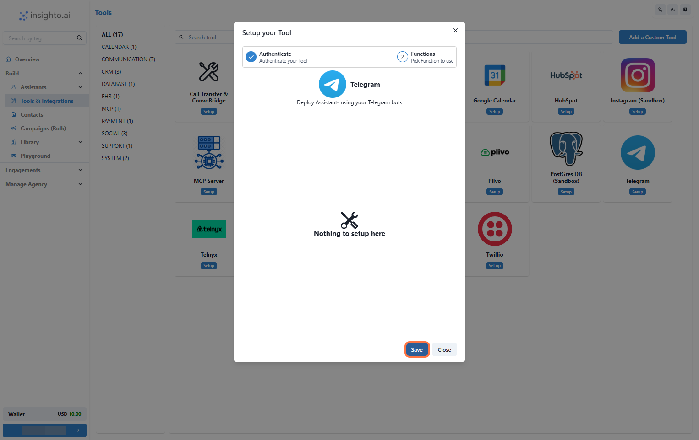
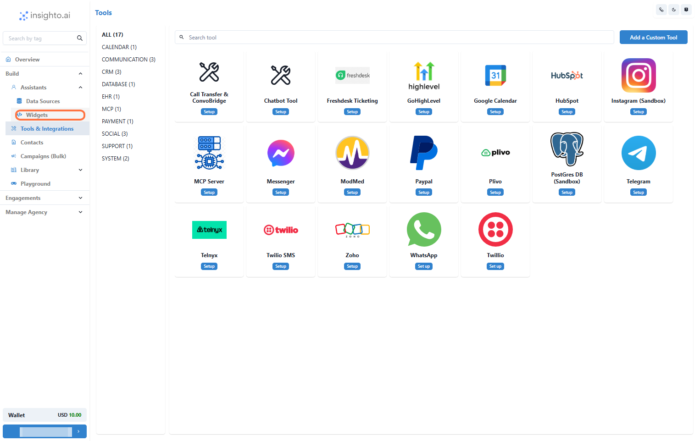
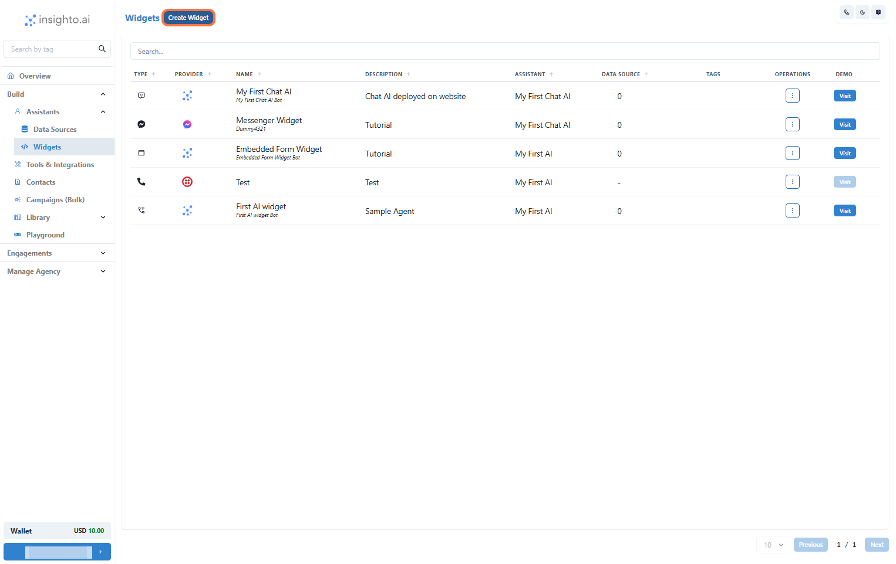
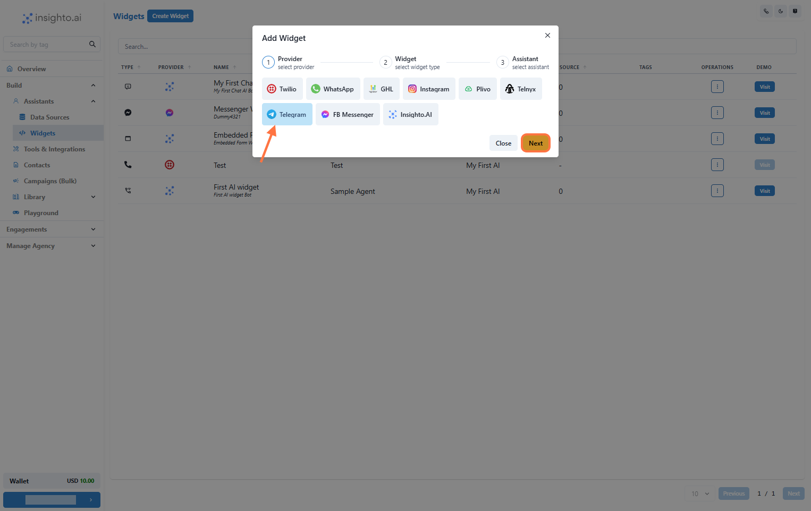
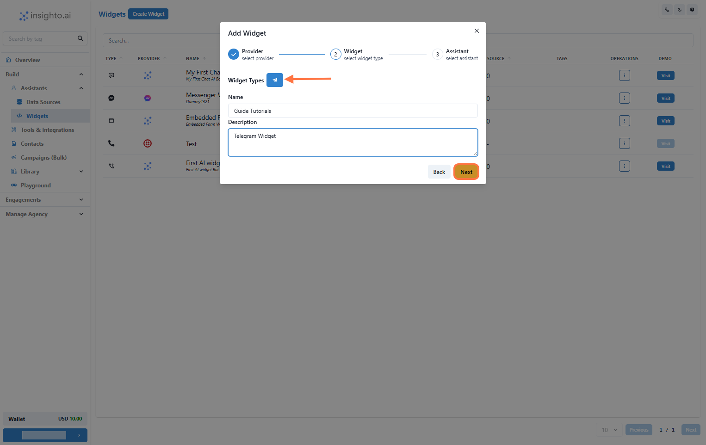
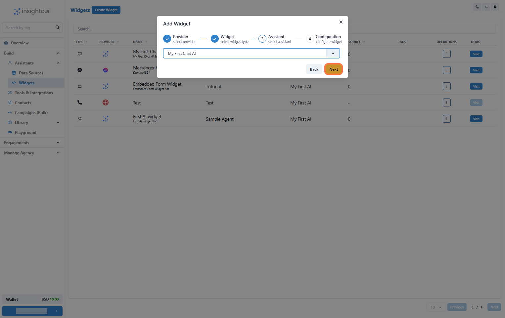
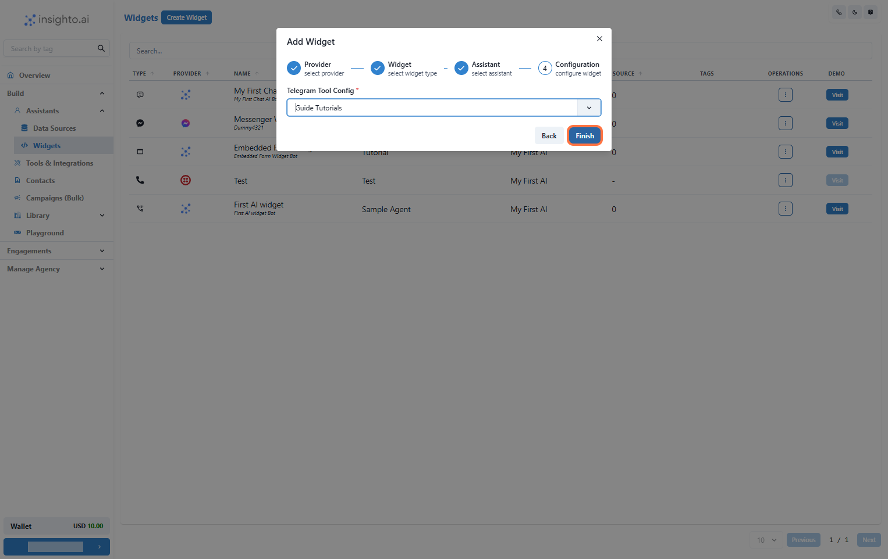

In this guide, you’ll learn how to set up the Telegram tool on Insighto and deploy your AI-powered chat assistant to a Telegram bot, enabling it to respond to user messages in real time. This integration allows your assistant to handle text-based queries from Telegram users just like any other messaging platform.

---

## Telegram Tool Setup
1. **Select Tools & Integration from the Sidebar**

2. **Click Set Up Next to Telegram Tool**

In the Tools & Integration section, locate Telegram from the list of available tools. Click the Set Up button.

Click Set Up Next to Telegram Tool

3. **Click on Start new**

Click the Start New button to initiate the configuration

4. **Enter Tool Name and Telegram Bot Token**

In this step, you need to:

- Give your Telegram tool integration a name  
- Paste your Telegram Bot API token  

This token is required to connect your Telegram bot with Insighto.

> 🔑 **How to Get Your Telegram Bot Token**  
> Open the Telegram app on your device.  
>  
> Search for BotFather (@BotFather) and start a conversation.  
>  
> Use the command `/newbot` to create a new bot.  
>  
> Follow the prompts:  
> - Enter a name for your bot.  
> - Enter a username (must end with "bot"—e.g., MyShopBot).  
>  
> Once done, BotFather will generate a unique API token for your bot.  
>  
> Copy the token—it will be used in this step.  
>  
> Paste the token into the Access Token field in Insighto, then click **Create** to continue.

5. **Finalize Setup by Clicking Save**

On the next page, you may see a message that says “Nothing to set up here” — this is expected. The tool doesn’t require additional configuration at this stage because it serves as a simple integration point.

> 💡 **Why This Happens:**  
> Telegram tool is used solely to link your telegram bot with Insighto. The actual deployment of your AI chat assistant will be handled separately via Widget during the agent setup process.

To complete the integration, simply click **Save**.

---

## Create Telegram Widget

6. **Click on Widgets from the Left Panel**

In the Assistants section on the left panel, click **Widgets**. This opens the widget setup page for deploying your AI assistant.

> 🔔 **Note:**  
> Ensure you’ve already created an AI assistant before proceeding. If not, follow the assistant creation guide first.

7. **Create a New Widget**

Click on **Create New Widget** to start the setup process.

8. **Select Telegram as the Provider Type**

In the setup screen:

- Set **Provider Type** to Telegram  
- Click **Next** to proceed

9. **Select Widget Type, Name, and Describe Your Widget**

Fill in the widget details:

- **Widget Type**: Choose appropriate type  
- **Name**: e.g., Customer Support Chat  
- **Description**: e.g., Handles customer support inquiries via Telegram  

Click **Next** when done.

10. **Select Your Chat Assistant**

Choose the assistant you created earlier from the dropdown list.

11. **Select Telegram configuration and Click Finish**

Select the Telegram tool configuration from the dropdown list

