# Telynx Set Up For Voice AI

Connect your Insighto voice assistant to a Telynx phone number and let users interact via real phone calls.  
This guide will walk you through setting up Telynx and integrating it with Insighto.

1. Click on Login

- Go to [Telnyx Login](https://portal.telnyx.com/#/login/sign-in)
- Enter your credentials, and access your dashboard.
- Once logged in, you’ll land on the Telnyx Console homepage.

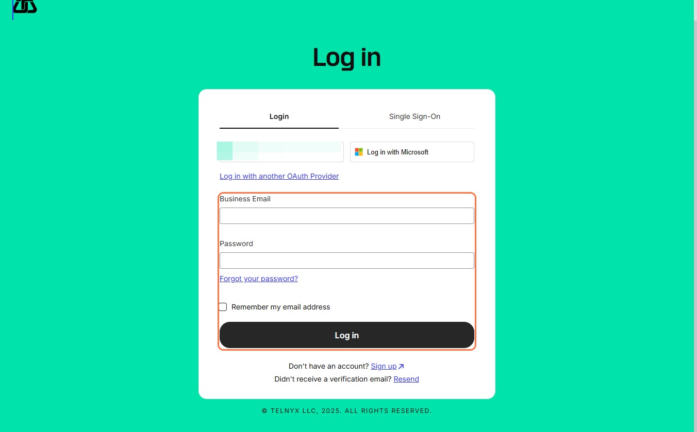
---

2. Click on API Keys

- In the top right corner, click on your **profile icon**.
- From the dropdown menu, click on **API keys**.

[Go to Telnyx Console](https://portal.telnyx.com/#/home)

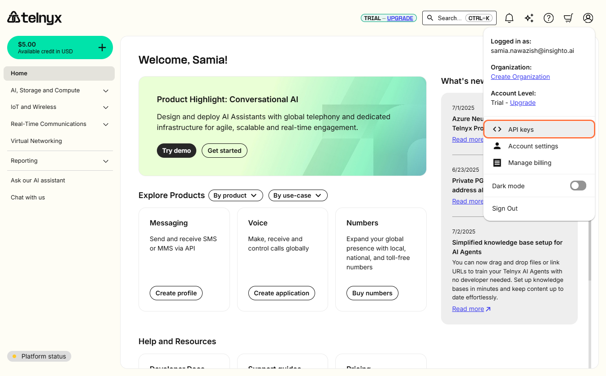
---

3. Create API Key

- Click the **Create API Key** button on the right side.
- This will generate a new Telnyx API key.
- **Copy the key** and keep it handy for Insighto setup.

[Go to API Keys](https://portal.telnyx.com/#/api-keys)
  
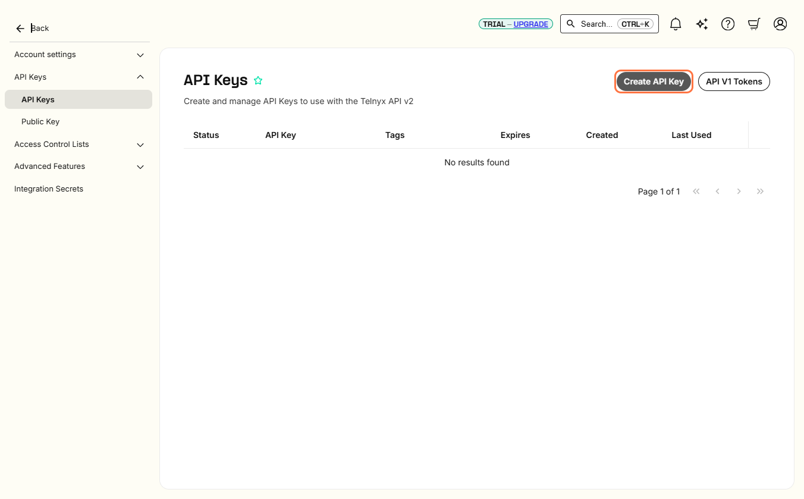  
---

4. Login to Insighto

- Go to [Insighto Login](https://app.insighto.ai/login)

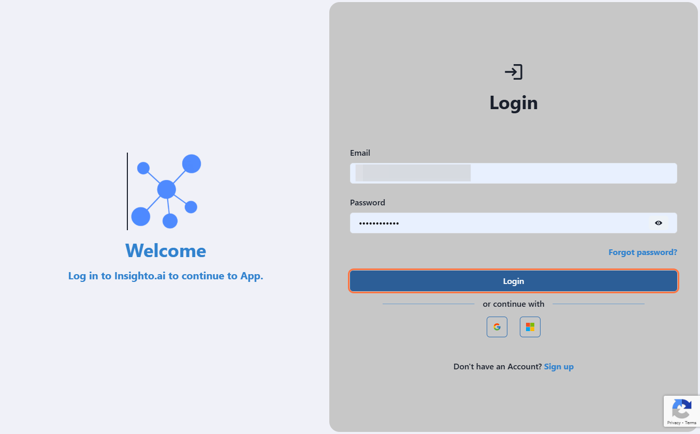
---

5. Navigate to Tools & Integrations

- Click on **Tools & Integrations** from the dashboard.
  

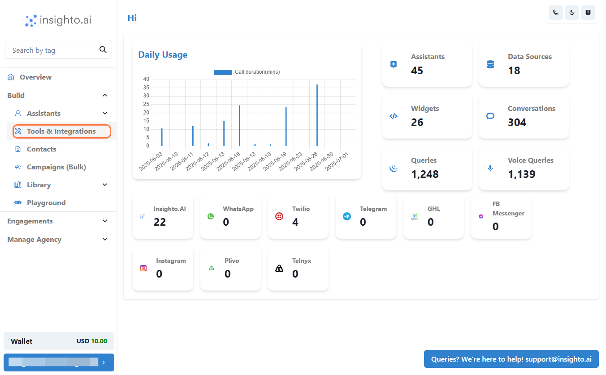
---

6. Click on Telnyx Setup

- Select **Telnyx Setup** from the list.

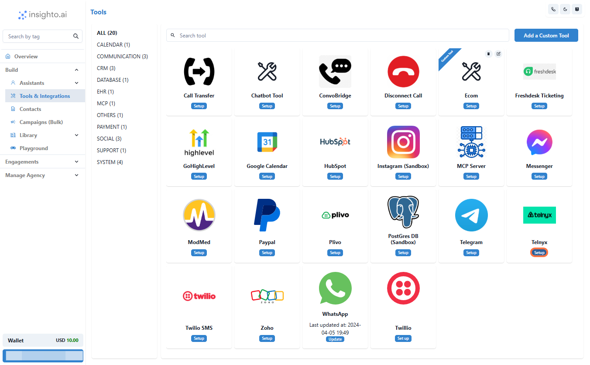
---

7. Click on Start New

- Click on **Create New**.

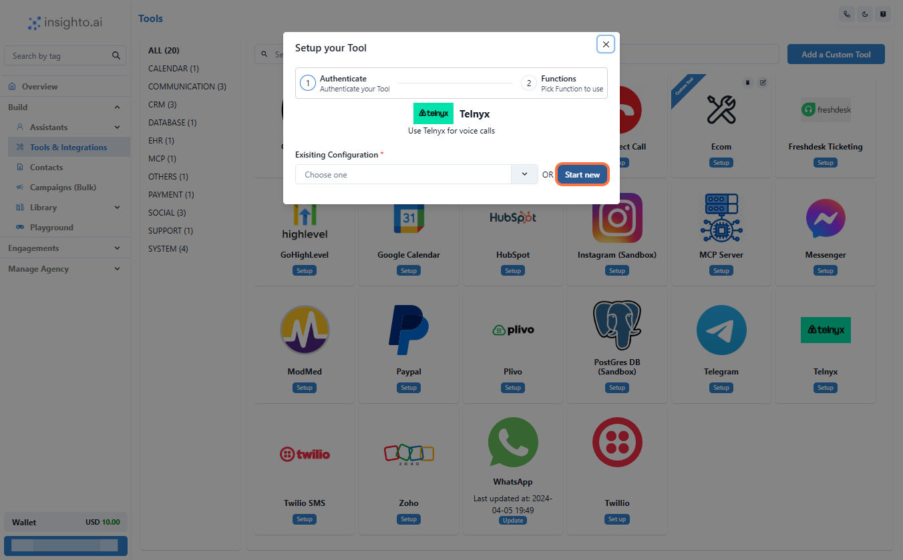
---

8. Enter Details and Create

- Enter a **Name** and **API Key**.
- Click on **Create**.

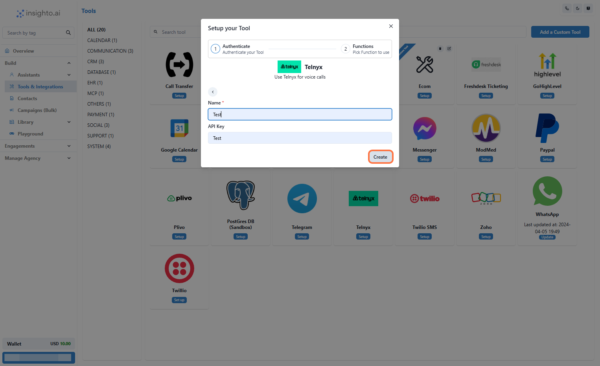
---

9. Save

- Click on **Save** to confirm integration.

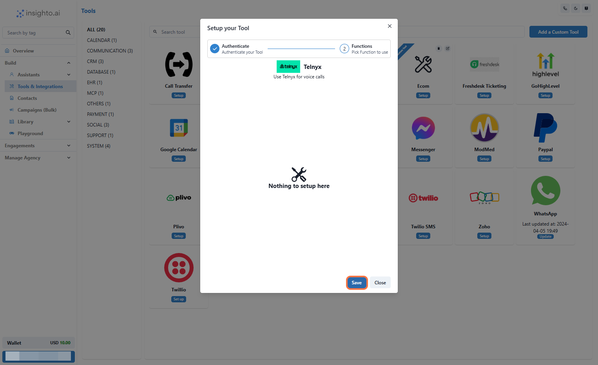
---
 10. Go to Widgets

- Click on **Widgets**.

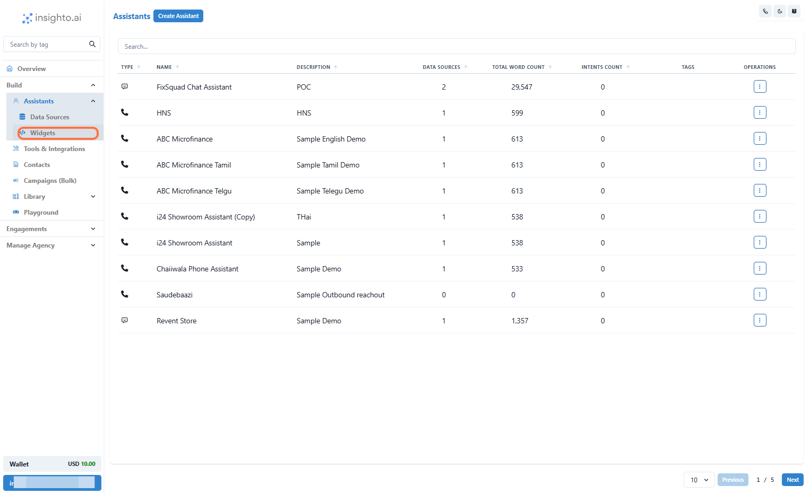
---

11. Create Widget

- Click on **Create Widget**.

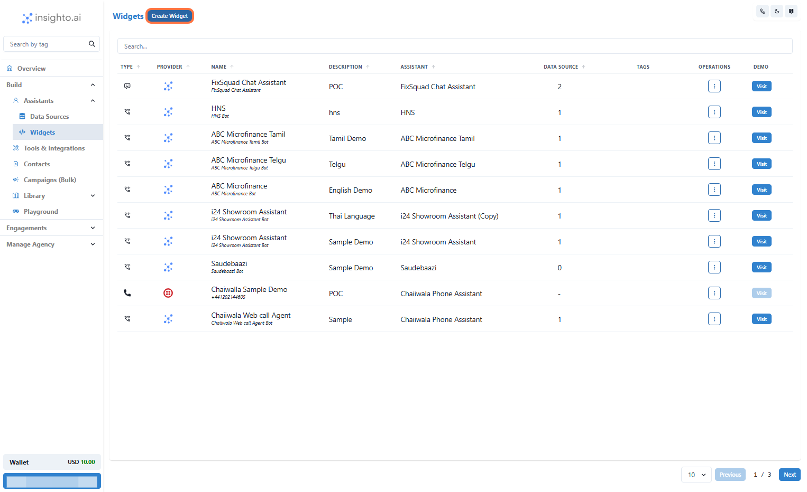
---

12. Select Provider Type

- Choose your **Provider Type**.

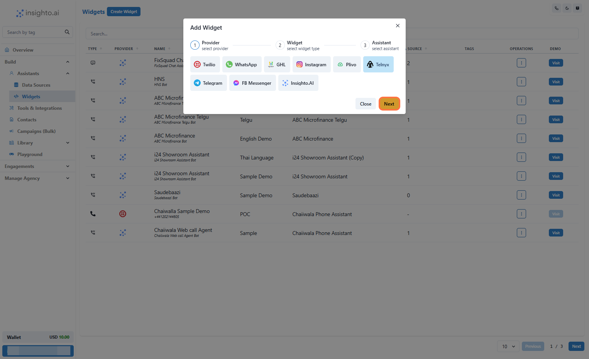
---

13. Select Widget Type

- Choose the **Widget Type**.
- Provide **Name** and **Description**.
- Click on **Next**.

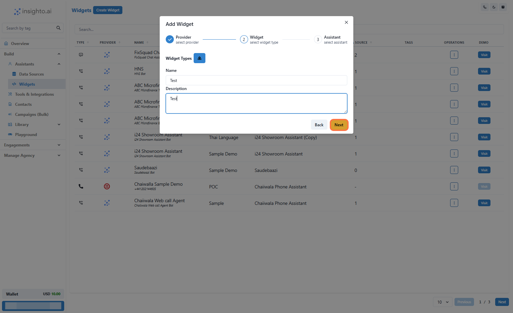
---

14. Select the Assistant

- Choose your AI **Assistant** from the dropdown and proceed.

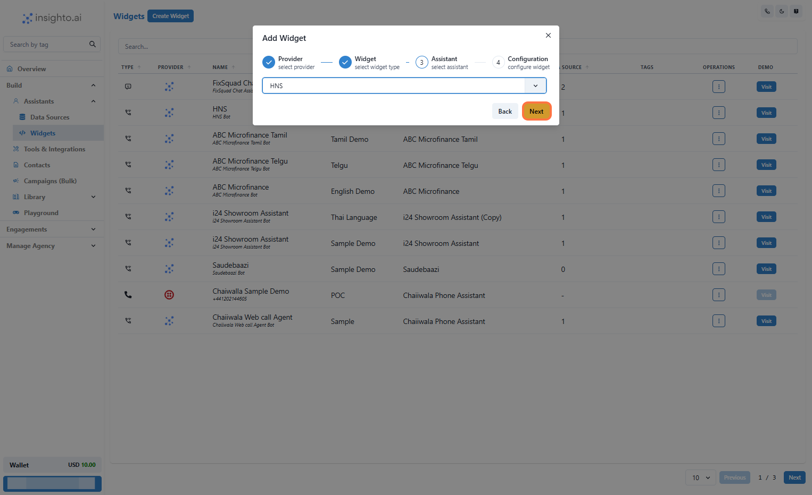
---

15. Configure Telnyx Widget

Configure the behavior of your Telnyx-powered voice assistant:

- Enable **Call Recording** (optional) – recordings available in Telnyx dashboard.
- Set **Maximum Call Duration** (e.g., 300 seconds for 5 minutes).
- Select your **Telnyx Account** from the dropdown.
- Choose a **Phone Number** associated with the account.

Once done, click **Finish** to complete deployment.

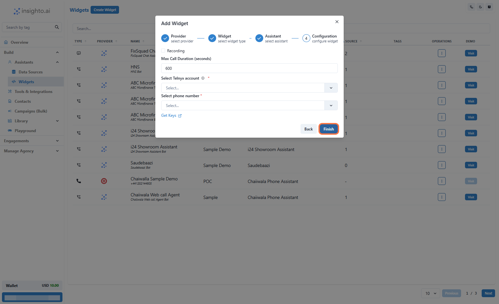
---

16. Test Your Voice Assistant

- Call the Telnyx number you just configured.
- Ensure the conversation flows correctly based on your prompt and voice settings.
