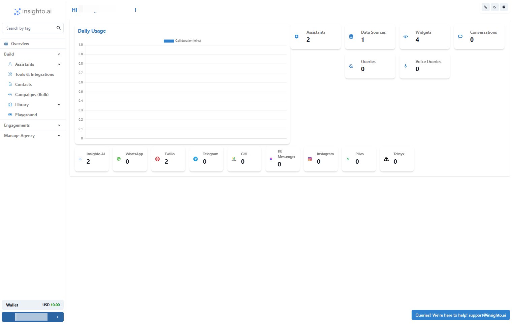
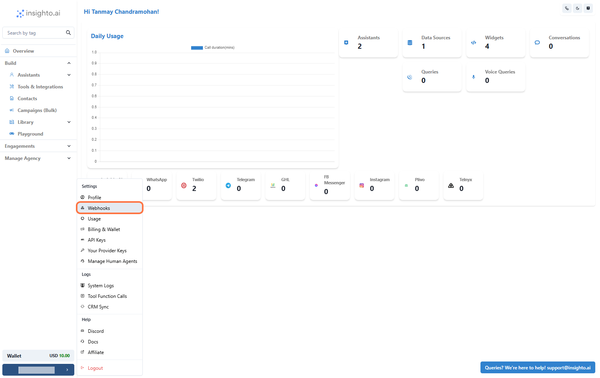
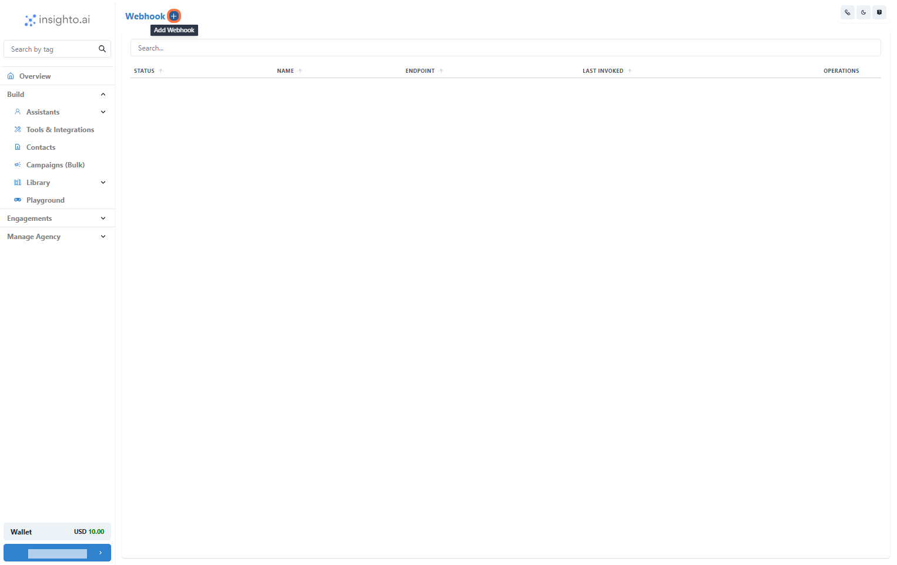
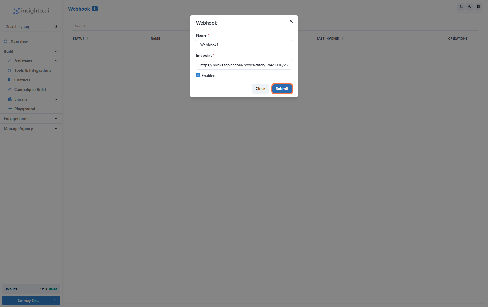
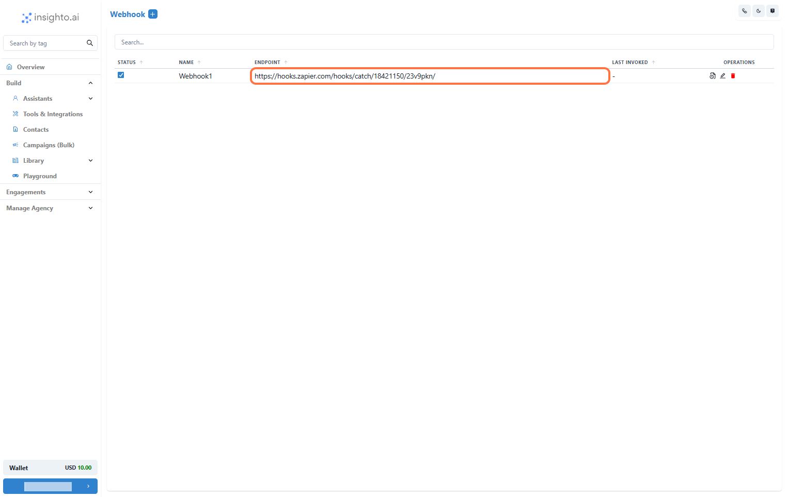
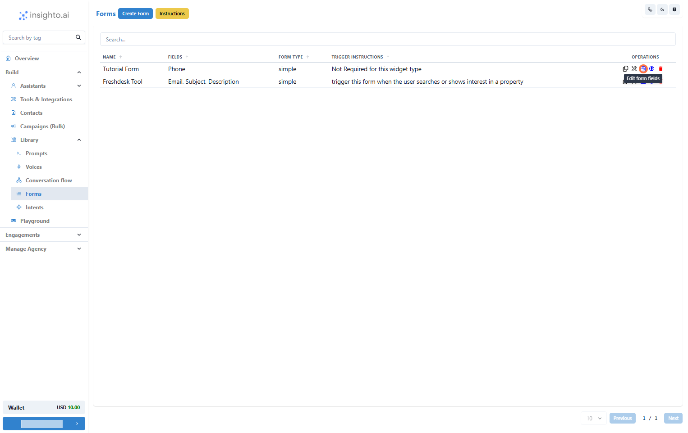
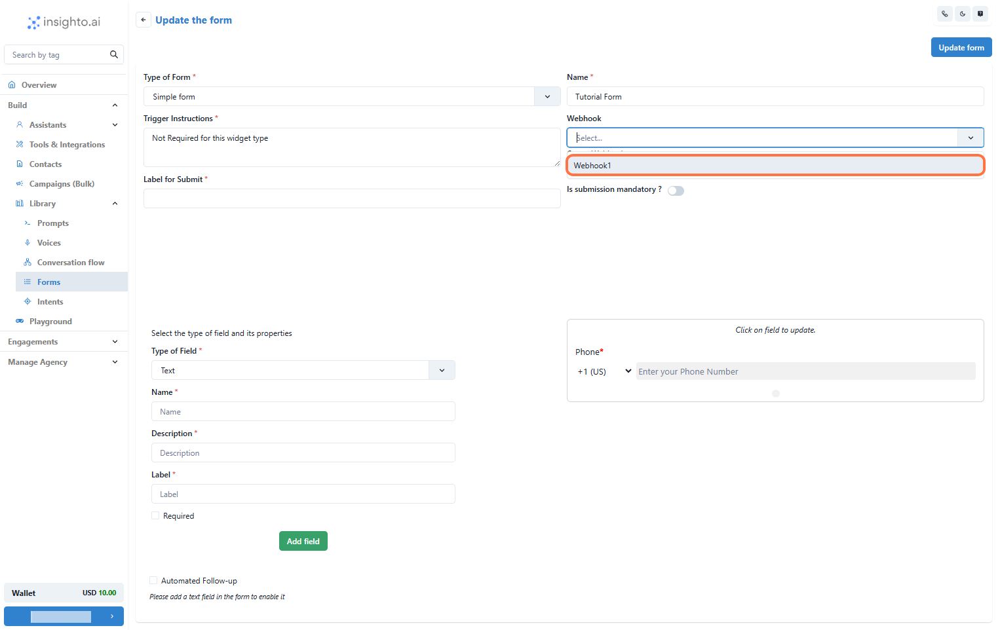
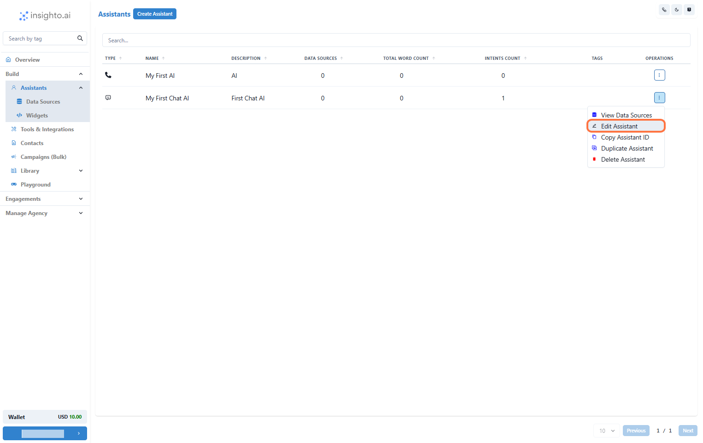
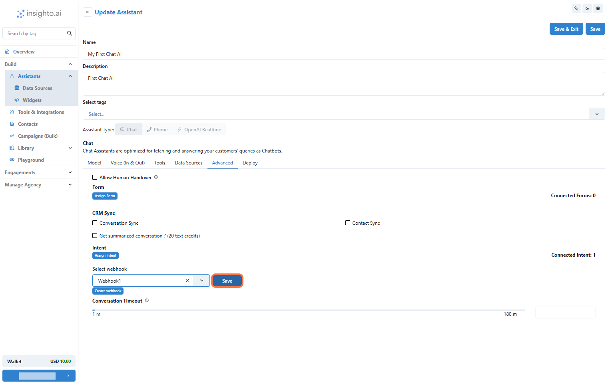

FWebhooks let you send data from Insighto to other platforms in real-time. You can use them to connect with external tools, automate tasks, and keep everything in sync. This guide will show you how to set up webhooks in Insighto and connect them with assistants or forms to push data wherever you need it.

---

## ➕ Add a Webhook in Insighto

1. Access Settings

Start by clicking on **Settings** located in the bottom left corner of your Insighto dashboard.

---

2. Select Webhooks

In the Settings menu, find and click on **Webhooks** from the list of options. This will open the Webhooks section.

---

3. Click the "+" Button to Add a New Webhook

In the Webhooks section, click the **+** button to create a new webhook. This will open a form where you can enter the webhook details.

---

4. Enter Webhook Details

In the form, provide the following information:

- **Name**: Enter a clear and descriptive name for your webhook.  
- **Endpoint URL**: Input the URL from the platform you’re creating a workflow with (e.g., Zapier, Make, or any other system).  

This tells Insighto where to send the data when this webhook is triggered.

---

5. Manage Your Webhook

After creating the webhook, you’ll see it listed in the Webhooks section. Here, you can:

- Check logs to see the activity for this webhook.  
- Edit the webhook details if you need to make changes.  
- Delete the webhook if it’s no longer needed.

> ⚠️ Each webhook connected to a form or assistant must be unique. Avoid reusing the same webhook across multiple forms or assistants to ensure your data flows correctly and actions trigger without conflicts.

---

## 📝 Connect with Forms

6. Go to the Forms Section

Next, head over to the **Forms** section in Insighto under the **Library**.

---

7. Edit an Existing Form

In the Forms section, locate the form you want to connect the webhook to. Click **Edit** to open the form’s settings.

---

8. Select the Webhook

Within the form’s settings, find the **Webhook** field. Open the dropdown and select the webhook you created earlier. This links the form to the webhook, so any form submissions will trigger the webhook automatically.

---

## 🤖 Connect with Assistant (2 Steps)

9. Edit the Assistant to Connect the Webhook

Now, head to the **Assistants** section. Find the assistant you want to connect the webhook to, and click **Edit** to open its settings.

---

10. Connect the Webhook in the Assistant’s Advanced Tab

Within the assistant’s settings, go to the **Advanced** tab. Scroll down to find the **Webhook** field, then select the webhook you want to connect from the dropdown menu. Finally, click **Save** to apply the changes.

