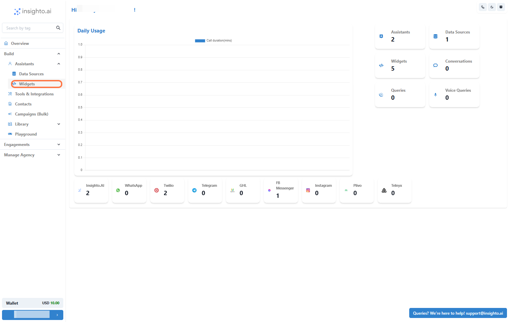
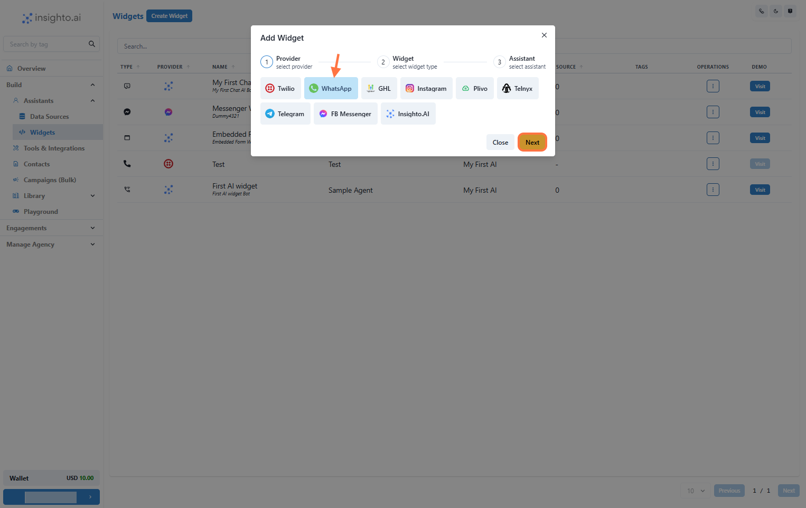
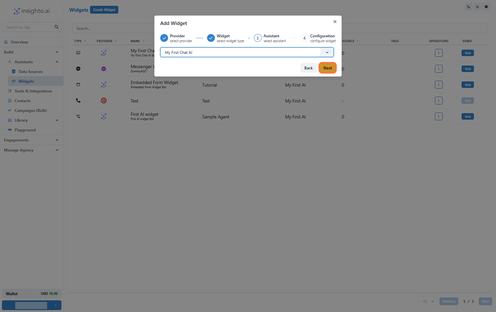
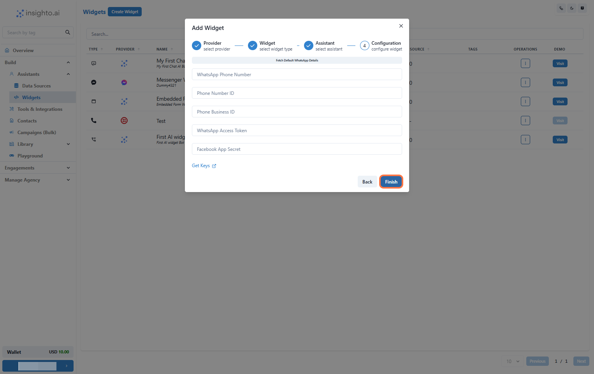

# Deploying Your Assistant on WhatsApp

In this guide, you’ll learn how to deploy your AI chat assistant on a **WhatsApp number** to automatically respond to incoming user queries, including **text messages** and **voice notes**. This integration allows your assistant to handle inbound conversations seamlessly.

> ⚠ **Limitations:**  
WhatsApp integration currently supports **inbound messages only**—your assistant cannot initiate outbound conversations as the first message due to WhatsApp's policy.

---

## 🧩 Prerequisite

1: Set Up WhatsApp Business on Meta Developer Account

Before deploying your assistant, you must first set up **WhatsApp Business** on your **Meta Developer Account**. This includes:

- Creating a Meta App  
- Verifying your phone number  
- Obtaining access tokens  

🔗 [Follow this guide to complete your WhatsApp Business setup →](https://docs.insighto.ai/Whatsapp-Setup)

Once completed, return to Insighto to deploy your assistant.

---

## 🚀 Create WhatsApp Widget

2: Click on Widgets from the Left Panel

In the **Assistants** section on the left panel, click **Widgets**. This opens the widget setup page for deploying your AI assistant.

> 🔔 **Note:**  
Ensure you've already created an AI assistant before proceeding. If not, follow the assistant creation guide first.

---

3: Create a New Widget

Click on **Create New Widget** to start the setup process.

---

4: Select WhatsApp as the Provider Type

In the setup screen:

- Set **Provider Type** to `WhatsApp`  
- Click **Next** to proceed

---

5: Select Widget Type, Name, and Describe Your Widget

Fill in the widget details:

- **Widget Type:** Choose appropriate type  
- **Name:** e.g., `Customer Support Chat`  
- **Description:** e.g., `Handles customer support inquiries via WhatsApp`

Click **Next** when done.

---

6: Select Your Chat Assistant

Choose the assistant you created earlier from the dropdown list.

---

7: Enter WhatsApp Business Credentials & Finish

Fill in the following details obtained during your WhatsApp Business setup:

- **Phone Number ID**  
- **WhatsApp Business Account ID**  
- **WhatsApp Access Token**  
- **Facebook App Secret Key**

Click **Finish** to complete the integration.

> ✅ **Note:**  
Ensure all values are accurate—incorrect or missing details may prevent the assistant from functioning on WhatsApp.

