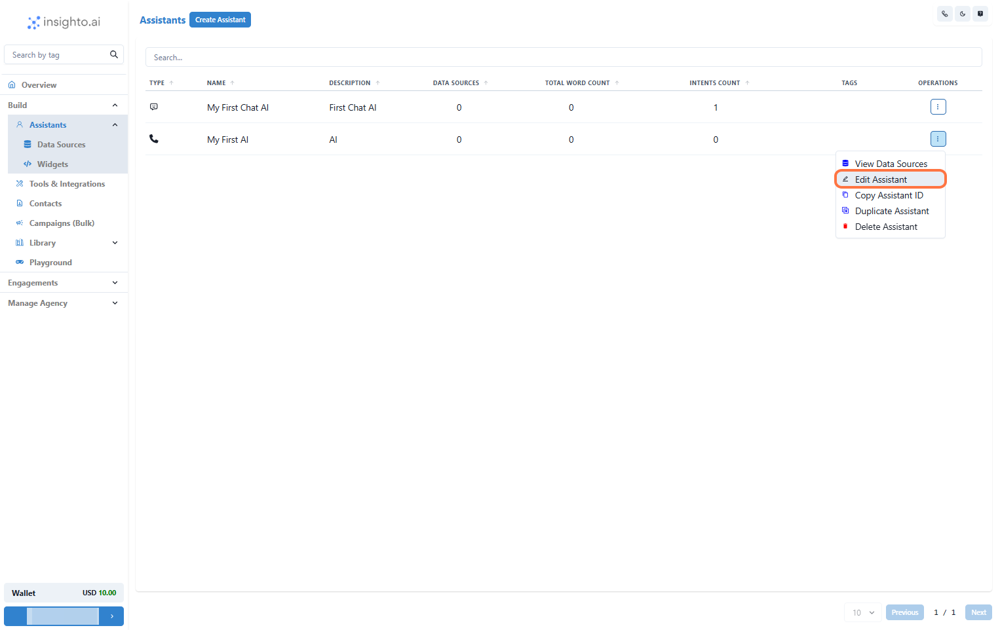

Integrate your **Zoho CRM** with Insighto to unlock powerful automation! Once connected, you can create leads directly in Zoho CRM from conversations in Insighto or set up calendar events for appointment bookings. This guide will show you how to connect and configure the Zoho tool for seamless workflows.

---

## 🔧 Zoho Tool Setup 

1. Go to Tools & Integration

From the left-hand sidebar of your Insighto dashboard, click on **Tools & Integration**.

---

2. Click on Set Up

Locate the **Zoho Tool** and click **Set Up**.

---

3. Click on Start New

After clicking **Set Up**, a popup window will appear. Click **Start New** to begin creating a new configuration.

---

4. Log In to Zoho Account

You’ll be redirected to **Zoho CRM**. Log in using your credentials to authorize the integration.

---

5. Accept Permissions

After logging in, Zoho will ask for permission to connect with Insighto. Click **Accept** to grant access and complete the integration.

---

6. Name Your Configuration and Click Create

Enter a descriptive name for your configuration, then click **Create**.

---

7. Enable Required Functions and Save

Toggle on the functions you want your assistant to use with Zoho. Then click **Save**.

---

8. Configure Calendar Preferences and Click Finish

In the Calendar configuration section:

- **Select the Service**: Choose the service you want to link (e.g., consultations, demos).
- **Select Staff**: Pick the staff member whose calendar will be used for appointments.

Click **Finish** to complete setup.

---

## 🤖 Connect with Assistant 

9. Edit Any Existing Assistant

From the **Assistants** section, click the three dots next to the assistant you want to update and select **Edit Assistant**.

---

10. Click on Connect Tools

In the **Tools** tab:
- Click **Connect Tool**
- Select **Zoho Tool** as the tool type
- Choose your tool configuration

---

11. Use Prompts to Trigger Zoho Functions

Navigate to the **Prompt** section in the assistant editor. Define instructions that allow your assistant to:

- Create a Lead  
- Check Availability  
- Book Appointments  
- Use other calendar actions

